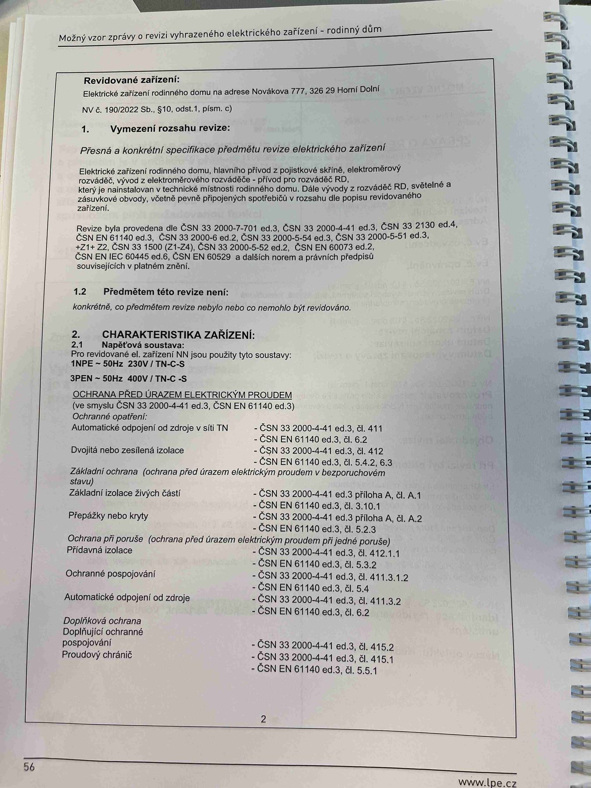

# IMG_2471

**Zdroj**: Macháček V., Dolenský M. — *Možné vzory zprávy o revizi VEZ*, vyd. lpe.cz, str. 56 / vnitřní str. 2 (rodinný dům).

**Téma**: Revidované zařízení, vymezení rozsahu revize a charakteristika zařízení (napěťová soustava, ochrana před úrazem elektrickým proudem).

**Klíčové body**:
- **Revidované zařízení**: Elektrické zařízení rodinného domu na adrese Nováková 777, 326 29 Horní Dolní
- **1. Vymezení rozsahu revize** (NV č. 190/2022 Sb. § 10 odst. 1 písm. c): "Přesná a konkrétní specifikace předmětu revize elektrického zařízení" — elektrické zařízení rodinného domu, hlavní přívod z pojistkové skříně, elektroměrový rozváděč, vývod z elektroměrového rozváděče — přívod pro rozváděč RD, který je nainstalován v technické místnosti rodinného domu. Dále vývody z rozváděče RD, světelné a zásuvkové obvody, včetně pevně připojených spotřebičů v rozsahu dle popisu revidovaného zařízení.
- Revize byla provedena dle: ČSN 33 2000-7-701 ed.3, ČSN 33 2000-4-41 ed.3, ČSN 33 2130 ed.4, ČSN EN 61140 ed.3, ČSN 33 2000-6 ed.2, ČSN 33 2000-5-54 ed.3, ČSN 33 2000-5-51 ed.3 +Z1+Z2, ČSN 33 1500 (Z1–Z4), ČSN 33 2000-5-52 ed.2, ČSN EN 60073 ed.2, ČSN EN IEC 60445 ed.6, ČSN EN 60529 a dalších norem a právních předpisů souvisejících v platném znění.
- **1.2 Předmětem této revize není**: konkrétně, co předmětem revize nebylo nebo co nemohlo být revidováno.
- **2. CHARAKTERISTIKA ZAŘÍZENÍ — 2.1 Napěťová soustava**: Pro revidované el. zařízení NN jsou použity tyto soustavy: **1NPE ~ 50 Hz 230 V / TN-C-S** a **3PEN ~ 50 Hz 400 V / TN-C-S**.
- **OCHRANA PŘED ÚRAZEM ELEKTRICKÝM PROUDEM** (ve smyslu ČSN 33 2000-4-41 ed.3, ČSN EN 61140 ed.3) — tabulka ochranných opatření:

| Ochranné opatření | ČSN 33 2000-4-41 ed.3 | ČSN EN 61140 ed.3 |
|---|---|---|
| Automatické odpojení od zdroje v síti TN | čl. 411 | čl. 6.2 |
| Dvojitá nebo zesílená izolace | čl. 412 | čl. 5.4.2, 6.3 |
| Základní ochrana — Základní izolace živých částí | příloha A, čl. A.1 | čl. 3.10.1 |
| Základní ochrana — Přepážky nebo kryty | příloha A, čl. A.2 | čl. 5.2.3 |
| Ochrana při poruše — Přídavná izolace | čl. 412.1.1 | čl. 5.3.2 |
| Ochrana při poruše — Ochranné pospojování | čl. 411.3.1.2 | čl. 5.4 |
| Ochrana při poruše — Automatické odpojení od zdroje | čl. 411.3.2 | čl. 6.2 |
| Doplňková ochrana — Doplňující ochranné pospojování | čl. 415.2 | — |
| Doplňková ochrana — Proudový chránič | čl. 415.1 | čl. 5.5.1 |

**Normy zmíněné na stránce**: NV č. 190/2022 Sb. § 10 odst. 1 písm. c), ČSN 33 2000-7-701 ed.3, ČSN 33 2000-4-41 ed.3 (čl. 411, 411.3.1.2, 411.3.2, 412, 412.1.1, 415.1, 415.2, příloha A), ČSN 33 2130 ed.4, ČSN EN 61140 ed.3 (čl. 3.10.1, 5.2.3, 5.3.2, 5.4, 5.4.2, 5.5.1, 6.2, 6.3), ČSN 33 2000-6 ed.2, ČSN 33 2000-5-54 ed.3, ČSN 33 2000-5-51 ed.3 +Z1+Z2, ČSN 33 1500 (Z1–Z4), ČSN 33 2000-5-52 ed.2, ČSN EN 60073 ed.2, ČSN EN IEC 60445 ed.6, ČSN EN 60529
