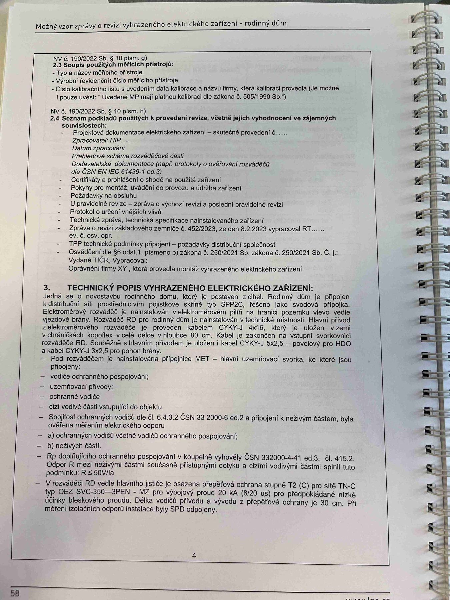

# IMG_2473

**Zdroj**: Macháček V., Dolenský M. — *Možné vzory zprávy o revizi VEZ*, vyd. lpe.cz, str. 58 / vnitřní str. 4 (rodinný dům).

**Téma**: Seznam podkladů použitých k provedení revize a technický popis vyhrazeného elektrického zařízení (přívod, rozváděč, ochrany, SPD).

**Klíčové body**:
- **NV č. 190/2022 Sb. § 10 odst. j)** — 2.3 Stupeň použitých měřicích přístrojů: výrobní číslo(a) přístroje, datum kalibrace provedla (je možné uvádět přímo za značkou kalibrace); v případě nesplnění v textu zprávy uvést "Uvedené MP mají platnou kalibraci dle zákona č. 505/1990 Sb."
- **NV č. 190/2022 Sb. § 10 odst. c)** — 2.4 Seznam podkladů použitých k provedení revize, včetně jejich vyhodnocení a jejich souvztažnosti (vzor bodů):
  - Projektová dokumentace elektrického zařízení — skutečné provedení č. …
  - Zpracoval XY …
  - Předchozí revizní zpráva ze dne ...
  - Přehled zkušeb/kontrol/revizí VEZ
  - Dokumentace dokumentů (např. protokoly o ověřování vodičů) — dle ČSN IEC 61439-1 ed.3
  - Certifikáty a prohlášení o shodě použitých zařízení
  - Pokyny pro montáž, obvykle dodavatelem, popř. záznam stavebního deníku
  - Projektový audit v případě, že byla provedena výchozí revize …
  - Protokol o určení vnějších vlivů
  - Technické normy, technická specifikace nainstalovaného zařízení
  - U mimořádné revize: dokumentace z 4.52/2023, ze dne 8.2.2023 vypracoval RT …
  - U opakované revize: dokumentace zemniče, z 4.52/2023, ze dne 8.2.2023 vypracoval RT …
  - **TPP technické práce přípojné** — přípojová dokumentace schvalovací
  - Osvědčení (§ 10 písm. I, pismen b) zákona č. 250/2021 Sb., zákona č. 250/2021 Sb. Č. j. …
  - Další …
- **3. TECHNICKÝ POPIS VYHRAZENÉHO ELEKTRICKÉHO ZAŘÍZENÍ**:
  - Jedná se o novostavbu rodinného domu, která je připojena z elektroměrového rozváděče (šmeroměř) na sloupu distribuční soustavy E.G.D. Elektroměrový rozvádě ž napojen z elektroměrového rozváděče, vnější prostor hl. sloupu Cassu 2, hl. jistič OEZ/32A/3B do objektu provedenou vodiči CYKY-J 4×16 do vlastního elektroměrového rozváděče (provedení fasádní pilíř) a dále z elektroměrového rozváděče kabelem CYKY-J 4×16 do domovního rozvaděče RD. Součástí domovního rozvaděče je kabel CYKY 4×2,5 ze spinače HDO.
  - Pod rozváděčem je nainstalována přípojnice MET — hlavní uzemňovací sběrnice, ke které jsou připojeny:
    - ochrana ochranného pospojování
    - uzemňovací přívod
    - ochrana vodiče
    - cizí vodivé části svisající do objektu
  - Společné ochranné vodiče dle ČSN 33 2000-5-54 ed.3 jsou uloženy s napájecími kabely a respektují parametry PE vodičů (chráněná/plánová izolace)
  - **a) Ochranný vodič** včetně vodiče ochranného pospojování — dle ČSN 332000-4-41 ed.3, d. 415.2
  - **b) Nulový vodič**
  - **c) Rozběhový opětovný zemnič** ochranných svorek CYA 1×10 dle ČSN 32 2000-4-41 ed.3, d. 415.2, dle ČSN 32 2000-5-54 ed.3. Sdružení vychází z ohmického přípojného zipku a jeho předpokládaných hodnot spojovacího zámku (zemnič u čemel — kV).
  - **Z rozvaděče RD** je vyveden jistič s přepěťovou ochranou stupně T2 (C) pro TN-C systém OEZ typ SVG 350-3PN/+N (20 kA) zásobníka SVG 3A (8/20 μs) pro předpokládaná hod učinu vuzemnění a ostnoslupa, spojeny jsou 3 přepěťové 30 cm od PR měřícího ochranného vodiče systému instalace bly SPD odpovídajícímu.

**Normy zmíněné na stránce**: NV č. 190/2022 Sb. § 10 (písm. c, j), zákon č. 250/2021 Sb. (§ 10 písm. b), zákon č. 505/1990 Sb. (metrologie), ČSN IEC 61439-1 ed.3, ČSN 33 2000-4-41 ed.3 (čl. 415.2), ČSN 33 2000-5-54 ed.3

> **Poznámka ke kvalitě**: Část textu na pravé straně snímku je mírně rozmazaná / pod úhlem; čísla a názvy typů (CYA, CYKY, SVG) byly přepsány co nejvěrněji, ale pro 100% přesnost doporučuji ověřit z originálního obrázku.
