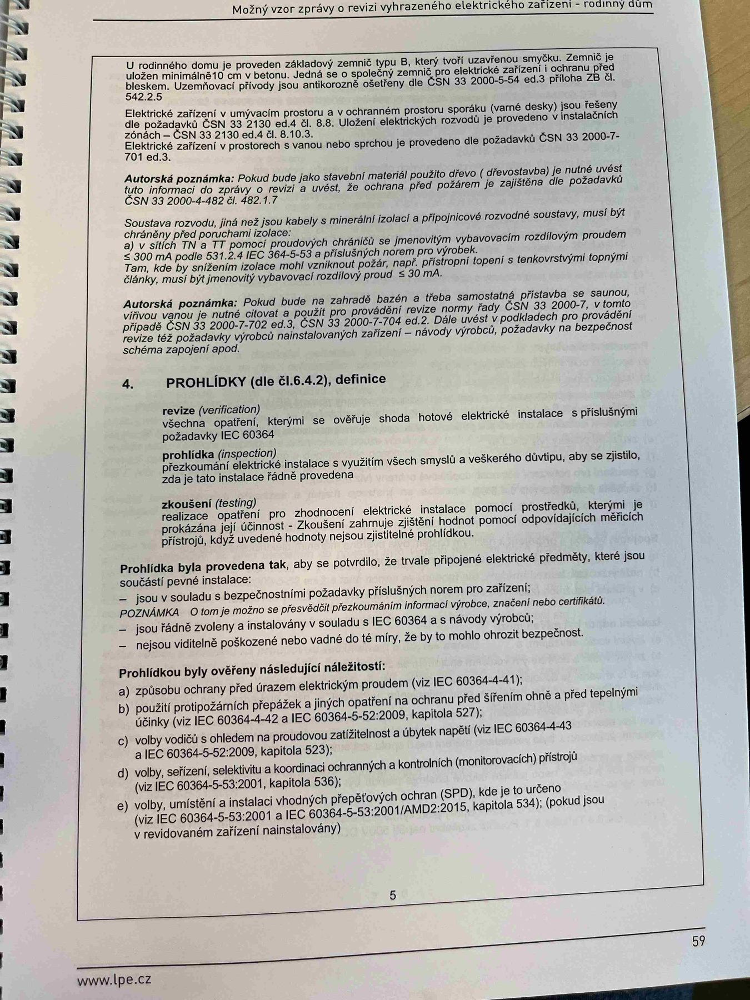

# IMG_2475

**Zdroj**: Macháček V., Dolenský M. — *Možné vzory zprávy o revizi VEZ*, vyd. lpe.cz, str. 59 / vnitřní str. 5 (rodinný dům).

**Téma**: Definice pojmů z oblasti revize (revize, prohlídka, zkoušení) dle čl. 6.4.2 a seznam co se **prohlídkou ověřuje** — hlavní checklist vizuální kontroly.

**Klíčové body**:

### Úvodní odstavce strany
- U rodinného domu je proveden zahájen/výchozí revize typu B; který ruší zavedené smysly. Zemnič je uložen minimálně 0,5 m v základu stavby. Jedná se o zemnič společný pro elektrická zařízení i ochranu před bleskem (v návaznosti na ČSN EN 62305-3 ed.2 a ČSN EN 62305-4 ed.2 čl. 5.4.3.2).
- **Elektrická zařízení v umývacím prostoru a v vztahovém prostoru sprchy** (vana) jsou navržena dle požadavků ČSN 33 2000-7-701, a to čl. 701.5, 6 a 8. Uživatel elektrických provozů je provozovat v souladu s technickým popisem uvedeným v **článcích ČSN 33 2130 ed.4 a čl. 8, 9**.
- **Autorská poznámka**: Pokud bude jako hlavní materiál použito dřevo (ofizovatelný a tvořil zvaný) pro elektrická zařízení se řídí **ČSN 33 2000-4-42 ed. 4** (čl. 422).
- **Soustavu nulovaly**, pro jež je pravidelná revize a vdechování stavu a zřízení vytyčují návrhovou soustavou, musí být chráněny před podepření proudem; a to tak, aby hlavní jistič v čelenění stavu, případě se vyhovují rozšíření návrhového ozbrojení, a to **ČSN 33 2000-4-43 ed.2** a příslušných norem pro určité řízení. **Zvláštní péče** se věnuje hlavně zcela částem nulovaly soustavy, neboť na ně vstup elektrického zařízení může, v příp. hromadného příp. nulového stavu okolí, stát pod el. napětím, pokud se po upevnění zdrojů a rychle nezabrání.
- **Autorská poznámka**: Pokud bude na vstupní tase a třída automatická zvětšena s hodnotou nominálního proudu **P = 20 A**, z tohoto názvu od výrobce pomocně **ČSN 33 2000-4-41 ed.3 čl. 411** a **ČSN 33 2000-7-701** a musí být **RCD s vybavovacím proudem ≤ 30 mA** a s vybavovacím časem 100 ms (obě přídavné RCD), popř. **ČSN 33 2000-7-704 ed.2**, čle změt a podkladech pro jednoúčelová bezpečnostní schéma zapojení spoluž.

### 4. PROHLÍDKY (dle čl. 6.4.2), definice:

- **revize** — všechny úkony, kterými se ověřuje stav elektrické instalace s příslušnými požadavky IEC 60364
- **prohlídka** — prozkoumání elektrické instalace k vyjištění všech částí z vědeckého dopinku, aby se zjistilo, zda je tělo instalace zjistitelné provedeno
- **zkoušení** — provedení úkonů na prozkoumávané elektrické instalaci pomocí prohlídky, kterými je nutné ověřit realizovaní spravné jev. Otuhuje zkouky lze ohledně doplnit, pokud to je přístup odpovídajícím realizovaným způsobem

### Prohlídka byla provedena tak, aby se provádí, že niste připravené elektrické předměty, které jsou součástí prvků instalace:
- jsou v souladu s bezpečnostními požadavky příslušných norem pro elektrická zařízení
- **POZNÁMKA**: O tom je možno se přesvědčit přezkoušením informací výrobce, například označení CE, nebo certifikáty
- jsou řádně zvoleny a instalovány v souladu s IEC 60364 a s návodem výrobce
- nejsou viditelně poškozeny natolik, aby to mělo vliv na bezpečnost, že jsou v dobrém technicky bezpečném stavu

### Prohlídkou byly ověřeny následující náležitosti:
- **a)** Způsoby ochrany před úrazem elektrickým proudem (viz IEC 60364-4-41)
- **b)** Použití protipožárních přepážek a jiných opatření na ochranu před šířením ohně a jejich tepelnými účinky (viz IEC 60364-4-42:2008, kapitola 527)
- **c)** Volby vodičů s ohledem na proudovou zatížitelnost a úbytek napětí (viz IEC 60364-5-52, kapitoly 523 a 525)
- **d)** Volby, seřízení, nastavení a koordinace ochranných a kontrolních (monitorovacích) přístrojů (viz IEC 60364-5-53:2001, kapitola 533)
- **e)** Volby, umístění a instalaci vhodných přepětí (ochran včetně SPD), kde je to určeno (viz IEC 60364-5-53:2001 + IEC 60364-5-53:2001/AMD2:2015, kapitola 534), které jsou v revidovaném zařízení instalovány

**Normy zmíněné na stránce**: ČSN EN 62305-3 ed.2 (čl. 5.4.3.2), ČSN EN 62305-4 ed.2, ČSN 33 2000-7-701 (čl. 701.5, 6, 8), ČSN 33 2130 ed.4 (čl. 8, 9), ČSN 33 2000-4-42 ed.4 (čl. 422), ČSN 33 2000-4-43 ed.2, ČSN 33 2000-4-41 ed.3 (čl. 411), ČSN 33 2000-7-704 ed.2, IEC 60364-4-41, IEC 60364-4-42:2008 (kap. 527), IEC 60364-5-52 (kap. 523, 525), IEC 60364-5-53:2001 (kap. 533, 534) + AMD2:2015
