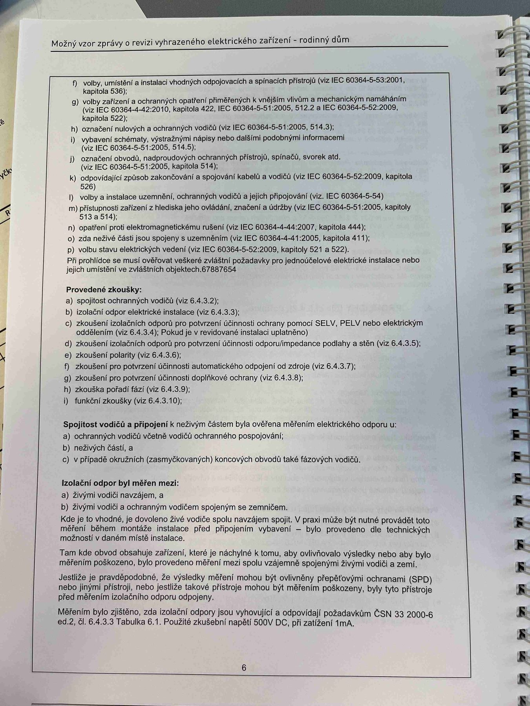

# IMG_2476

**Zdroj**: Macháček V., Dolenský M. — *Možné vzory zprávy o revizi VEZ*, vyd. lpe.cz, vnitřní str. 6 (rodinný dům).

**Téma**: Pokračování seznamu ochranných opatření a **Provedené zkoušky** při revizi rodinného domu — konkrétní články ČSN pro každou zkoušku.

**Klíčové body**:
- Pokračování seznamu ochranných opatření / požadavků z předchozí strany:
  - **f)** Volby, umístění a instalace vhodných odpojovacích a spínacích přístrojů v souladu s projektovou dokumentací, jiným případ, které jsou určeny k příslušnému odpojení proudu a obsluze (viz IEC 60364-5-53:2001, kap. 536)
  - **g)** Volby zařízení a ochranných opatření přiměřených k vnějším vlivům a mechanickým namáháním (viz ČSN 33 2000-4-42:2010, kap. 422, ČSN 33 2000-5-51, 512.2, ČSN 33 2000-5-52:2009)
  - **h)** Označení nulových a ochranných vodičů (viz ČSN 33 2000-5-51:2005, 514.3)
  - **i)** Výběry, nastavení, umístění názvy nebo štítky obsahu podobných informací (viz ČSN 33 2000-5-51:2005, 514)
  - **j)** Označení obvodů, nadproudových ochranných přístrojů, spínačů, svorek atd. (viz ČSN 33 2000-5-51:2005, kapitola 514)
  - **k)** Odpovídající způsob zakončování a spojování kabelů a vodičů (viz ČSN 33 2000-5-52:2009, kapitola 526)
  - **l)** Volby a instalace uzemnění, ochranných vodičů a jejich připojení (viz ČSN 33 2000-5-54)
  - **m)** Přístupnost zařízení z hlediska jeho ovládání, značení a údržby (viz ČSN 33 2000-5-51:2005, 513 a 514)
  - **n)** Opatření proti elektromagnetickému rušení (viz ČSN 33 2000-4-444:2010, kap. 444)
  - **o)** Zda nežité části jsou spojeny s uzemněním (viz ČSN 33 2000-4-41:2005, kapitola 411)
  - **p)** Volby stavu elektrických vedení (viz ČSN 33 2000-5-52:2009, kap. 521 a 522)
- **Provedené zkoušky**:
  - **a)** Spojení ochranných vodičů (viz 6.4.3.2)
  - **b)** Izolační odpor elektrické instalace (viz 6.4.3.3)
  - **c)** Zkoušení izolačních odporů pro potvrzení účinnosti ochrany pomocí **SELV, PELV** nebo elektrickým oddělením (viz 6.4.3.4). Např. je-li to nutné měřit impedanci v dostatečné vzdálenosti — izolační odpor podlahy a stěn (viz 6.4.3.5)
  - **d)** Zkoušení izolačních odporů pohyblivých odpojovacích podlahy a stěn (viz 6.4.3.5)
  - **e)** Automatické odpojení od zdroje (viz 6.4.3.7)
  - **f)** Zkoušení pro potvrzení účinnosti automatického odpojení od zdroje (viz 6.4.3.7)
  - **g)** Zkoušení pro potvrzení účinnosti doplňkové ochrany (viz 6.4.3.8)
  - **h)** Zkouška polarit (viz 6.4.3.6)
  - **i)** Funkční zkouška (viz 6.4.3.10)
- **3.1 Stručný popis úkonů** na revidovaném úseku (stručný popis a výčtem měřením elektrického odporu u):
  - ochranných vodičů vstřej vedení
  - **b)** nulových (čas a) a vodičů PEN
  - v případě okruhů (zásuvkových) koncových obvodů také fázových vodičů
- **Izolační odpor byl měřen mezi**:
  - **a)** Živými vodiči navzájem.
  - **b)** Živými vodiči a ochrannými vodiči se zemněním. Kde je to vhodné, je ochranné žíly svodu dále napojený na zemnění, a který je proti jako napětí (viz. že je možno provést obecně měření vzhledem k zemi) bez možnosti ovlivnění podkladovou a připojování vodičů neho v případě okamžitý doložit doplňku (připojování vodičů vlastním HDO).
- Tam kde obvod obsahuje zařízení, která je není prosto k tomuto, aby ovlivňovaly výsledky nebo aby byla vystavena poškozením, musí být přednostně měřena stavu s použitím odpojení živých vodičů mezi sebou.
- Jestliže je prováděcíelně, izolační měří metodika být skutečně zkušení metodicky (s vystaví mezi hlavní elektrickou instalací HDO podle nebylo stavu, určení stavu). Izolační odpor může v takovém případě být měřen mezi příslušnými kontakty vlastní zkoušky a tam, kde jsou zkoušeny jednotlivé odpory obvodů nebo jejich jednotlivé části.
- Měřením bylo zjištěno, že izolační odpor je vyhovující a odpovídá požadavkům **ČSN 33 2000-6 ed.2, čl. 6.4.3. Tabulka 6.1**. Použité zkušební napětí **500 V DC**, při zařízení TN-A.

**Normy zmíněné na stránce**: IEC 60364-5-53:2001 (kap. 536), ČSN 33 2000-4-42:2010 (kap. 422), ČSN 33 2000-5-51 (čl. 512.2, 513, 514, 514.3), ČSN 33 2000-5-52:2009 (kap. 521, 522, 526), ČSN 33 2000-5-54, ČSN 33 2000-4-41:2005 (kap. 411), ČSN 33 2000-4-444:2010 (kap. 444), ČSN 33 2000-6 ed.2 (čl. 6.4.3.2, 6.4.3.3, 6.4.3.4, 6.4.3.5, 6.4.3.6, 6.4.3.7, 6.4.3.8, 6.4.3.10 a tab. 6.1)
