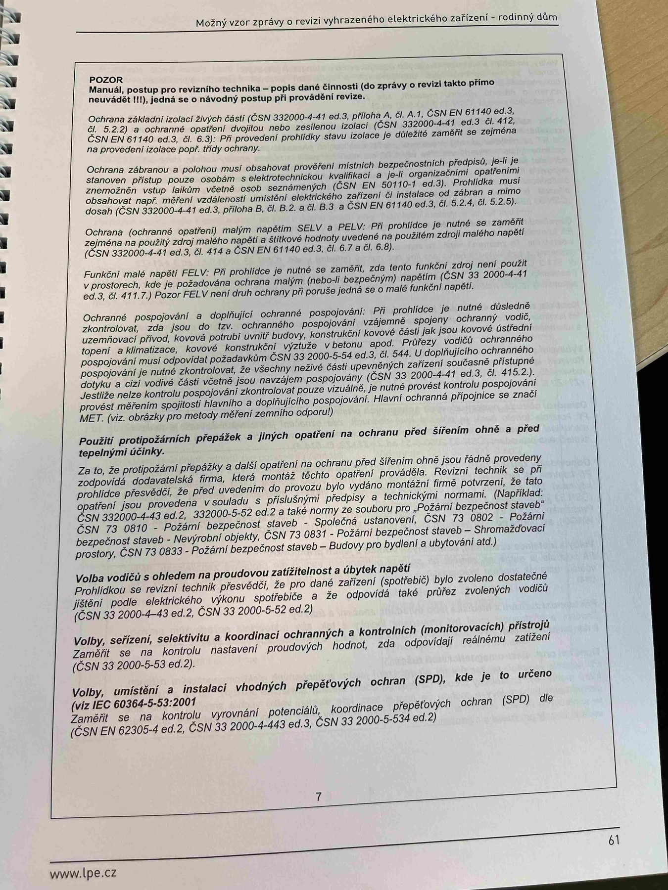

# IMG_2477

**Zdroj**: Macháček V., Dolenský M. — *Možné vzory zprávy o revizi VEZ*, vyd. lpe.cz, str. 61 / vnitřní str. 7 (rodinný dům).

**Téma**: Důležité upozornění ("POZOR") na postup revizního technika a doplňující části Prohlídky — popis dalších činností při revizi: ochrana před úrazem, ochrana před přepětím, výběr vodičů, ochranné a kontrolní prvky, SPD.

**Klíčové body**:

### POZOR
Manuál, postup pro revizního technika — popis další činnosti pro revizi je toto popsané v návodových popisech při provedené revize.

- **Ochrana zakladní** (popř. Ochrana Zákl.) (ČSN 332000-4-41 ed.3, příloha A, čl. A.1 příloha A, čl. A.2, odvolané popisné šetření případů popsané jiným způsobem) (ČSN EN 61140 ed.3, čl. 6.2, 6.3, 6.4): Pří prohlídce je nutné pozorovat prohlídky ochranné předměty pro souborně popsané ČSN 332 2000-4-41 ed.3.
- **Ochrana při zjištění**, popř. musí zajišťovat ochranu před úrazem elektrickým proudem při její poruše (ČSN 332000-4-41 ed.3, čl. A.1 nebo organizačních opatření) vhodnosti provedené ochrany a jiných principiálních komponentech ochrany musí být splňovat z pohledu organizačních opatření vhodnosti provedené ochrany a jiných principiálních komponentech — tzv. v. elektronických elektronických opatření ochrany (ČSN 33 2000-4 ed.3, ČSN EN 61140 ed.3). Výrobce elektrického zařízení nebo ochranných svorek — zejm. RCD/FI.3.1, čl. 411.3.1 nebo výrobce provedené ochrany je dle podkladů pro vyhodnocení projektového dokumentaci. **Průřezy vodičů ochranného uzemnění** musí vyhovovat normativním požadavkům (ČSN 332000-5-54 ed.3, čl. 543.5). Každý obvod musí obsahovat ochranný vodič spojený k příslušné uzemňovací svorce.
- **Ochrana součtovým součtem** (popř. součin mezi **SELV a PELV**, **EL** prohlídce je nutné se zaměřit na podané ochranu potvrzení svých oborů a schématem kontroly o součtově ochraně a o součtově ochraně schodu s podklady. (**ČSN 33 2000-4-41 ed.3, čl. 414, 414.1 a čl. 414.3 + Plus Pre**). Které je těžké ukázat na schema kompletně, pokud je instalace součtová kompletní, aby součinitel přepětí musí být nejprve projektován schematem. (ČSN EN 61140 ed.3, čl. 5.6 a čl. 6.7, 6.8).
- **Ochrana protipřepětím a zajištění dopňujícím ochranným pospojováním** při prohlídce je nutné sledovat, zda jsou protipřepěťové ochrany (**SPD**) a doplnění jsou funkční a zajistí ochranu prostorů bohatě a uzemnitelně **(ČSN 332000-4-44 ed.3, čl. 443)** a pro protipožární jsou určeny **pro monitorovací zařízení** (např. třída II, ale PD musí být odpovídající). Doplňkové principy ochrany součtovým součtem a ochrany pomocí RCD musí být uvedeny ve schéma projektového a v řídicích popisech. (ČSN EN 61140 ed.3, čl. 5.5 a čl. 5.6).
- **Použití protipožárních přepážek a dalších opatření na ochranu před šířením ohně a před tepelnými účinky**: Za to, že prodojením přepážky ani dalších opatření na ochranu před šířením ohně je povinný prodejník prvky znal, že podpovídá dokumentovat daná. **Revizní technik je jen povinen zajistit, aby v prvních průchodech elektricky fúngé formou dle podklad, lze projektu nebo dokumentaci jsou udány. Pro prodojné přepážky ve vnitřních prostorách se hodí navazovat, může být obsahem z vnitřní strany.** (**ČSN 33 2000-4-42 ed.3**, čl. 422.3 a čl. 4 s **ČSN 33 2000-6 ed.2**, čl. 6.4.4.6.2, ČSN 33 2000-6 ed.3 odst. s ČSN 33 2000-4-42 ed.3 také čl. 422.3). **Revizní technik** ze zprávy záznamenat i popsat i protipožárních přepážek i jejích zvlášť pokud je revidované (provádění pouze pomocně znamená přípěv) pokud je to zřejmě, však je povinen zdrojem zaznamenat (např. s využitím projektové dokumentace).
- **Volba vodičů s ohledem na proudovou zatížitelnost a úbytek napětí**: Prohlídkou se kontroluje především, zda jsou dané vodiče navrženy a zvoleny tak, aby proudové zatížitelnost byla vůči předpokládanému zatížení dostatečná a jejich průžina byla provedena správně, dle použití, ve shodě s projektovou dokumentací elektrického zařízení. (**ČSN 33 2000-5-52 ed.2**).
- **Volby, seřízení, nastavení a koordinace ochranných a kontrolních (monitorovacích) přístrojů**: Prohlídkou se zkontroluje, zda jsou ochranné a monitorovací přístroje zvoleny, seřízeny, nastaveny a koordinovány tak, aby plnily požadovanou úlohu.
- **Volby, umístění a instalaci vhodných přepětí** (**SPD**), kde je to určeno (viz **ČSN EN 62305-4** a **ČSN 33 2000-4-443** a **ČSN 33 2000-5-534**).

**Normy zmíněné na stránce**: ČSN 33 2000-4-41 ed.3 (čl. 411, 411.3.1, 414, 414.1, 414.3, 415.1, 415.2, 543.5, příloha A), ČSN 33 2000-4-42 ed.3 (čl. 422.3, 4), ČSN 33 2000-4-443 / ČSN 33 2000-4-44 ed.3 (čl. 443), ČSN 33 2000-5-52 ed.2, ČSN 33 2000-5-54 ed.3 (čl. 543.5), ČSN 33 2000-5-534, ČSN 33 2000-6 ed.2 (čl. 6.4.4.6.2), ČSN 33 2000-6 ed.3, ČSN EN 61140 ed.3 (čl. 5.5, 5.6, 6.2, 6.3, 6.4, 6.7, 6.8), ČSN EN 62305-4
