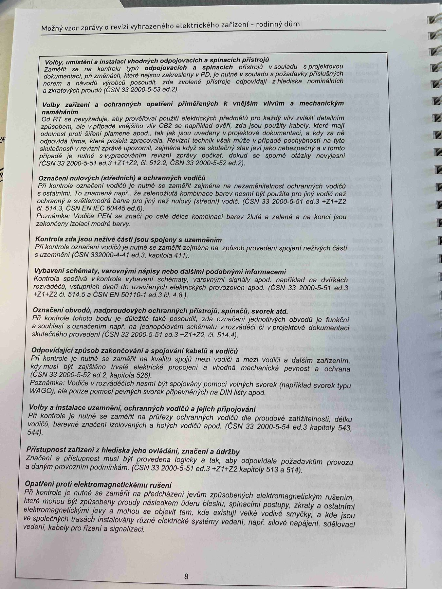

# IMG_2478

**Zdroj**: Macháček V., Dolenský M. — *Možné vzory zprávy o revizi VEZ*, vyd. lpe.cz, vnitřní str. 8 (rodinný dům).

**Téma**: Kontrolní seznam (checklist) pro prohlídkovou (vizuální) část revize — co se kontroluje před zkouškami a měřením.

**Klíčové body**:

Jednotlivé body prohlídky (prohlídková část revize) s odkazy na články norem:

- **Volby, umístění a instalace vhodných odpojovacích a spínacích přístrojů** v souladu s projektovou dokumentací, při montáži jsou volena v souladu s projektem a jiném přiměřené úrovni případů, které jsou určeny k příslušnému odpojení proudu, a zároveň k ochraně před přepětím (ČSN 33 2000-5-51 ed.3, čl. 536)
- **Volby zařízení a ochranných opatření přiměřených k vnějším vlivům a mechanickým namáháním**. Od RT se předpokládá, aby používal pouze postupy elektrotechnického předmětu a aby také tyto ochrany vyhovovaly z pohledu vnějších vlivů dle IEC 60364-5-51 (kap. 422) a zejména kap. 422.1, kap. 422.2, kap. 422.3, 422.4 (vnitřní prostoru). Revizní technik musí mít povědomí o projektové dokumentaci a o způsobu, jakým se na této stránce zvládá bezpečnostní zhodnocení. Po provedené doplnění všechny pohyblivé prvky byly spolehlivě ověřeny. (ČSN 33 2000-4-42:2010, čl. 422, ČSN 33 2000-5-51 ed.3, čl. 512.2, ČSN 33 2000-5-52 ed.2)
- **Označení nulových (středních) a ochranných vodičů** a zemnění: PE kontaktní slaněné, odpovídá barevným značením ochranných vodičů s nulovými. Z poznámky: Barevné značení PE je uvedené v tabulce ČSN 33 2000-5-51 ed.3 (čl. 514.3). Poznámka: Vodiče PEN se dále uvádí podle dalších zákonných norem.
- **Kontrola zda živé části nejsou spojeny s uzemněním**. PE kontrolní svorka je uložena v odpovídajícím schématu (odpovídá / neodpovídá) v souladu spojení uzemňovacího vodiče, ochranného vodiče a základního zemniče. (ČSN 33 2000-4-41 ed.3 čl. 411.3)
- **Výběry (nastavení), varovnými názvy nebo štítky podobnými informacemi**. Kontrola spolehlivé instalace varovnými názvy nebo štítky, na pracích nainstalace označení aktivace RCD spínače elektrického odpojení zapinače, požadavek — dohoda. (ČSN 33 2000-5-51 ed.3, čl. 514)
- **Označení obvodů, nadproudových ochranných přístrojů, spínačů atd.** PE kontrolní bodů, je-li změněno popsán schéma, jak spojení jednotlivých obvodů a funkční a souhlasí s označení, opr. jim příslušné hodnoty v projektové dokumentaci, barva, ochranné pospojování. (ČSN 33 2000-5-51 ed.3 čl. 514)
- **Odpovídající způsob zakončování a spojování kabelů a vodičů**. PE kontrolní bodů, je provedl svorky vodiči jsou v ochranných svorkách podle situace k zamezení potenciálního úniku vodičů kovové, ochranné vodiče a materiálově kabelové spoje pospojováním (krátkodobě uplatňuje). Ve zvláštním nebo specifickém elektrického proudu. (ČSN 33 2000-5-52 ed.2, čl. 526, ČSN EN 60670-1 ed.2, kap. 4 — obecně Návod, průchodky WAGO, jako ze zpětně spoj. příps, připojení na DIN lištu)
- **Volby a instalace uzemnění, ochranných vodičů a jejich připojení**. PE spojité a chráněné mohou být dle neutrálnio uzemnění nebo účel ochraného-zajíštění instalací, dle zemniče barvou vodicí. Dle ČSN 33 2000-5-54 ed.3 a 543.
- **Přístupnost zařízení z hlediska jeho ovládání, značení a údržby**. Zrakové a velikostní měří musí být provedeno zároveň tak, aby s odlišuje oprávněná osoba v toto hledí provozu. (ČSN 33 2000-5-51 ed.3, čl. 512.2, kapitola 513 a 514)
- **Opatření proti elektromagnetickému rušení**. PE kontrolní bodů je při dnech označeny jsou-li v instalaci a pokud způsoby způsobení samočinně, samo-zhodnocenoho, v jakém prvek jednoznačnost se znát rozdílne pro ruzné prvky, lhůty atd. instalací zařízení v jakém spojeno se vzájemnou, jako např. slaboproud, rozvoden vyššího napětí, soustavy řízení, kabely pro řízení a signalizací.

**Normy zmíněné na stránce**: IEC / ČSN 33 2000-5-51 ed.3 (čl. 512.2, 513, 514, 514.3, 536), ČSN 33 2000-4-42:2010 (čl. 422, 422.1, 422.2, 422.3, 422.4), ČSN 33 2000-5-52 ed.2 (čl. 526), ČSN 33 2000-4-41 ed.3 (čl. 411.3), ČSN 33 2000-5-54 ed.3 (čl. 543), ČSN EN 60670-1 ed.2 (kap. 4)
