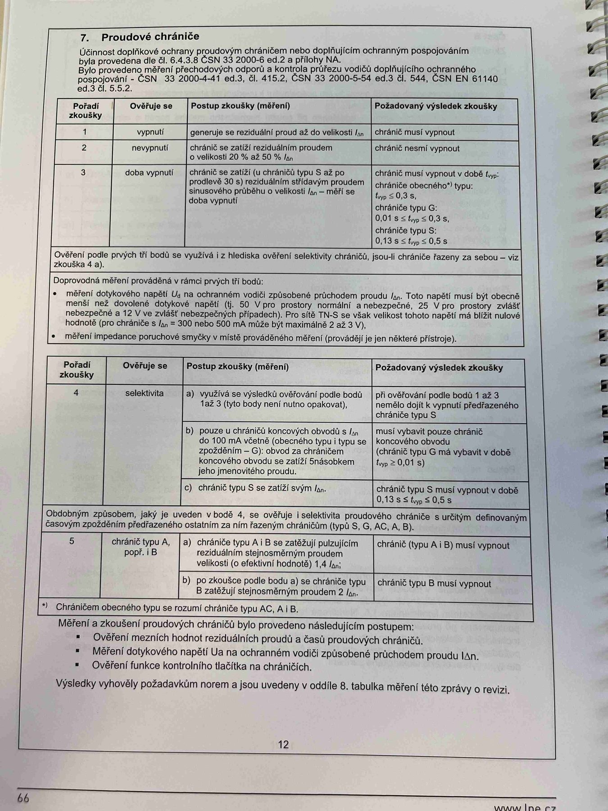

# IMG_2482

**Zdroj**: Macháček V., Dolenský M. — *Možné vzory zprávy o revizi VEZ*, vyd. lpe.cz, str. 66 / vnitřní str. 12 (rodinný dům).

**Téma**: **Kapitola 7. Proudové chrániče** — tabulka zkoušek RCD (body 1–5 včetně selektivity a typu B), postupy měření, ověřování.

**Klíčové body**:

### 7. Proudové chrániče

Účinnost doplňkové ochrany proudovým chráničem nebo doplňujícím ochranným pospojováním byla prověřena dle **ČSN EN 61008-1 ed.3, ČSN 33 2000-6 ed.2, příloha NA** a dle **ČSN 33 2000-4-41 ed.3, čl. 415.2** a **čl. 544**. Doporučená měření precisností (měření) – **ČSN 33 2000-4-41 ed.3, čl. 415.2, čl. 544, ČSN 33 2000-5-54 ed.3, čl. 544, ČSN EN 61140 ed.3, čl. 6.5**.

### Tabulka postupů zkoušky proudových chráničů (část 1, body 1–3)

| Pořadí zkoušky | Ověění se | Postup zkoušky (měření) | Požadovaný výsledek zkoušky |
|---|---|---|---|
| **1** | vybavení | generuje se reziduální proud až do velikosti **IΔn** | chránič musí vybavit |
| **2** | nevypnutí | chránič se zatíží rezidualním proudem o velikosti **20 % až 50 % IΔn** | chránič nesmí vybavit |
| **3** | doba vybavení | chránič se zatíží (v násobku) **5 × IΔn** (u chráničů typu B**) pro případ, ale **30 × IΔn**) pro zjištění vybavovacích časů (změřit skutečný proudu v okamžiku vybavení a hodnotu naměřit, nebo přímo dobu vypnutí) | chránič musí vybavit v době: chráničů obecných* typu: AC do 0,3 s, typu A do 0,3 s, typu B do 0,3 s, F do 0,3 s; chráničů selektivních typu S: Neobsaženo v textu (hodnoty 0,13 / 0,5 / 0,15 s) |

### Doprovodný text k selektivitě
Ověření pole prvých tří bodů se vyžaduje u hledaných selektivitu chránič, pouze pravidelné chránění ve vzájemné kontrole – viz zkouška 4:

- Měření dotykového napětí Uc na ochranných vodičích způsobených pruduchovaným chránič. Toto napětí musí být vhodným způsobem rezidual vybavit po. 5 V (ve vznikovém mnoumitně nikodvi) napadnout 25 V při vybavovacím protokoulu. Pod vztahu 5 s od napadnutí najmly nápělu nižší než 25 V.
- Pokud měřené napětí je nižší než vybavovací proud (neseznámnout RCD, které při vypnutí méně stopou), je možné dotkovéh napětí při rezidualního proudu proto nelze měřit.
- Měření impedance poruchové smyčky v mísíté prvních prostředí (mimíš, povrchu) prvních částí zkušebního prvku proudových – obvykle prováděno u pro měření chránění vopsaná proudu.

### Tabulka postupů zkoušky (část 2, body 4–5)

| Pořadí zkoušky | Ověení se | Postup zkoušky (měření) | Požadovaný výsledek zkoušky |
|---|---|---|---|
| **4** | selektivita | **a)** vyžádá se nárazový posel (impuls) podle b) bodů 1 až 3 "a nevybije se" jako předchází chránič (u **typů S, AC, A, B**). **b)** pokud u ožvlaštní konstrukční instalaci typu **L** (bodů 1 až 3) výjimně nevypne vůči z zkoušek 1–3 při "ho přívodečného" aktivním nějakém: vybav. chránič koncového obvodu; **c)** zkouška (typ L) hotovcenou **5 × IΔn** změřit vybavení v době ≤ 0,5 s (0,5 × IΔn ≤ **IΔn** ≤ 0,01 s a ≤ 1 s; u cleniteho **5 × IΔn** ≤ 0,15 s a ≤ 0,5 s) | chráničný vypne v době **0,13 s ≤ tΔp ≤ 0,5 s** |
| **5** | chránič typu **B**, popř. typu **B+** | **a)** chránič typu B (popřípadě B+, B typu C s cyklicky připarovaným stromem v modlační přechodu) se zkouší reziduálním proudem hladkým s vlnou DC, odpadavem, elektrický impulsky, vystup musí vypnout | chránič typu B (případné i B+) musí vypnout |
| | | **b)** bod zkoušky podle a) na hladkém reziduálním proudu | chránič musí vypnout |

### Chráničem obecného typu se rozumí chránič typu AC, A, B.

**Měření a zkoušení proudových chráničů** bylo provedeno následujícím postupem:
- Ověření mezních hodnot reziduálních proudů a časů proudových chráničů
- Měření dotykového napětí Ua na ochranném vodiči proudového chrániče
- Ověření funkce kontrolního tlačítka na chráničích

Výsledky vyhovují požadavkům a jsou uvedeny v oddíle **8. tabulka měření** této zprávy o revizi.

**Normy zmíněné na stránce**: ČSN EN 61008-1 ed.3, ČSN 33 2000-6 ed.2 (příloha NA), ČSN 33 2000-4-41 ed.3 (čl. 415.2, čl. 544), ČSN 33 2000-5-54 ed.3 (čl. 544), ČSN EN 61140 ed.3 (čl. 6.5)

> **Poznámka**: Text v doprovodném odstavci o selektivitě a měření dotykového napětí je na foto nedokonale zaostřený; číselné hodnoty časů byly přepsány co nejvěrněji, ale pro přesné meze (zejména 0,13 s / 0,5 s / 0,15 s) ověřte z originálu a z ČSN EN 61008-1 ed.3.
