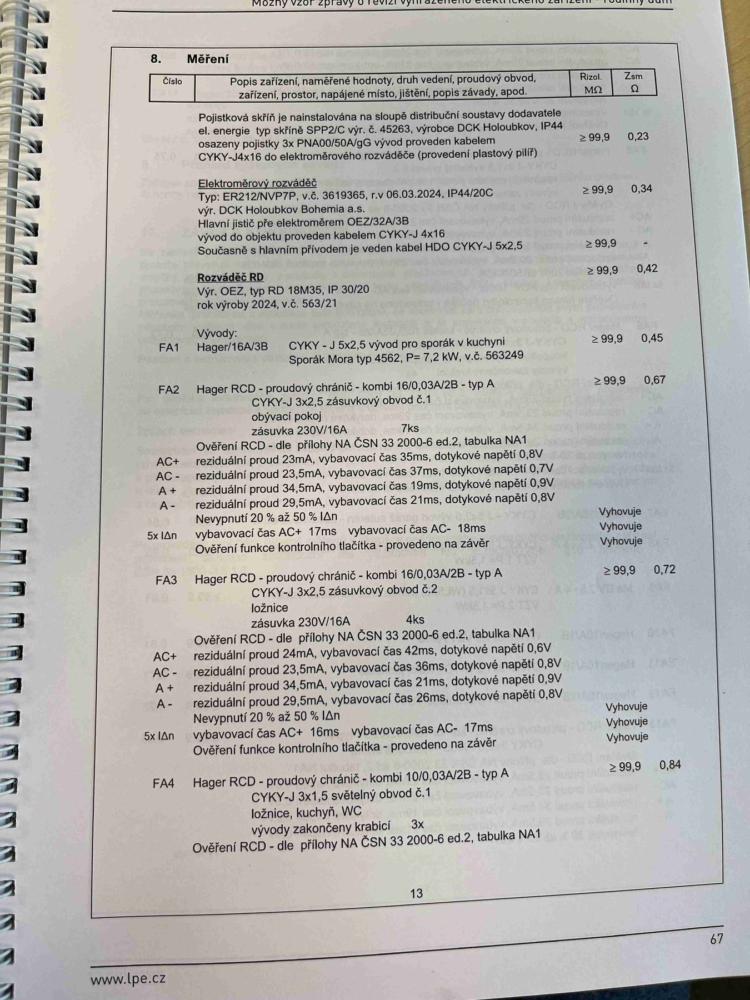

# IMG_2483

**Zdroj**: Macháček V., Dolenský M. — *Možné vzory zprávy o revizi VEZ*, vyd. lpe.cz, str. 67 / vnitřní str. 13 (rodinný dům).

**Téma**: **Kapitola 8. Měření** — hlavní tabulka naměřených hodnot revize rodinného domu. Obsahuje pojistkovou skříň, elektroměrový rozváděč, hlavní jistič, domovní rozváděč RD a vývody FA1–FA4 včetně ověření RCD.

**Klíčové body**:

### 8. Měření

Hlavičky tabulky: **Číslo | Popis zařízení, naměřené hodnoty, druh vedení, proudový obvod, zařízení, prostor, napájené místo, jištění, popis závady, apod. | Rizol. MΩ | Zsm Ω**

| Číslo | Popis zařízení | Rizol. [MΩ] | Zsm [Ω] |
|---|---|---|---|
| — | **Pojistková skříň** na sloupu distribuční soustavy dodavatele el. energie, typ skříně **SPP2/C**, výr. č. 45263, výrobce **DCK Holoubkov**, IP44, osazeny pojistkami **3× PNA00/50A/gG**, vývod proveden kabelem **CYKY-J 4×16** do elektroměrového rozváděče (provedení plastový pilíř) | ≥ 99,9 | 0,23 |
| — | **Elektroměrový rozváděč** — Typ: **ER212/NVP7P**, v.č. 3619365, r.v 06.03.2024, **IP44/20C**, výr. **DCK Holoubkov Bohemia a.s.** Hlavní jistič před elektroměrem **OEZ/32A/3B**, vývod do objektu proveden kabelem **CYKY-J 4×16**. Současně s hlavním přívodem je veden kabel HDO **CYKY-J 5×2,5** | ≥ 99,9 | 0,34 |
| — | **Rozváděč RD** — Výr. **OEZ**, typ **RD 18M35**, **IP 30/20**, rok výroby 2024, v.č. 563/21 | ≥ 99,9 | 0,42 |

### Vývody (obvody FA1–FA4)

| Obvod | Popis | Rizol. [MΩ] | Zsm [Ω] |
|---|---|---|---|
| **FA1** | **Hager/16A/3B** — **CYKY-J 5×2,5** vývod pro sporák v kuchyni; Sporák Mora typ 4562, P = 7,2 kW, v.č. 563249 | ≥ 99,9 | 0,45 |
| **FA2** | **Hager RCD — proudový chránič kombi 16/0,03 A/2B — typ A**, **CYKY-J 3×2,5**, zásuvkový obvod č. 1, obývací pokoj, zásuvka 230V/16A, 7ks | ≥ 99,9 | 0,67 |
| **FA3** | **Hager RCD — proudový chránič kombi 16/0,03 A/2B — typ A**, **CYKY-J 3×2,5**, zásuvkový obvod č. 2, ložnice, zásuvka 230V/16A, 4ks | ≥ 99,9 | 0,72 |
| **FA4** | **Hager RCD — proudový chránič kombi 10/0,03 A/2B — typ A**, **CYKY-J 3×1,5**, světelný obvod č. 1, ložnice, kuchyň, WC, vývody zakončeny krabicí 3× | (dále) | (dále) |

### Ověření RCD — dle přílohy NA ČSN 33 2000-6 ed.2, tabulka NA1

**FA2** (Hager RCD kombi 16/0,03 A/A):

| Pol. | Reziduální proud | Vybavovací čas | Dotykové napětí | Výsledek |
|---|---|---|---|---|
| AC+ | 23 mA | 35 ms | 0,8 V | Vyhovuje |
| AC− | 23,5 mA | 37 ms | 0,7 V | Vyhovuje |
| A+  | 34,5 mA | 19 ms | 0,9 V | Vyhovuje |
| A−  | 29,5 mA | 21 ms | 0,8 V | Vyhovuje |
| **Nevypnutí 20 % až 50 % IΔn** | — | — | — | Vyhovuje |
| **5× IΔn**: vybavovací čas AC+ 17 ms / AC− 18 ms | — | — | — | Vyhovuje |
| Ověření funkce kontrolního tlačítka — provedeno na závěr | — | — | — | Vyhovuje |

**FA3** (Hager RCD kombi 16/0,03 A/A):

| Pol. | Reziduální proud | Vybavovací čas | Dotykové napětí | Výsledek |
|---|---|---|---|---|
| AC+ | 24 mA | 42 ms | 0,6 V | Vyhovuje |
| AC− | 23,5 mA | 36 ms | 0,8 V | Vyhovuje |
| A+  | 34,5 mA | 21 ms | 0,9 V | Vyhovuje |
| A−  | 29,5 mA | 26 ms | 0,8 V | Vyhovuje |
| **Nevypnutí 20 % až 50 % IΔn** | — | — | — | Vyhovuje |
| **5× IΔn**: vybavovací čas AC+ 16 ms / AC− 17 ms | — | — | — | Vyhovuje |
| Ověření funkce kontrolního tlačítka | — | — | — | Vyhovuje |

**Normy zmíněné na stránce**: ČSN 33 2000-6 ed.2 (příloha NA, tabulka NA1)

> **Poznámka**: Tabulka měření obsahuje citlivá reálná data (typy přístrojů, výrobní čísla, proudové hodnoty). Slouží jako **vzor** pro strukturu reálné revizní zprávy; pro aplikaci revize-el je relevantní zejména struktura sloupců (`popis zařízení / Rizol MΩ / Zsm Ω`) a formát tabulky ověření RCD (AC+/AC−/A+/A−, reziduální proud, vybavovací čas, dotykové napětí).
