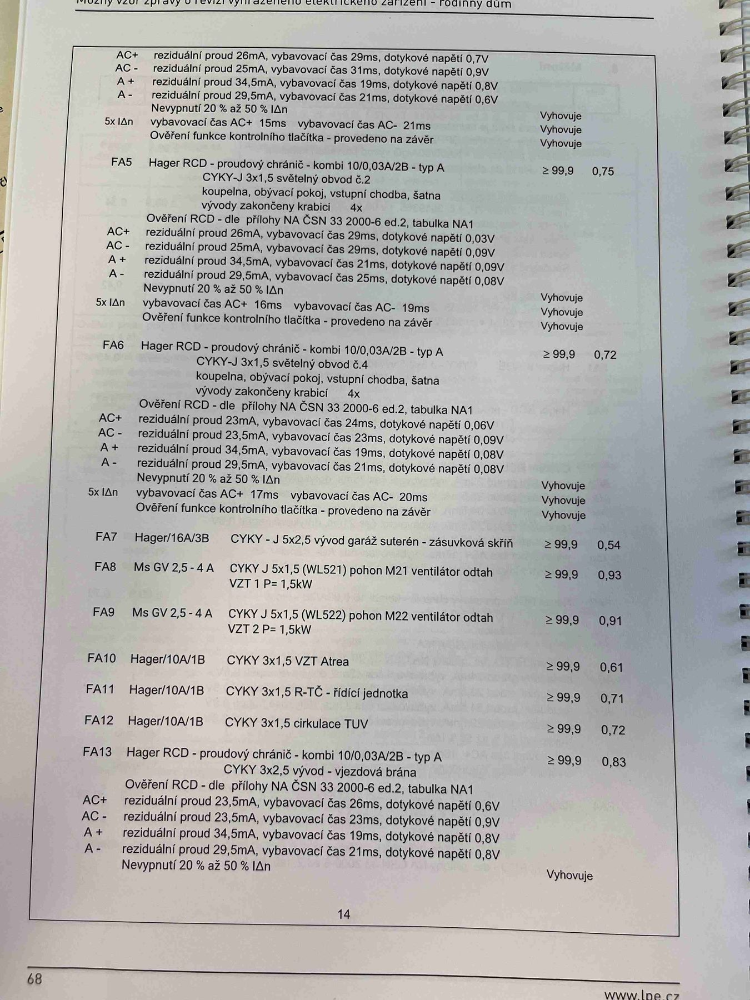

# IMG_2484

**Zdroj**: Macháček V., Dolenský M. — *Možné vzory zprávy o revizi VEZ*, vyd. lpe.cz, str. 68 / vnitřní str. 14 (rodinný dům).

**Téma**: Pokračování tabulky **8. Měření** — dokončení FA4, RCD obvody FA5/FA6, přímo jištěné obvody FA7–FA13 (zásuvková skříň, ventilátory VZT, Atrea, TČ, TUV), závěrečný RCD FA13 a ověření dle přílohy NA.

**Klíčové body**:

### Dokončení FA4 (RCD kombi 10/0,03 A/A — světelný obvod č. 1)

| Pol. | Reziduální proud | Vybavovací čas | Dotykové napětí | Výsledek |
|---|---|---|---|---|
| AC+ | 26 mA | 29 ms | 0,7 V | Vyhovuje |
| AC− | 25 mA | 31 ms | 0,9 V | Vyhovuje |
| A+  | 34,5 mA | 19 ms | 0,8 V | Vyhovuje |
| A−  | 29,5 mA | 21 ms | 0,6 V | Vyhovuje |
| **Nevypnutí 20 % až 50 % IΔn** | — | — | — | Vyhovuje |
| **5× IΔn**: vybavovací čas AC+ 15 ms / AC− 21 ms | — | — | — | Vyhovuje |
| Ověření funkce kontrolního tlačítka | — | — | — | Vyhovuje |

### FA5 (Hager RCD kombi 10/0,03 A/A — typ A)
**CYKY-J 3×1,5** světelný obvod č. 2 — koupelna, obývací pokoj, vstupní chodba, šatna; vývody zakončeny krabicí 4×. **R_izol ≥ 99,9 MΩ, Z_sm = 0,75 Ω**

Ověření RCD — dle přílohy NA ČSN 33 2000-6 ed.2, tabulka NA1:

| Pol. | Reziduální proud | Vybavovací čas | Dotykové napětí | Výsledek |
|---|---|---|---|---|
| AC+ | 26 mA | 29 ms | 0,03 V | Vyhovuje |
| AC− | 25 mA | 29 ms | 0,09 V | Vyhovuje |
| A+  | 34,5 mA | 21 ms | 0,09 V | Vyhovuje |
| A−  | 29,5 mA | 25 ms | 0,08 V | Vyhovuje |
| **Nevypnutí 20–50 % IΔn** | — | — | — | Vyhovuje |
| **5× IΔn**: vybavovací čas AC+ 16 ms / AC− 19 ms | — | — | — | Vyhovuje |
| Ověření funkce kontrolního tlačítka | — | — | — | Vyhovuje |

### FA6 (Hager RCD kombi 10/0,03 A/A — typ A)
**CYKY-J 3×1,5** světelný obvod č. 4 — koupelna, obývací pokoj, vstupní chodba, šatna; vývody zakončeny krabicí 4×. **R_izol ≥ 99,9 MΩ, Z_sm = 0,72 Ω**

| Pol. | Reziduální proud | Vybavovací čas | Dotykové napětí | Výsledek |
|---|---|---|---|---|
| AC+ | 23 mA | 24 ms | 0,06 V | Vyhovuje |
| AC− | 23,5 mA | 23 ms | 0,09 V | Vyhovuje |
| A+  | 34,5 mA | 19 ms | 0,08 V | Vyhovuje |
| A−  | 29,5 mA | 21 ms | 0,08 V | Vyhovuje |
| **Nevypnutí 20–50 % IΔn** | — | — | — | Vyhovuje |
| **5× IΔn**: vybavovací čas AC+ 17 ms / AC− 20 ms | — | — | — | Vyhovuje |
| Ověření funkce kontrolního tlačítka | — | — | — | Vyhovuje |

### Další vývody FA7–FA12

| Obvod | Jištění | Kabel | Popis | R_izol [MΩ] | Z_sm [Ω] |
|---|---|---|---|---|---|
| **FA7** | Hager/16A/3B | CYKY-J 5×2,5 | vývod garáž suterén — zásuvková skříň | ≥ 99,9 | 0,54 |
| **FA8** | Ms GV 2,5 – 4 A | CYKY-J 5×1,5 (WL521) | pohon M21, ventilátor odtah VZT 1, P = 1,5 kW | ≥ 99,9 | 0,93 |
| **FA9** | Ms GV 2,5 – 4 A | CYKY-J 5×1,5 (WL522) | pohon M22, ventilátor odtah VZT 2, P = 1,5 kW | ≥ 99,9 | 0,91 |
| **FA10** | Hager/10A/1B | CYKY 3×1,5 | **VZT Atrea** | ≥ 99,9 | 0,61 |
| **FA11** | Hager/10A/1B | CYKY 3×1,5 | **R-TČ** — řídicí jednotka | ≥ 99,9 | 0,71 |
| **FA12** | Hager/10A/1B | CYKY 3×1,5 | cirkulace **TUV** | ≥ 99,9 | 0,72 |

### FA13 (Hager RCD kombi 10/0,03 A/A — typ A)
**CYKY 3×2,5** — vývod vjezdová brána. **R_izol ≥ 99,9 MΩ, Z_sm = 0,83 Ω**

Ověření RCD — dle přílohy NA ČSN 33 2000-6 ed.2, tabulka NA1:

| Pol. | Reziduální proud | Vybavovací čas | Dotykové napětí | Výsledek |
|---|---|---|---|---|
| AC+ | 23,5 mA | 26 ms | 0,6 V | Vyhovuje |
| AC− | 23,5 mA | 23 ms | 0,9 V | Vyhovuje |
| A+  | 34,5 mA | 19 ms | 0,8 V | Vyhovuje |
| A−  | 29,5 mA | 21 ms | 0,8 V | Vyhovuje |
| **Nevypnutí 20–50 % IΔn** | — | — | — | Vyhovuje |

**Normy zmíněné na stránce**: ČSN 33 2000-6 ed.2 (příloha NA, tabulka NA1)
