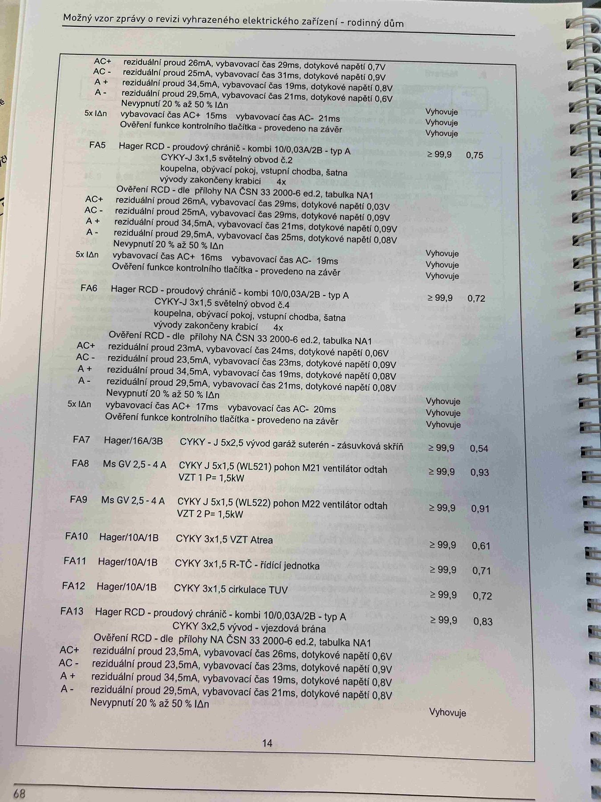

# IMG_2485

**Zdroj**: Macháček V., Dolenský M. — *Možné vzory zprávy o revizi VEZ*, vyd. lpe.cz, str. 68 / vnitřní str. 14 (rodinný dům).

**Stav**: **Vizuální duplikát / druhý záběr téže strany jako IMG_2484** (mírně odlišný úhel a oříz).

**Téma**: Pokračování tabulky **8. Měření** — dokončení FA4, RCD obvody FA5/FA6, přímo jištěné obvody FA7–FA13 a závěrečný RCD FA13 s ověřením.

**Klíčové body**:

Obsah strany je **totožný** s [IMG_2484](IMG_2484.md) — pro plný přepis tabulek (FA4 dokončení, FA5, FA6, FA7–FA13, FA13 ověření RCD) viz odkaz. Hlavní hodnoty:

- FA5 (RCD kombi 10/0,03 A/A) — Z_sm = 0,75 Ω, všechny zkoušky vyhovují
- FA6 (RCD kombi 10/0,03 A/A) — Z_sm = 0,72 Ω, všechny zkoušky vyhovují
- FA7 (zásuvková skříň garáž) — Z_sm = 0,54 Ω
- FA8/FA9 (ventilátory VZT 1,5 kW přes motorový spouštěč Ms GV 2,5–4 A) — Z_sm = 0,93 / 0,91 Ω
- FA10 (VZT Atrea) — Z_sm = 0,61 Ω
- FA11 (řídicí jednotka TČ) — Z_sm = 0,71 Ω
- FA12 (cirkulace TUV) — Z_sm = 0,72 Ω
- FA13 (RCD vjezdová brána) — Z_sm = 0,83 Ω

Izolační odpor R_izol ≥ 99,9 MΩ pro všechny vývody.

**Normy zmíněné na stránce**: ČSN 33 2000-6 ed.2 (příloha NA, tabulka NA1)

> Duplicitní záběr je v literatuře ponechán pro úplnost (stejný typ je v PR #3 dvakrát u IMG_2493/IMG_2493_2 — pravděpodobně autor focení pořídil dvě verze pro jistotu).
