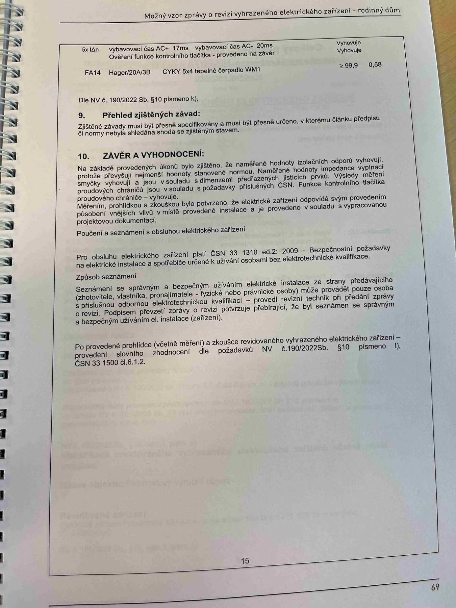

# IMG_2486

**Zdroj**: Macháček V., Dolenský M. — *Možné vzory zprávy o revizi VEZ*, vyd. lpe.cz, str. 69 / vnitřní str. 15 (rodinný dům).

**Téma**: Dokončení tabulky měření (FA14), **kapitola 9. Přehled zjištěných závad** a **kapitola 10. Závěr a vyhodnocení** revize rodinného domu.

**Klíčové body**:

### Dokončení tabulky měření

| Obvod | Popis | R_izol [MΩ] | Z_sm [Ω] |
|---|---|---|---|
| (pokračování RCD z předchozí strany) **5× IΔn** AC+ 17 ms / AC− 20 ms | — | Vyhovuje | — |
| Ověření funkce kontrolního tlačítka — provedeno na závěr | — | Vyhovuje | — |
| **FA14** | **Hager/20A/3B**, **CYKY 5×4** — tepelné čerpadlo WM1 | ≥ 99,9 | 0,58 |

Dle **NV č. 190/2022 Sb. § 10 písm. k)**.

### 9. Přehled zjištěných závad
Zjištěné závady musí být přesně specifikovány a musí být přesně určeno, v kterém článku předpisu či normy nebyla shledána shoda se zjištěným stavem.

### 10. ZÁVĚR A VYHODNOCENÍ
Na základě provedených úkonů bylo zjištěno, že **naměřené hodnoty izolačních odporů vyhovují**, protože převyšují nejmenší hodnoty stanovené normou. **Naměřené hodnoty impedance vypínací smyčky vyhovují** a jsou v souladu s dimenzemi předřazených jisticích prvků. Výsledky měření proudových chráničů jsou v souladu s požadavky příslušných ČSN. Funkce kontrolního tlačítka proudového chrániče — vyhovuje.

Měřením, prohlídkou a zkouškou bylo potvrzeno, že elektrické zařízení odpovídá svým provedením působení vnějších vlivů v místě provedené instalace a je provedeno v souladu s vypracovanou projektovou dokumentací.

### Poučení a seznámení s obsluhou elektrického zařízení
Pro obsluhu elektrického zařízení platí **ČSN 33 1310 ed.2 : 2009** — Bezpečnostní požadavky na elektrické instalace a spotřebiče určené k užívání osobami bez elektrotechnické kvalifikace.

### Způsob seznámení
Seznámení se správným a bezpečným užíváním elektrické instalace ze strany předávajícího (zhotovitele, vlastníka, pronajímatele — fyzické nebo právnické osoby) může provádět pouze osoba s příslušnou odbornou elektrotechnickou kvalifikací — provedl revizní technik při předání zprávy o revizi. Podpisem převzetí zprávy o revizi potvrzuje přebírající, že byl seznámen se správným a bezpečným užíváním el. instalace (zařízení).

### Závěrečné slovní zhodnocení
Po provedené prohlídce (včetně měření) a zkoušce revidovaného vyhrazeného elektrického zařízení — provedení slovního zhodnocení dle požadavků **NV č. 190/2022 Sb. § 10 písm. l)**, **ČSN 33 1500 čl. 6.1.2**.

**Normy zmíněné na stránce**: NV č. 190/2022 Sb. (§ 10 písm. k, l), ČSN 33 1310 ed.2 : 2009, ČSN 33 1500 (čl. 6.1.2)
