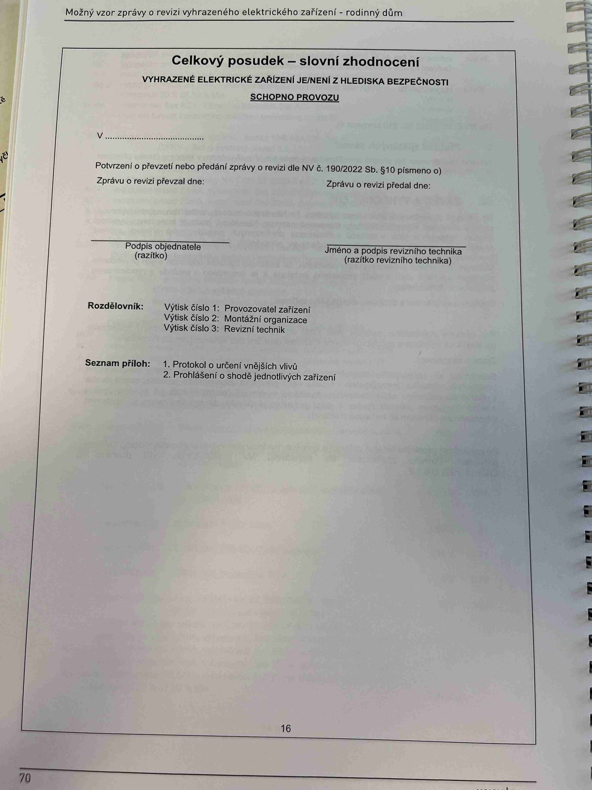

# IMG_2487

**Zdroj**: Macháček V., Dolenský M. — *Možné vzory zprávy o revizi VEZ*, vyd. lpe.cz, str. 70 / vnitřní str. 16 (rodinný dům).

**Téma**: **Celkový posudek — slovní zhodnocení** — závěrečná (podpisová) strana vzorové zprávy o revizi pro rodinný dům.

**Klíčové body**:

### Celkový posudek — slovní zhodnocení

**VYHRAZENÉ ELEKTRICKÉ ZAŘÍZENÍ JE/NENÍ Z HLEDISKA BEZPEČNOSTI SCHOPNO PROVOZU**

V ____________________________ (místo a datum)

**Potvrzení o převzetí nebo předání zprávy o revizi dle NV č. 190/2022 Sb. § 10 písmeno o)**
- Zprávu o revizi převzal dne: ____
- Zprávu o revizi předal dne: ____

Podpis:
- **Podpis objednatele (razítko)**
- **Jméno a podpis revizního technika (razítko revizního technika)**

### Rozdělovník
- **Výtisk číslo 1**: Provozovatel zařízení
- **Výtisk číslo 2**: Montážní organizace
- **Výtisk číslo 3**: Revizní technik

### Seznam příloh
1. **Protokol o určení vnějších vlivů**
2. **Prohlášení o shodě jednotlivých zařízení**

**Normy zmíněné na stránce**: NV č. 190/2022 Sb. (§ 10 písmeno o)
