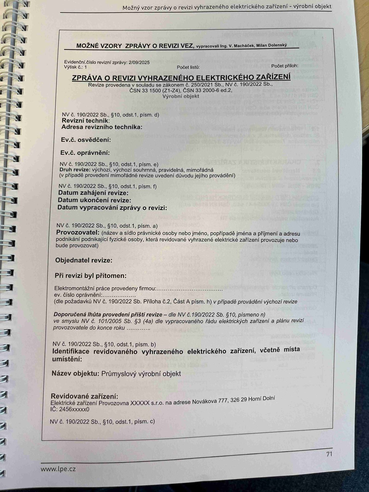

# IMG_2488

**Zdroj**: Macháček V., Dolenský M. — *Možné vzory zprávy o revizi VEZ*, vyd. lpe.cz, str. 71 (titulní strana vzoru pro **výrobní objekt** / průmyslovou provozovnu). Evidenční číslo revizní zprávy: 2/09/2025, výtisk č. 1.

**Téma**: Úvodní (titulní) strana vzoru "Zpráva o revizi vyhrazeného elektrického zařízení" pro průmyslový výrobní objekt — seznam povinných úvodních údajů dle NV č. 190/2022 Sb. § 10.

**Klíčové body**:
- Revize provedena v souladu se zákonem č. 250/2021 Sb., NV č. 190/2022 Sb., ČSN 33 1500 (Z1–Z4), ČSN 33 2000-6 ed.2. Objekt: **Průmyslový výrobní objekt**.
- **§ 10 odst. 1 písm. d)** — Revizní technik, Adresa revizního technika, Ev. č. osvědčení, Ev. č. oprávnění
- **§ 10 odst. 1 písm. e)** — Druh revize: výchozí / výchozí souhrnná / pravidelná / mimořádná (v případě mimořádné uvedení důvodu provádění)
- **§ 10 odst. 1 písm. f)** — Datum zahájení revize, Datum ukončení revize, Datum vypracování zprávy o revizi
- **§ 10 odst. 1 písm. a)** — Provozovatel (název a sídlo právnické osoby nebo jméno a adresa podnikající fyzické osoby)
- Objednatel revize, Při revizi byl přítomen, Elektromontážní práce provedeny firmou, ev. číslo oprávnění (dle požadavků NV č. 190/2022 Sb. Příloha č. 2, Část A písm. h) v případě provádění výchozí revize)
- **Doporučená lhůta provedení příští revize** — dle NV č. 190/2022 Sb. § 10 písm. n), ve smyslu NV č. 101/2005 Sb. § 3 (4a) dle vypracovaného řádu elektrických zařízení a plánu revizí provozovatele do konce roku ...
- **§ 10 odst. 1 písm. b)** — Identifikace revidovaného vyhrazeného elektrického zařízení, včetně místa umístění. Název objektu: **Průmyslový výrobní objekt**
- **Revidované zařízení**: Elektrické zařízení Provozovna XXXXX s.r.o. na adrese Nováková 777, 326 29 Horní Dolní, IČ: 2456xxxxx0
- **§ 10 odst. 1 písm. c)** — vymezení rozsahu revize (pokračuje dále)

**Normy zmíněné na stránce**: zákon č. 250/2021 Sb., zákon č. 101/2005 Sb. (§ 3 (4a)), NV č. 190/2022 Sb. (§ 10 odst. 1 písm. a, b, c, d, e, f, h, n), ČSN 33 1500 (Z1–Z4), ČSN 33 2000-6 ed.2
