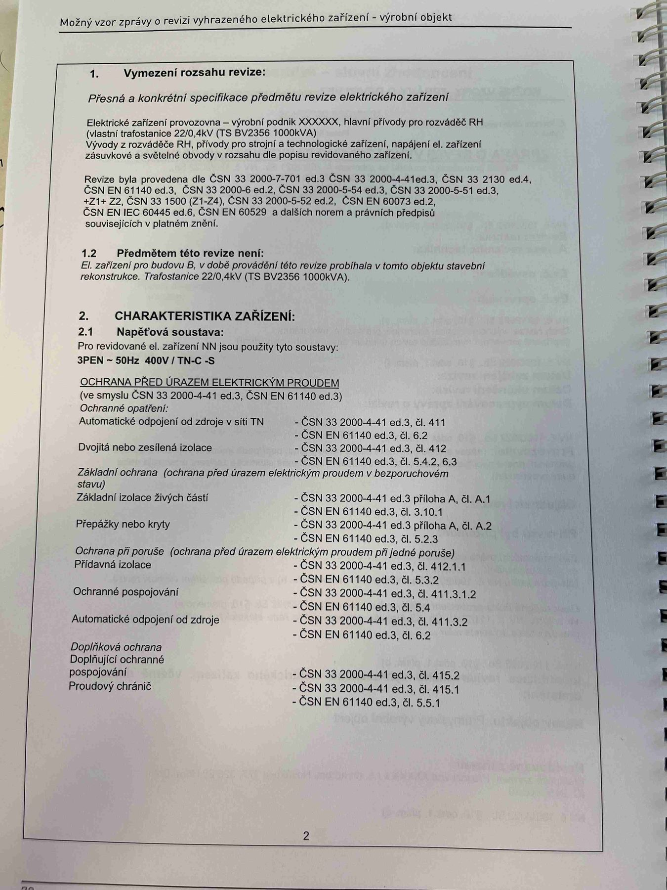

# IMG_2489

**Zdroj**: Macháček V., Dolenský M. — *Možné vzory zprávy o revizi VEZ*, vyd. lpe.cz, str. 72 / vnitřní str. 2 (**výrobní objekt**).

**Téma**: Vymezení rozsahu revize výrobního objektu + tabulka napěťové soustavy a ochranných opatření pro průmyslovou instalaci.

**Klíčové body**:

### 1. Vymezení rozsahu revize (NV č. 190/2022 Sb. § 10 odst. 1 písm. c)
"Přesná a konkrétní specifikace předmětu revize elektrického zařízení"

- Elektrické zařízení provozovny — **výrobní podnik XXXXXX**, hlavní přívody pro rozváděč **RH** (vlastní trafostanice **22/0,4 kV (TS BV2356 1000 kVA)**)
- Vývody z rozváděče **RH**, přívody pro strojní a technologické zařízení, napájení el. zařízení, zásuvkové a světelné obvody v rozsahu dle popisu revidovaného zařízení
- Revize byla provedena dle: ČSN 33 2000-7-701 ed.3, ČSN 33 2000-4-41 ed.3, ČSN 33 2130 ed.4, ČSN EN 61140 ed.3, ČSN 33 2000-6 ed.2, ČSN 33 2000-5-54 ed.3, ČSN 33 2000-5-51 ed.3 +Z1+Z2, ČSN 33 1500 (Z1–Z4), ČSN 33 2000-5-52 ed.2, ČSN EN 60073 ed.2, ČSN EN IEC 60445 ed.6, ČSN EN 60529

### 1.2 Předmětem této revize není
El. zařízení pro budovu B, v době provádění této revize probíhala v tomto objektu stavební rekonstrukce. Trafostanice 22/0,4 kV (TS BV2356 1000 kVA).

### 2. CHARAKTERISTIKA ZAŘÍZENÍ
**2.1 Napěťová soustava**: Pro revidované el. zařízení NN jsou použity tyto soustavy:
- **3PEN ~ 50 Hz 400 V / TN-C-S**

### OCHRANA PŘED ÚRAZEM ELEKTRICKÝM PROUDEM
(ve smyslu ČSN 33 2000-4-41 ed.3, ČSN EN 61140 ed.3)

Ochranná opatření:

| Opatření | ČSN 33 2000-4-41 ed.3 | ČSN EN 61140 ed.3 |
|---|---|---|
| Automatické odpojení od zdroje v síti TN | čl. 411 | čl. 6.2 |
| Dvojitá nebo zesílená izolace | čl. 412 | čl. 5.4.2, 6.3 |

**Základní ochrana** (ochrana před úrazem elektrickým proudem v bezporuchovém stavu):

| | ČSN 33 2000-4-41 ed.3 | ČSN EN 61140 ed.3 |
|---|---|---|
| Základní izolace živých částí | Příloha A, čl. A.1 | čl. 3.10.1 |
| Přepážky nebo kryty | Příloha A, čl. A.2 | čl. 5.2.3 |

**Ochrana při poruše** (ochrana před úrazem elektrickým proudem při jedné poruše):

| | ČSN 33 2000-4-41 ed.3 | ČSN EN 61140 ed.3 |
|---|---|---|
| Přídavná izolace | čl. 412.1.1 | čl. 5.3.2 |
| Ochranné pospojování | čl. 411.3.1.2 | čl. 5.4 |
| Automatické odpojení od zdroje | čl. 411.3.2 | čl. 6.2 |

**Doplňková ochrana**:

| | ČSN 33 2000-4-41 ed.3 | ČSN EN 61140 ed.3 |
|---|---|---|
| Doplňující ochranné pospojování | čl. 415.2 | — |
| Proudový chránič | čl. 415.1 | čl. 5.5.1 |

**Normy zmíněné na stránce**: NV č. 190/2022 Sb. (§ 10 odst. 1 písm. c), ČSN 33 2000-7-701 ed.3, ČSN 33 2000-4-41 ed.3 (čl. 411, 411.3.1.2, 411.3.2, 412, 412.1.1, 415.1, 415.2, příloha A), ČSN 33 2130 ed.4, ČSN EN 61140 ed.3 (čl. 3.10.1, 5.2.3, 5.3.2, 5.4, 5.4.2, 5.5.1, 6.2, 6.3), ČSN 33 2000-6 ed.2, ČSN 33 2000-5-54 ed.3, ČSN 33 2000-5-51 ed.3 +Z1+Z2, ČSN 33 1500 (Z1–Z4), ČSN 33 2000-5-52 ed.2, ČSN EN 60073 ed.2, ČSN EN IEC 60445 ed.6, ČSN EN 60529

> **Poznámka**: Pro výrobní objekt (na rozdíl od rodinného domu v IMG_2471) se používá pouze **3PEN 400V / TN-C-S** soustava (bez 1NPE 230V).
