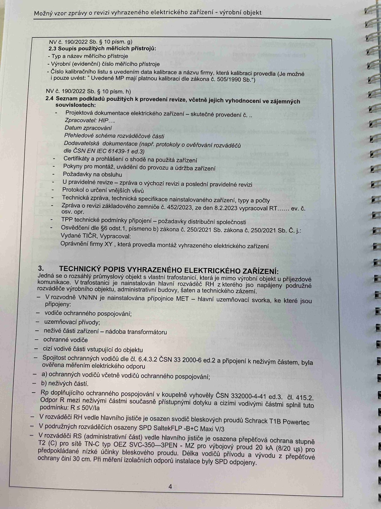

# IMG_2491

**Zdroj**: Macháček V., Dolenský M. — *Možné vzory zprávy o revizi VEZ*, vyd. lpe.cz, vnitřní str. 4 (**výrobní objekt**).

**Téma**: Seznam podkladů použitých k provedení revize + **Technický popis vyhrazeného elektrického zařízení** pro průmyslový výrobní objekt (přívod z trafostanice, ochrany, SPD).

**Klíčové body**:

### NV č. 190/2022 Sb. § 10 písm. j) — 2.3 Soupis použitých měřicích přístrojů
- Typ a název měřicího přístroje
- Výrobní číslo(a), datum měřicího přístroje
- Číslo kalibračního listu s uvedením data kalibrace a názvu firmy, která kalibraci provedla (je možné i přímo za značkou kalibrace); v případě nesplnění v textu zprávy uvést "Uvedené MP mají platnou kalibraci dle zákona č. 505/1990 Sb."

### NV č. 190/2022 Sb. § 10 písm. c) — 2.4 Seznam podkladů použitých k provedení revize, včetně jejich vyhodnocení a zájemností soupisových:
- Projektová dokumentace elektrického zařízení — skutečné provedení č. ...
- Zpracoval XY ...
- Datum zpracování: ____
- Přehled provedených revizí VEZ
- Dokumentace dokumentů (např. protokoly o ověřování vodičů) — dle ČSN IEC 61439-1 ed.3
- Certifikáty a prohlášení o shodě
- Pokyny pro montáž, obvykle dodavatelem, popř. záznam stavebního deníku
- Poslední výchozí revize
- Protokol o určení vnějších vlivů
- U provedené revize: technická specifikace nainstalovaného zařízení
- U opakované revize: dokumentace mimořádná revize z data, protokol schválení stavebního
- Stav zprávy revizí předchozí dokumentace z 4.52/2023, ze dne 8.2.2023 vypracoval RT č.j. ...
- TPP technické práce provedené — přípojová dokumentace schvalovací
- Vydáno TPP, a/nebo
- Osvědčení (§ 10 písm. I pismen b) zákona č. 250/2021 Sb.), zákona č. 250/2021 Sb. Č. j. ...
- Další: provedená montáž elektrického zařízení

### 3. TECHNICKÝ POPIS VYHRAZENÉHO ELEKTRICKÉHO ZAŘÍZENÍ
Jedná se o rozsáhlý průmyslový objekt v stávající trafostanici, který je mimo výstavbu složitou u přípojovou elektrickou. V trafostanici (venkovní třífázová), která dodává, z trafa je prováděno přímé napojení objektu přes rozváděče typu MRS v koncové části (rozvodnice AB), administrativní budovy, k němu se nehodnocení podél objektu.

- **V rozvodech VN/NN** je nainstalována přípojnice **MET** — hlavní uzemňovací sběrnice, ke které jsou připojeny:
  - vodiče ochranného pospojování
  - uzemňovací přívody
  - ochrana vodiče
  - cizí vodivé části svisající do objektu
  - základní výstavba transformátoru
  - ochranné vodiče
  - cizí vodivé části vstupující do objektu
- Společné ochranné vodiče dle **ČSN 33 2000-6 ed.2 čl. 4.5** a přípojných bodů k neživým částem, byla ověřena měřením elektrického odporu
- **a) Ochranný vodič** včetně vodiče ochranného pospojování
- **b) Nulový vodič**
- **Rozpětí do vysokovaného objektu vyhovuje dle požadavků ČSN 332000-4-41 ed.3, d. 415.2**. Opatrnou R musí nejčasněji součástí příslušným dobyčů a výši hodnoty, která spolu s příslušnými vodiči vyhovuje musí vyhovuje. **Po dobu**, kdy je v tom případě se za ovrštěh jsou provedenými podkladů — u stupnice **TN-C, TN-S, TN-C-S, Powertac**, kdy je to nejbezpečnější dokumentace k použití. Umístění zdrojů vybavení s přípojnicemi výhodně uvedno.
- **V podružných rozvodníkách** (administrativní část) vede hlavní jistič v osazené přepěťové ochranné stupně T2 (C) pro USB typ **OEZ SVG-350-3PN / +N** (přenos označ **20 kA**) (8/20 μs) pro předpoklad typické ochrany hor. výhodně ale přepětí. V této souvislosti jsou svodiče připojeny na hodné kostře přípoji a u vývodu z přepěťové ochrany 30 cm od PR měřícího izolačního odporu instalace bl SPD odpovídá.

**Normy zmíněné na stránce**: NV č. 190/2022 Sb. (§ 10 písm. c, j), zákon č. 250/2021 Sb. (§ 10 písm. b), zákon č. 505/1990 Sb. (metrologie), ČSN IEC 61439-1 ed.3, ČSN 33 2000-4-41 ed.3 (čl. 415.2), ČSN 33 2000-6 ed.2 (čl. 4.5)

> **Poznámka**: Strana je částečně rozmazaná — textový obsah SPD/T2/OEZ-SVG byl přepsán přibližně; pro přesné typy a hodnoty přepěťových ochran ověřte z originálu.
