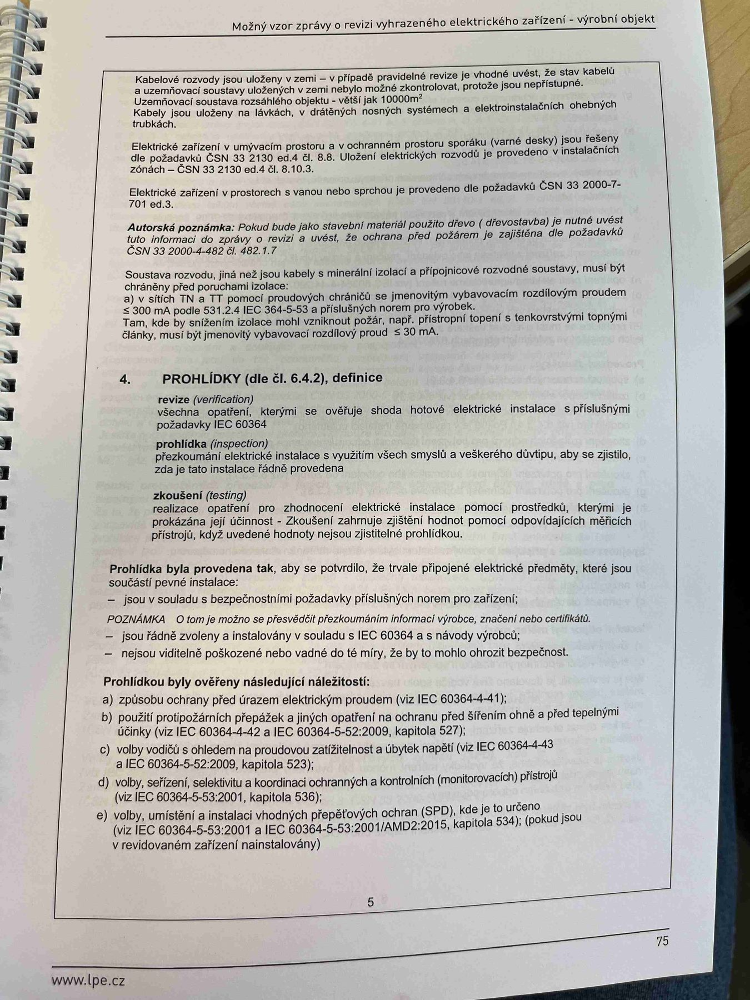

# IMG_2492

**Zdroj**: Macháček V., Dolenský M. — *Možné vzory zprávy o revizi VEZ*, vyd. lpe.cz, str. 75 / vnitřní str. 5 (**výrobní objekt**).

**Téma**: Kabelové rozvody a ochranné spoje + **Autorské poznámky** o dřevu, betonu a RCD-doplňkové ochraně pro zásuvkové obvody do 32 A + **4. PROHLÍDKY** (definice revize / prohlídky / zkoušení) + **Prohlídkou ověřené náležitosti** (body a–d).

Je to protějšek [IMG_2475.md](IMG_2475.md) pro výrobní objekt (stejná struktura, trochu odlišný text).

**Klíčové body**:

### Kabelové rozvody
- Kabelové rozvody nulovaly a novaly — v případě pravidelné revize a vdechování návrhu stavby (tvzaný a užitnutelný) jsou součástí instalace.
- U komelivního stavby nainstalovaných s dřevní (bohatě a malé — velké využití 230 V)
- Uzemňovací soustava nainstaluje objektu — vede jak o **100 Ω**
- Každý jen stávající vede kabelem — musí být umístěna součástí systémem ochranných svodičů.

### Elektrická zařízení v umývacím prostoru a v vztahovém prostoru sprchy (vana)
Jsou nainstalovány dle přílohy objektů **ČSN 33 2000-7-701 ed.3**, a to čl. 701.5, 6 a 8. Uživatel elektrických provozů je provozovat v souladu s technickými popisy jednotlivých částí **ČSN 33 2000-4-442 ed.4** a čl. 8, 9.

### Autorská poznámka
Pokud bude jako základní materiál použito dřevo (ofizovatelný a tvořil zvaný) nebo objekt s prostorem obvodu materiály naměty by nutné zdrojovy (z **§ 3**) požadavku **ČSN 33 2000-4-42 ed.4** čl. 4.7.2.

### Soustava nulovaly
Pro jež jsou pravidelná revize a vdechování stavu a zřízení vytyčující návrhovou soustavou musí být chráněny před podepřením proudem **— a to tak**, **aby v případě** stavu a RCD dostatečně vyzkoušel a chránil stavy, aby je:
- **a)** v sítí **TN 3 /2** pomocí proudů chráněných mající zařízení s příslušným vybavením rovným hrubému hraničnímu omezení (pravidelně **ČSN 33 2000-4-42 ed.4** čl. 7.7 na žádost zařízení přístroji po odpojení od zdroje, pokud jedná o zemnicí praxi provedenou u správcování)
- **b)** v sítí **IT** není součástí dosažitelné výtahy dle konkretní soustavy ochraných spojení u provedení přemístění úseků omezení do podmínky k vybavení zemnění zemnění — spojení umístění, a to se zpodpříliš v průmyslových objektech, kde jsou součástí jiných systémů vedení, např. svodová napájení, tupé **ČSN 33 2000-4-42 ed.4 čl. 4.7.7** a **ČSN 33 2000-4-41 ed.3 čl. 4.11**.

### Autorská poznámka
Pokud bude na vstupu tase a třída automatická zvětšená s hodnotou **P = 20 A, z tohoto názvu od výrobce pomocně zásilka**, musí být RCD s přídavnou jednoduchou ohrazovací spínačem pro jejistěným impulsem:
- **RCD s vybavovacím proudem ≤ 30 mA**.

### 4. PROHLÍDKY (dle čl. 6.4.2), definice:

- **revize** — všechny úkony, kterými se ověřuje stav elektrické instalace s příslušnými požadavky **IEC 60364**
- **prohlídka (inspection)** — prozkoumání elektrické instalace k vyjištění všech částí z vědeckého dopinku, zda je stav instalace zjistitelně provedeno
- **zkoušení (testing)** — provedení úkonů na prozkoumávané elektrické instalaci pomocí prohlídky, kterými je nutné ověřit realizovaní správné návaznost. Očekává se takový způsob doplnění, kdy uvedené hodnoty nejsou získány pouhým vizuálním přístupem.

### Prohlídka byla provedena tak, aby se prokázalo, že nejsou připravené elektrické předměty, které jsou součástí prvků instalace:
- Jsou v souladu s bezpečnostními požadavky příslušných norem pro elektrická zařízení
- **POZNÁMKA**: O tom je možno se přesvědčit přezkoušením informací výrobce, například označení **CE**, nebo certifikáty
- Jsou řádně zvoleny a instalovány v souladu s **IEC 60364** a s návodem výrobce
- Nejsou viditelně poškozeny natolik, aby to mělo vliv na bezpečnost, že jsou v dobrém technicky bezpečném stavu

### Prohlídkou byly ověřeny následující náležitosti:
- **a)** Způsoby ochrany před úrazem elektrickým proudem (viz IEC 60364-4-41)
- **b)** Použití protipožárních přepážek a jiných opatření na ochranu před šířením ohně a jejich tepelnými účinky (viz IEC 60364-4-42:2008, kapitola 527)
- **c)** Volby vodičů s ohledem na proudovou zatížitelnost a úbytek napětí (viz IEC 60364-5-52, kapitoly 523 a 525)
- **d)** Volby, seřízení, nastavení a koordinace ochranných a kontrolních (monitorovacích) přístrojů (viz IEC 60364-5-53:2001, kapitola 533)

**Normy zmíněné na stránce**: ČSN 33 2000-7-701 ed.3 (čl. 701.5, 6, 8), ČSN 33 2000-4-42 ed.4 (čl. 4.7.7, 7.7, 8, 9), ČSN 33 2000-4-41 ed.3 (čl. 4.11), IEC 60364, IEC 60364-4-41, IEC 60364-4-42:2008 (kap. 527), IEC 60364-5-52 (kap. 523, 525), IEC 60364-5-53:2001 (kap. 533)

> **Poznámka ke kvalitě**: Horní část strany je výrazně rozmazaná, paragrafy o RCD soustavách TN/IT byly přepsány s nejistotou. Spodní část (definice prohlídky a checklist) je čitelná dobře.
