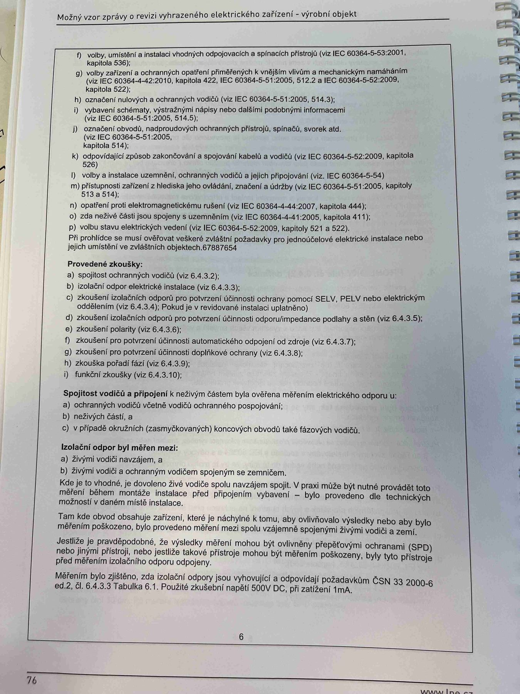

# IMG_2493

**Zdroj**: Macháček V., Dolenský M. — *Možné vzory zprávy o revizi VEZ*, vyd. lpe.cz, str. 76 / vnitřní str. 6 (**výrobní objekt**).

**Téma**: Pokračování prohlídky (body f–p) + **Provedené zkoušky** (a–i) + **Spojitost vodičů a připojení k neživým částem** + **Izolační odpor** pro průmyslovou instalaci.

Obsah strany je **identický** s [IMG_2493_2](IMG_2493_2.md) (druhý záběr téže strany). Pro plný přepis tabulek a bodů viz výše. Hlavní obsah zopakován níže pro samostatnou grep-ovatelnost.

**Klíčové body**:

### Pokračování prohlídky (body f–p)
- **f)** volby, umístění a instalaci vhodných odpojovacích a spínacích přístrojů (IEC 60364-5-53:2001, kap. 536)
- **g)** volby zařízení a ochranných opatření přiměřených k vnějším vlivům a mechanickým namáháním (IEC 60364-4-42:2010 kap. 422, IEC 60364-5-51:2005, 512.2, IEC 60364-5-52:2009 kap. 522)
- **h)** označení nulových a ochranných vodičů (IEC 60364-5-51:2005, 514.3)
- **i)** vybavení schématy, výstražnými nápisy nebo jinými podobnými informacemi (IEC 60364-5-51:2005, 514.5)
- **j)** označení obvodů, nadproudových ochranných přístrojů, spínačů, svorek atd. (IEC 60364-5-51:2005, kap. 514)
- **k)** odpovídající způsob zakončování a spojování kabelů a vodičů (IEC 60364-5-52:2009, kap. 526)
- **l)** volby a instalace uzemnění, ochranných vodičů a jejich připojení (IEC 60364-5-54)
- **m)** přístupnost zařízení z hlediska jeho ovládání, značení a údržby (IEC 60364-5-51:2005, kap. 513 a 514)
- **n)** opatření proti elektromagnetickému rušení (IEC 60364-4-44:2007, kap. 444)
- **o)** zda neživé části jsou spojeny s uzemněním (IEC 60364-4-41:2005, kap. 411)
- **p)** volbu stavu elektrických vedení (IEC 60364-5-52:2009, kap. 521 a 522)

Při prohlídce se musí ověřovat veškeré zvláštní požadavky pro jednoúčelové elektrické instalace nebo jejich umístění ve zvláštních objektech.

### Provedené zkoušky
- **a)** spojitost ochranných vodičů (čl. 6.4.3.2)
- **b)** izolační odpor elektrické instalace (čl. 6.4.3.3)
- **c)** zkoušení izolačních odporů pro potvrzení účinnosti ochrany pomocí **SELV**, **PELV** nebo elektrickým oddělením (čl. 6.4.3.4); pokud je v revidované instalaci uplatněno
- **d)** zkoušení izolačních odporů pro potvrzení účinnosti odporu/impedance podlahy a stěn (čl. 6.4.3.5)
- **e)** zkouška polarity (čl. 6.4.3.6)
- **f)** zkoušení pro potvrzení účinnosti automatického odpojení od zdroje (čl. 6.4.3.7)
- **g)** zkoušení pro potvrzení účinnosti doplňkové ochrany (čl. 6.4.3.8)
- **h)** zkouška pořadí fází (čl. 6.4.3.9)
- **i)** funkční zkoušky (čl. 6.4.3.10)

### Spojitost vodičů a připojení k neživým částem
Ověřena měřením elektrického odporu u:
- **a)** ochranných vodičů včetně vodičů ochranného pospojování
- **b)** neživých částí
- **c)** v případě okružních (zasmyčkovaných) koncových obvodů také fázových vodičů

### Izolační odpor byl měřen mezi
- **a)** živými vodiči navzájem
- **b)** živými vodiči a ochranným vodičem spojeným se zemničem

Kde je to vhodné, je dovoleno živé vodiče spolu navzájem spojit. V praxi může být nutné provádět toto měření během montáže instalace před připojením vybavení.

Tam kde obvod obsahuje zařízení, které je náchylné k tomu, aby ovlivňovalo výsledky nebo aby bylo měřením poškozeno, bylo provedeno měření mezi spolu vzájemně spojenými živými vodiči a zemí.

Jestliže je pravděpodobné, že výsledky měření mohou být ovlivněny přepěťovými ochranami (**SPD**) nebo jinými přístroji, nebo jestliže takové přístroje mohou být měřením poškozeny, byly tyto přístroje před měřením izolačního odporu odpojeny.

Měřením bylo zjištěno, že izolační odpory jsou vyhovující a odpovídají požadavkům **ČSN 33 2000-6 ed.2, čl. 6.4.3.3 Tabulka 6.1**. Použité zkušební napětí **500 V DC**, při zatížení **1 mA**.

**Normy zmíněné na stránce**: IEC 60364-4-41:2005 (kap. 411), IEC 60364-4-42:2010 (kap. 422), IEC 60364-4-44:2007 (kap. 444), IEC 60364-5-51:2005 (kap. 512.2, 513, 514, 514.3, 514.5), IEC 60364-5-52:2009 (kap. 521, 522, 526), IEC 60364-5-53:2001 (kap. 536), IEC 60364-5-54, ČSN 33 2000-6 ed.2 (čl. 6.4.3.2–6.4.3.10, tab. 6.1)
