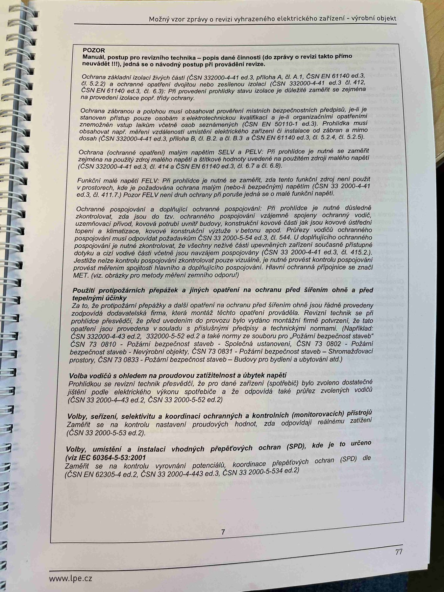

# IMG_2495

**Zdroj**: Macháček V., Dolenský M. — *Možné vzory zprávy o revizi VEZ*, vyd. lpe.cz, str. 77 / vnitřní str. 7 (**výrobní objekt**).

**Téma**: POZOR — manuál/postup pro revizního technika (verze pro výrobní objekt) — základní ochrana, ochrana při poruše, SELV/PELV, SPD, protipožární přepážky, volba vodičů, ochranné prvky. **Paralela k IMG_2477** (rodinný dům), ale pro průmyslovou instalaci.

**Klíčové body**:

### POZOR
Manuál, postup pro revizního technika — popis dané činnosti (do zprávy o revizi takto přímo nevkládá) jehož se o návody postupů pro provedení revize.

- **Ochrana základní** živých částí (ČSN 33 2000-4-41 ed.3, příloha A, čl. A.1, příloha A, čl. A.2, ČSN EN 61140 ed.3, čl. 6.2, 6.3, 6.4): Při prohlídce je nutné se zaměřit na stupně ochrany krytem dle ČSN EN 60529 (IP), zejména v prostorech s vyšším rizikem (venkovní, vlhké, prašné) — zda odpovídá projektové dokumentaci a vnějším vlivům.
- **Ochrana při poruše** — zajistit ochranu před úrazem elektrickým proudem ve stavu jedné poruchy: kontrolovat přídavnou izolaci, ochranné pospojování a automatické odpojení od zdroje (ČSN 33 2000-4-41 ed.3, čl. 411.3.1.2, 411.3.2, 412.1.1). Povolené časy odpojení: pro síť **TN 0,4 s / 230 V** u koncových obvodů (32 A), pro distribuční obvody (nad 32 A) **5 s**. Kontrola přiřazení článků norem **ČSN 33 2000-4-41 ed.3** a **ČSN EN 61140 ed.3**.
- **Ochrana součtovým proudem** – **SELV, PELV, EL** — při prohlídce je nutné se zaměřit na oddělení obvodů, napájecí zdroj (transformátor dle ČSN EN 61558-2-6 s bezpečnostním oddělením), max. napětí **50 V AC / 120 V DC** (SELV/PELV) a absenci spojení obvodu s jinými obvody a s uzemněním pro SELV, resp. spojení s ochranným vodičem pro PELV (ČSN 33 2000-4-41 ed.3, čl. 414.1, 414.3 + příloha; ČSN EN 61140 ed.3, čl. 5.6 a čl. 6.7, 6.8).
- **Ochrana přepětím a zajištění doplňujícím ochranným pospojováním** při prohlídce je nutné sledovat, zda jsou **SPD (svodiče přepětí)** funkční a zajišťují ochranu prostoru dle (ČSN 33 2000-4-44 ed.3, čl. 443) a pro bezpečné provozování koncových zařízení (např. třída T1/T2/T3). Doplňkové principy ochrany součtovým proudem a ochrany pomocí RCD musí být uvedeny v schématu projektové dokumentace a v technických popisech (ČSN EN 61140 ed.3, čl. 5.5 a čl. 5.6).
- **Použití protipožárních přepážek a dalších opatření na ochranu před šířením ohně a před tepelnými účinky**: Za to, že prostupem přepážky další opatření na ochranu před šířením ohně jsou provedena, byly provedeny dle projektové dokumentace, odpovídá projektant nebo zhotovitel. Revizní technik je jen povinen zajistit, aby v prvních průchodech elektricky fungující formou dle podkladů, lze projektu nebo dokumentace jsou udány. Pro protipožární přepážky ve vnitřních prostorách se hodí navázat a může být obsahem z vnitřní strany. (ČSN 33 2000-4-42 ed.3, čl. 422.3 a čl. 4 s ČSN 33 2000-6 ed.2, čl. 6.4.4.6.2). Revizní technik ze zprávy zaznamená i popsat i protipožárních přepážek pokud je to zřejmě.
- **Volba vodičů s ohledem na proudovou zatížitelnost a úbytek napětí**: Prohlídkou se kontroluje především, zda jsou dané vodiče navrženy tak, aby byly provedeny ve shodě s projektovou dokumentací elektrického zařízení (ČSN 33 2000-5-52 ed.2).
- **Volby, seřízení, nastavení a koordinace ochranných a kontrolních (monitorovacích) přístrojů**: Prohlídkou se zkontroluje, zda jsou ochranné a monitorovací přístroje zvoleny, seřízeny, nastaveny a koordinovány tak, aby plnily požadovanou úlohu.
- **Volby, umístění a instalaci vhodných přepětí (SPD), kde je to určeno** (viz IEC 60364-5-53:2001, ČSN 33 2000-4-443 a ČSN 33 2000-5-534).

**Normy zmíněné na stránce**: ČSN 33 2000-4-41 ed.3 (čl. 411, 411.3.1.2, 411.3.2, 412.1.1, 414.1, 414.3, 415.1, 415.2, příloha A), ČSN 33 2000-4-42 ed.3 (čl. 422.3), ČSN 33 2000-4-443 / ČSN 33 2000-4-44 ed.3 (čl. 443), ČSN 33 2000-5-52 ed.2, ČSN 33 2000-5-534, ČSN 33 2000-6 ed.2 (čl. 6.4.4.6.2), ČSN EN 60529 (IP), ČSN EN 61140 ed.3 (čl. 5.5, 5.6, 6.2, 6.3, 6.4, 6.7, 6.8), ČSN EN 61558-2-6, IEC 60364-5-53:2001

> **Poznámka**: Strana je pro průmyslový objekt — textově velmi podobná IMG_2477 (rodinný dům), ale některé odkazy jsou doplněné o SPD normy relevantní pro průmysl.
