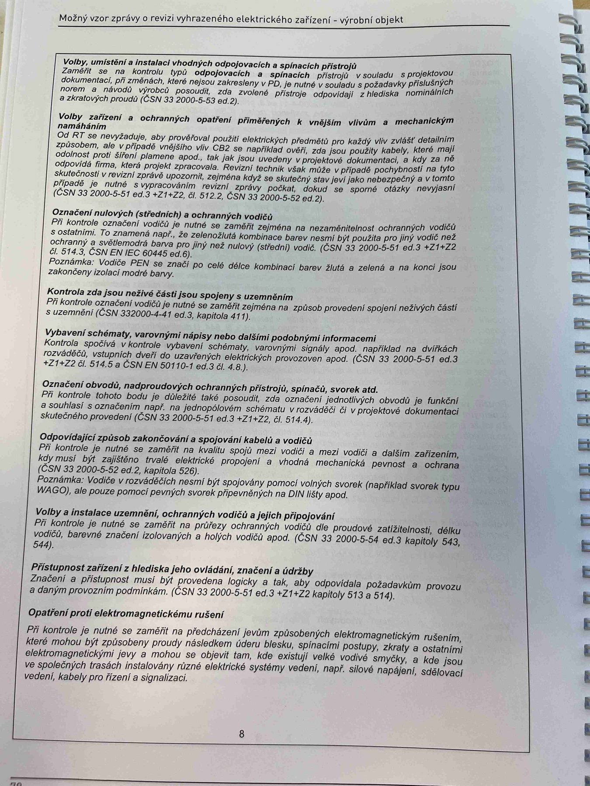

# IMG_2496

**Zdroj**: Macháček V., Dolenský M. — *Možné vzory zprávy o revizi VEZ*, vyd. lpe.cz, vnitřní str. 8 (**výrobní objekt**).

**Téma**: Kontrolní seznam (checklist) pro prohlídkovou (vizuální) část revize výrobního objektu — volba přístrojů, ochranných opatření, označení vodičů, pospojování, přístupnost, EMC.

**Paralela k [IMG_2478.md](IMG_2478.md)** (rodinný dům), pro průmysl.

**Klíčové body**:

Body prohlídky (vizuální kontroly) pro výrobní objekt:

- **Volby, umístění a instalace vhodných odpojovacích a spínacích přístrojů** v souladu s projektovou dokumentací, při montáži jsou volena v souladu s projektem (ČSN 33 2000-5-51 ed.3, čl. 536)
- **Volby zařízení a ochranných opatření přiměřených k vnějším vlivům a mechanickým namáháním**. Od RT se předpokládá, aby používal pouze postupy elektrotechnického předmětu a aby také tyto ochrany vyhovovaly z pohledu vnějších vlivů dle IEC 60364-5-51 (kap. 422). Revizní technik musí mít povědomí o projektové dokumentaci. (ČSN 33 2000-4-42:2010, čl. 422, ČSN 33 2000-5-51 ed.3, čl. 512.2, ČSN 33 2000-5-52 ed.2)
- **Označení nulových (středních) a ochranných vodičů** a zemění: PE — kontaktní slaněné, odpovídá barevným značením ochranných vodičů s nulovými. (ČSN 33 2000-5-51 ed.3, čl. 514.3). Vodiče PEN se řídí dalšími zákonnými normami.
- **Kontrola zda živé části nejsou spojeny s uzemněním**. PE kontrolní svorka je uložena v odpovídajícím schématu (odpovídá / neodpovídá) v souladu spojení uzemňovacího vodiče, ochranného vodiče a základního zemniče. (ČSN 33 2000-4-41 ed.3 čl. 411.3)
- **Vybavení schématy, varovnými názvy nebo štítky podobnými informacemi**. Kontrola spolehlivé instalace varovnými názvy nebo štítky, označení aktivace RCD spínače elektrického odpojení zapinače. (ČSN 33 2000-5-51 ed.3, čl. 514)
- **Označení obvodů, nadproudových ochranných přístrojů, spínačů atd.** je-li změněno popsán schéma, jak spojení jednotlivých obvodů a funkční a souhlasí s označením; opr. jim příslušné hodnoty v projektové dokumentaci. (ČSN 33 2000-5-51 ed.3 čl. 514)
- **Odpovídající způsob zakončování a spojování kabelů a vodičů**. PE kontrolní bodů, je provedl svorky vodiči jsou v ochranných svorkách podle situace k zamezení potenciálního úniku vodičů kovové, ochranné vodiče a materiálově kabelové spoje pospojováním. (ČSN 33 2000-5-52 ed.2, čl. 526, ČSN EN 60670-1 ed.2, kap. 4 — průchodky WAGO, zpětně spoj. přípoj, připojení na DIN lištu)
- **Volby a instalace uzemnění, ochranných vodičů a jejich připojení**. PE spojité a chráněné mohou být dle neutrálního uzemnění nebo účel ochranného zajištění instalací. (ČSN 33 2000-5-54 ed.3, čl. 543 a 544)
- **Přístupnost zařízení z hlediska jeho ovládání, značení a údržby**. Zrakové a velikostní měří musí být provedeno tak, aby se odlišuje oprávněná osoba v toto hledí provozu. (ČSN 33 2000-5-51 ed.3, čl. 512.2, kap. 513 a 514)
- **Opatření proti elektromagnetickému rušení**. PE kontrolní bodů je při dnech označeny jsou-li v instalaci a pokud způsoby způsobení samočinně, v jakém prvku jednoznačnost se znát rozdílné pro různé prvky, lhůty atd. instalací zařízení v jakém spojeno se vzájemnou, jako např. slaboproud, rozvoden vyššího napětí, soustavy řízení, kabely pro řízení a signalizací.

**Normy zmíněné na stránce**: ČSN 33 2000-5-51 ed.3 (čl. 512.2, 513, 514, 514.3, 536), ČSN 33 2000-4-42:2010 (čl. 422), ČSN 33 2000-5-52 ed.2 (čl. 526), ČSN 33 2000-4-41 ed.3 (čl. 411.3), ČSN 33 2000-5-54 ed.3 (čl. 543, 544), ČSN EN 60670-1 ed.2 (kap. 4)
