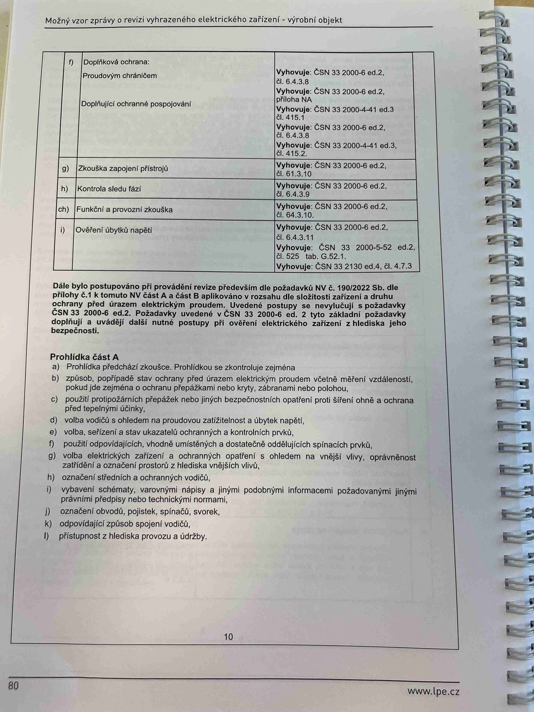

# IMG_2498

**Zdroj**: Macháček V., Dolenský M. — *Možné vzory zprávy o revizi VEZ*, vyd. lpe.cz, str. 80 / vnitřní str. 10 (**výrobní objekt**).

**Téma**: Dokončení tabulky zkoušek čl. 6.4.3 (body f–i) + **Prohlídka část A** pro výrobní objekt — body a–l checklistu.

**Paralela k [IMG_2480.md](IMG_2480.md)** (rodinný dům), s drobným rozdílem — checklist má o jeden bod víc (písm. l) kvůli specifikům průmyslu.

**Klíčové body**:

### Pokračování tabulky zkoušek (dle čl. 6.4.3)

| Bod | Zkouška | Vyhovuje podle |
|---|---|---|
| **f)** | Doplňková ochrana — Proudovým chráničem | **ČSN 33 2000-6 ed.2, čl. 6.4.3.8**; **příloha NA**; **ČSN 33 2000-4-41 ed.3, čl. 415.1** |
| **f)** | Doplňující ochranné pospojování | **ČSN 33 2000-6 ed.2, čl. 6.4.3.8**; **ČSN 33 2000-4-41 ed.3, čl. 415.2** |
| **g)** | Zkouška zapojení přístrojů | **ČSN 33 2000-6 ed.2, čl. 61.3.10** |
| **h)** | Kontrola sledu fází | **ČSN 33 2000-6 ed.2, čl. 6.4.3.9** |
| **ch)** | Funkční a provozní zkouška | **ČSN 33 2000-6 ed.2, čl. 64.3.10** |
| **i)** | Ověření úbytků napětí | **ČSN 33 2000-6 ed.2, čl. 6.4.3.11**; **ČSN 33 2000-5-52 ed.2, čl. 525, tab. G.52.1**; **ČSN 33 2130 ed.4, čl. 4.7.3** |

### Dále bylo postupováno při provádění revize
Především dle požadavků **NV č. 190/2022 Sb.** dle přílohy č. 1 k tomuto NV **část A a část B**, aplikováno v rozsahu dle složitosti zařízení a druhu ochrany před úrazem elektrickým proudem. Uvedené postupy se nevylučují s požadavky **ČSN 33 2000-6 ed.2**. Požadavky uvedené v ČSN 33 2000-6 ed.2 tyto základní požadavky doplňují a uvádějí další nutné postupy při ověření elektrického zařízení z hlediska jeho bezpečnosti.

### Prohlídka část A
Prohlídka předchází zkoušce. Prohlídkou se zkontroluje zejména:
- **a)** Prohlídka předchází zkoušce.
- **b)** způsob, popřípadě stav ochrany před úrazem elektrickým proudem včetně měření vzdáleností, pokud jde zejména o ochranu přepážkami nebo kryty, zábranami nebo polohou
- **c)** použití protipožárních přepážek nebo jiných bezpečnostních opatření proti šíření ohně a ochrana před tepelnými účinky
- **d)** volba vodičů s ohledem na proudovou zatížitelnost a úbytek napětí
- **e)** volba, seřízení a stav ukazatelů ochranných a kontrolních prvků
- **f)** použití odpovídajících, vhodně umístěných a dostatečně oddělujících spínacích prvků
- **g)** volba elektrických zařízení a ochranných opatření s ohledem na vnější vlivy, oprávněnost zatížení a označení prostorů z hlediska vnějších vlivů
- **h)** označení středních a ochranných vodičů
- **i)** vybavení schématy, varovnými nápisy a jinými podobnými informacemi požadovanými jinými právními předpisy nebo technickými normami
- **j)** označení obvodů, pojistek, spínačů, svorek
- **k)** odpovídající způsob spojení vodičů
- **l)** přístupnost z hlediska provozu a údržby

**Normy zmíněné na stránce**: NV č. 190/2022 Sb. (příloha č. 1 část A a B), ČSN 33 2000-6 ed.2 (čl. 6.4.3.8, 6.4.3.9, 6.4.3.11, 61.3.10, 64.3.10, příloha NA), ČSN 33 2000-4-41 ed.3 (čl. 415.1, 415.2), ČSN 33 2000-5-52 ed.2 (čl. 525, tab. G.52.1), ČSN 33 2130 ed.4 (čl. 4.7.3)
