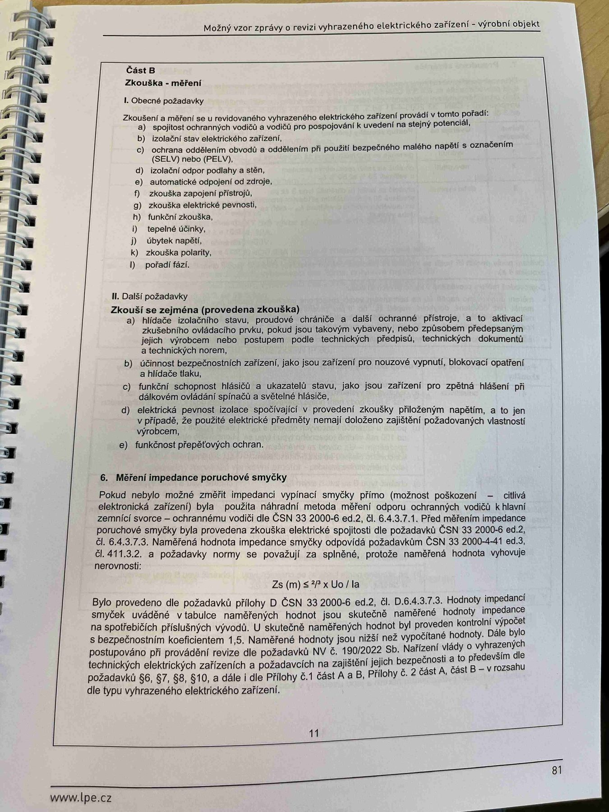

# IMG_2499

**Zdroj**: Macháček V., Dolenský M. — *Možné vzory zprávy o revizi VEZ*, vyd. lpe.cz, str. 81 / vnitřní str. 11 (**výrobní objekt**).

**Téma**: **Část B — Zkouška/měření**: obecné požadavky, další požadavky a kapitola **6. Měření impedance poruchové smyčky** — vzorec a postup.

**Paralela k [IMG_2481.md](IMG_2481.md)** (rodinný dům) — obsah identický pro výrobní objekt.

**Klíčové body**:

### Část B — Zkouška/měření

#### I. Obecné požadavky
Zkoušení a měření se u revidovaného vyhrazeného elektrického zařízení provádí v tomto pořadí:
- **a)** spojitost ochranných vodičů a vodičů pro pospojování k uvedení na stejný potenciál
- **b)** izolační stav elektrického zařízení
- **c)** ochrana oddělením obvodu a oddělením při použití bezpečného malého napětí s označením (**SELV**) nebo (**PELV**)
- **d)** izolační odpor podlahy a stěn
- **e)** automatické odpojení od zdroje
- **f)** zkouška zapojení přístrojů
- **g)** zkouška elektrické pevnosti
- **h)** funkční zkouška
- **i)** tepelné účinky
- **j)** úbytek napětí
- **k)** zkouška polarity
- **l)** pořadí fází

#### II. Další požadavky
Zkouší se zejména (provedená zkouška):
- **a)** hlídače izolačního stavu, proudové chrániče a další ochranné přístroje, a to aktivací zkušebního ovládacího prvku, pokud jsou takovým vybaveny, nebo způsobem předepsaným jejich výrobcem nebo postupem podle technických předpisů, technických dokumentů a technických norem
- **b)** účinnost bezpečnostních zařízení, jako jsou zařízení pro nouzové vypnutí, blokovací opatření a hlídače tlaku
- **c)** funkční schopnost hlásičů a ukazatelů stavu, jako jsou zařízení pro zpětná hlášení při dálkovém ovládání spínačů a světelné hlásiče
- **d)** elektrická pevnost izolace spočívající v provedení zkoušky přiloženým napětím, a to jen v případě, že použité elektrické předměty nemají doloženo zajištění požadovaných vlastností výrobcem
- **e)** funkčnost přepěťových ochran

### 6. Měření impedance poruchové smyčky

Pokud nebylo možné změřit impedanci vypínací smyčky přímo (možnost poškození — citlivá elektronická zařízení), byla použita náhradní metoda měření odporu ochranných vodičů k hlavní zemnicí svorce — ochrannému vodiči dle **ČSN 33 2000-6 ed.2, čl. 6.4.3.7.1**. Před měřením impedance poruchové smyčky byla provedena zkouška elektrické spojitosti dle požadavků **ČSN 33 2000-6 ed.2, čl. 6.4.3.7.3**. Naměřená hodnota impedance smyčky odpovídá požadavkům **ČSN 33 2000-4-41 ed.3, čl. 411.3.2**, a požadavky normy se považují za splněné, protože naměřená hodnota vyhovuje nerovnosti:

**Zs(m) ≤ (2/3) × Uo / Ia**

Bylo provedeno dle požadavků přílohy D ČSN 33 2000-6 ed.2, čl. D.6.4.3.7.3. Hodnoty impedancí smyček uváděné v tabulce naměřených hodnot jsou **skutečně naměřené hodnoty impedance** na spotřebičích příslušných vývodů. U skutečně naměřených hodnot byl proveden kontrolní výpočet s **bezpečnostním koeficientem 1,5**. Naměřené hodnoty jsou nižší než vypočítané hodnoty.

Dále bylo postupováno při provádění revize dle požadavků **NV č. 190/2022 Sb.** — Nařízení vlády o vyhrazených technických zařízeních a požadavcích na zajištění jejich bezpečnosti a to především dle požadavků **§ 6, § 7, § 8, § 10**, a dále dle **Přílohy č. 1 část A a B**, **Přílohy č. 2 část A, část B** — v rozsahu dle typu vyhrazeného elektrického zařízení.

**Normy zmíněné na stránce**: NV č. 190/2022 Sb. (§ 6, 7, 8, 10, příloha č. 1 A, B, příloha č. 2 A, B), ČSN 33 2000-6 ed.2 (čl. 6.4.3.7.1, 6.4.3.7.3, příloha D), ČSN 33 2000-4-41 ed.3 (čl. 411.3.2)
