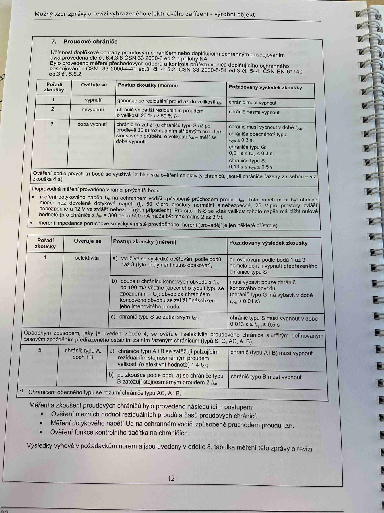

# IMG_2500

**Zdroj**: Macháček V., Dolenský M. — *Možné vzory zprávy o revizi VEZ*, vyd. lpe.cz, vnitřní str. 12 (**výrobní objekt**).

**Téma**: **Kapitola 7. Proudové chrániče** — tabulka zkoušek RCD (body 1–5) pro průmyslové vzor zprávy.

**Paralela k [IMG_2482.md](IMG_2482.md)** (rodinný dům) — shodný obsah.

**Klíčové body**:

### 7. Proudové chrániče
Účinnost doplňkové ochrany proudovým chráničem nebo doplňujícím ochranným pospojováním byla prověřena dle **ČSN EN 61008-1 ed.3, ČSN 33 2000-6 ed.2, příloha NA** a dle **ČSN 33 2000-4-41 ed.3, čl. 415.2 + čl. 544, ČSN 33 2000-5-54 ed.3, čl. 544, ČSN EN 61140 ed.3, čl. 6.5**.

### Tabulka postupů zkoušky proudových chráničů (body 1–3)

| Pořadí zkoušky | Ověření se | Postup zkoušky (měření) | Požadovaný výsledek zkoušky |
|---|---|---|---|
| **1** | vypnutí | generuje se reziduální proud až do velikosti **IΔn** | chránič musí vypnout |
| **2** | nevypnutí | chránič se zatíží reziduálním proudem o velikosti **20 % až 50 % IΔn** | chránič nesmí vypnout |
| **3** | doba vypnutí | chránič se zatíží (v násobku) **5 × IΔn** (u chráničů typu B**) nebo **30 × IΔn**) pro zjištění vybavovacích časů | chránič musí vypnout v době: chráničů obecných* typu: AC do 0,3 s, typu A do 0,3 s, typu B do 0,3 s, F do 0,3 s; chráničů selektivních typu S: 0,5 s ... |

### Doprovodný text
Ověření prvních tří bodů se vyžaduje u hledaných selektivních chráničů, pouze pravidelné chránění ve vzájemné kontrole. Měření dotykového napětí Ua na ochranných vodičích způsobené proudovým chráničem — napětí musí být vhodným způsobem redukováno pod hodnoty dle typu instalace (50 V / 25 V).

### Tabulka postupů zkoušky (body 4–5)

| Pořadí zkoušky | Ověření se | Postup zkoušky (měření) | Požadovaný výsledek zkoušky |
|---|---|---|---|
| **4** | selektivita | **a)** vyžádá se nárazový posel (impuls) podle b) bodů 1 až 3 "a nevypne se" jako předchází chránič (u **typů S, AC, A, B**); **b)** pokud u zvláštní konstrukční instalaci typu L (bodů 1 až 3) výjimečně nevypne; **c)** zkouška typu L hotovená **5 × IΔn** — změřit vybavení v době ≤ 0,5 s | chránič vypne v době **0,13 s ≤ tΔp ≤ 0,5 s** |
| **5** | chránič typu **B**, popř. typu **B+** | **a)** chránič typu B (popř. B+, nebo typu C s cyklicky pulzující amplitudou) se zkouší reziduálním proudem hladkým s vlnou DC | chránič typu B (popř. i B+) musí vypnout |
| | | **b)** bod zkoušky podle a) na hladkém reziduálním proudu | chránič musí vypnout |

\* **Chráničem obecného typu se rozumí chránič typu AC, A, B.**

### Měření a zkoušení proudových chráničů bylo provedeno následujícím postupem
- Ověření mezních hodnot reziduálních proudů a časů proudových chráničů
- Měření dotykového napětí Ua na ochranném vodiči proudového chrániče
- Ověření funkce kontrolního tlačítka na chráničích

Výsledky vyhovují požadavkům a jsou uvedeny v oddíle **8. tabulka měření** této zprávy o revizi.

**Normy zmíněné na stránce**: ČSN EN 61008-1 ed.3, ČSN 33 2000-6 ed.2 (příloha NA), ČSN 33 2000-4-41 ed.3 (čl. 415.2, čl. 544), ČSN 33 2000-5-54 ed.3 (čl. 544), ČSN EN 61140 ed.3 (čl. 6.5)
