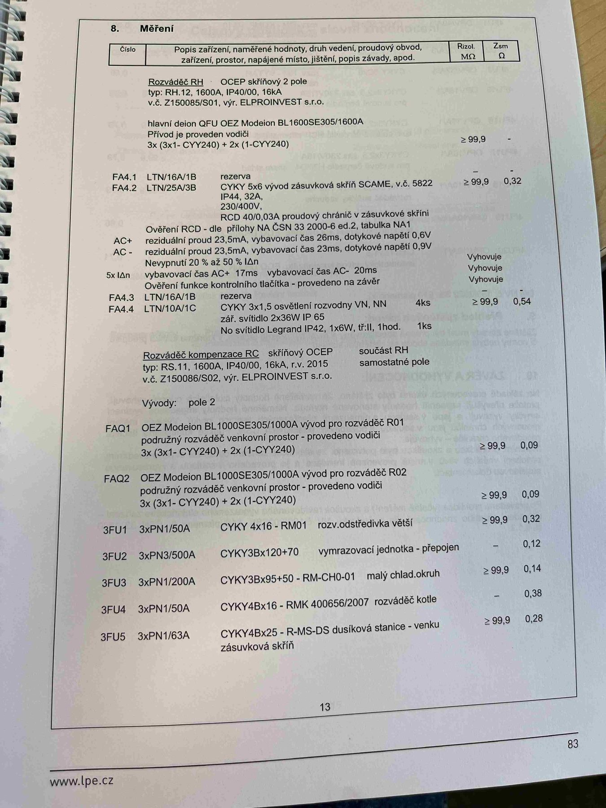

# IMG_2501

**Zdroj**: Macháček V., Dolenský M. — *Možné vzory zprávy o revizi VEZ*, vyd. lpe.cz, str. 83 / vnitřní str. 13 (**výrobní objekt**).

**Téma**: **Kapitola 8. Měření** — hlavní tabulka naměřených hodnot revize průmyslové provozovny. Rozváděč **RH** (OCEP, 1600 A), přívod z trafostanice, obvody FA4.1–FA4.4, rozváděč kompenzace **RC**, vývody FAQ1/FAQ2 pro rozváděče R01/R02, jistící soustavy 3FU1–3FU5.

**Klíčové body**:

### 8. Měření

Hlavičky tabulky: **Číslo | Popis zařízení, naměřené hodnoty, druh vedení, proudový obvod, zařízení, prostor, napájené místo, jištění, popis závady, apod. | Rizol. MΩ | Zsm Ω**

### Rozváděč RH

**OCEP skříňový 2 pole**, typ **RH.12, 1600 A, IP40/00, 16 kA**, v.č. Z150085/S01, výr. **ELPROINVEST s.r.o.**

Hlavní deion (jistič) **QFU OEZ Modelon BL1600SE305/1600A**. Přívod je proveden vodiči **3×(3×1 – CYY240) + 2×(1-CYY240)**. **R_izol ≥ 99,9 MΩ**.

| Obvod | Jištění / kabel | Popis | R_izol [MΩ] | Z_sm [Ω] |
|---|---|---|---|---|
| **FA4.1** | LTN/16A/1B | rezerva | — | — |
| **FA4.2** | LTN/25A/3B | **CYKY 5×6** vývod zásuvková skříň SCAME, v.č. 5822, IP44, 32 A, 230/400 V, **RCD 40/0,03 A** proudový chránič v zásuvkové skříni | ≥ 99,9 | 0,32 |

**Ověření RCD** — dle přílohy NA ČSN 33 2000-6 ed.2, tabulka NA1 (pro FA4.2):
- AC+ reziduální proud 23,5 mA, vybavovací čas 26 ms, dotykové napětí 0,6 V
- AC− reziduální proud 23,5 mA, vybavovací čas 23 ms, dotykové napětí 0,9 V
- **Nevypnutí 20 % až 50 % IΔn** — Vyhovuje
- **5× IΔn**: vybavovací čas AC+ 17 ms / AC− 20 ms — Vyhovuje
- Ověření funkce kontrolního tlačítka — provedeno na závěr — Vyhovuje

| Obvod | Jištění / kabel | Popis | R_izol [MΩ] | Z_sm [Ω] |
|---|---|---|---|---|
| **FA4.3** | LTN/16A/1B | rezerva | — | — |
| **FA4.4** | LTN/10A/1C | **CYKY 3×1,5** osvětlení rozvodny VN, NN zář. svítidlo 2×36W IP 65 (4ks), No svítidlo Legrand IP42, 1×6W, tř./I, 1 hod. (1 ks) | ≥ 99,9 | 0,54 |

### Rozváděč kompenzace RC

**Skříňový OCEP**, součást RH, samostatné pole, typ **RS.11, 1600 A, IP40/00, 16 kA, r.v. 2015**, v.č. Z150086/S02, výr. **ELPROINVEST s.r.o.**

Vývody: pole 2

| Obvod | Popis | R_izol [MΩ] | Z_sm [Ω] |
|---|---|---|---|
| **FAQ1** | **OEZ Modelon BL1000SE305/1000A** vývod pro rozváděč R01, podružný rozváděč venkovní prostor — provedeno vodiči **3×(3×1 – CYY240) + 2×(1-CYY240)** | ≥ 99,9 | 0,09 |
| **FAQ2** | **OEZ Modelon BL1000SE305/1000A** vývod pro rozváděč R02, podružný rozváděč venkovní prostor — provedeno vodiči **3×(3×1 – CYY240) + 2×(1-CYY240)** | ≥ 99,9 | 0,09 |
| **3FU1** | **3×PN1/50A** — **CYKY 4×16** — **RM01** rozv. odstředivka větší | ≥ 99,9 | 0,32 |
| **3FU2** | **3×PN3/500A** — **CYKY 3B×120+70** — vymrazovací jednotka, přepojení | — | 0,12 |
| **3FU3** | **3×PN1/200A** — **CYKY 3B×95+50** — **RM-CH0-01** malý chlad. okruh | ≥ 99,9 | 0,14 |
| **3FU4** | **3×PN1/50A** — **CYKY 4B×16** — **RMK 400656/2007** rozváděč kotle | — | 0,38 |
| **3FU5** | **3×PN1/63A** — **CYKY 4B×25** — **R-MS-DS** dusíková stanice — venku zásuvková skříň | ≥ 99,9 | 0,28 |

**Normy zmíněné na stránce**: ČSN 33 2000-6 ed.2 (příloha NA, tabulka NA1)

> **Poznámka**: Tabulka měření obsahuje vzorová reálná data pro průmyslový vzor — typové označení rozváděčů OCEP/OEZ Modelon BL, kompenzační rozváděče, výkonové vývody do R01/R02 s pojistkami PN1/PN3 a kabely CYKY velkých průřezů (4×16 až 3B×120+70). Slouží jako **vzor formátu** pro rozsáhlé průmyslové instalace v aplikaci revize-el.
