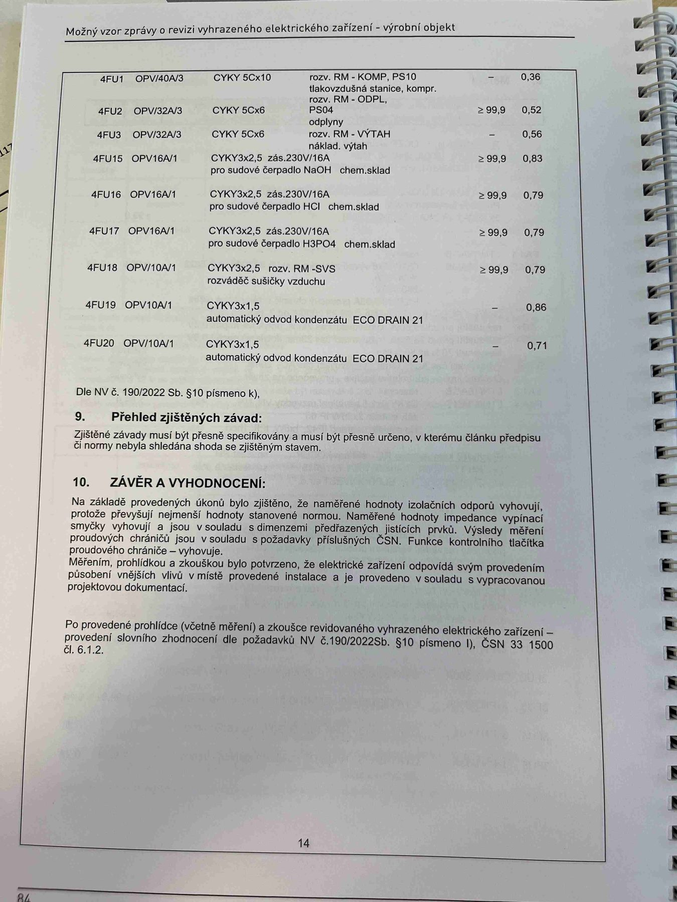

# IMG_2502

**Zdroj**: Macháček V., Dolenský M. — *Možné vzory zprávy o revizi VEZ*, vyd. lpe.cz, str. 84 / vnitřní str. 14 (**výrobní objekt**).

**Téma**: Pokračování tabulky **8. Měření** — okruhy 4FU1–4FU20 (kompresor, odplyny, výtah, čerpadla chemických látek, sušička, odvod kondenzátu) + **Kapitola 9. Přehled zjištěných závad** + **Kapitola 10. Závěr a vyhodnocení**.

**Klíčové body**:

### Pokračování tabulky měření (4FU1–4FU20)

| Obvod | Jištění | Kabel | Popis | R_izol [MΩ] | Z_sm [Ω] |
|---|---|---|---|---|---|
| **4FU1** | OPV/40A/3 | CYKY 5C×10 | rozv. **RM - KOMP**, PS10 tlakovzdušná stanice, kompr. rozv. RM - OPTU | — | 0,36 |
| **4FU2** | OPV/32A/3 | CYKY 5C×6 | rozv. **RM - ODPL**, **PS04** odplyny | ≥ 99,9 | 0,52 |
| **4FU3** | OPV/32A/3 | CYKY 5C×6 | rozv. **RM - VYTAH** — nákladní výtah | — | 0,56 |
| **4FU15** | OPV/16A/1 | CYKY 3×2,5 | zás. 230V/16A pro sudové čerpadlo **NaOH** chem. sklad | ≥ 99,9 | 0,83 |
| **4FU16** | OPV/16A/1 | CYKY 3×2,5 | zás. 230V/16A pro sudové čerpadlo **HCl** chem. sklad | ≥ 99,9 | 0,79 |
| **4FU17** | OPV/16A/1 | CYKY 3×2,5 | zás. 230V/16A pro sudové čerpadlo **H₃PO₄** chem. sklad | ≥ 99,9 | 0,79 |
| **4FU18** | OPV/10A/1 | CYKY 3×2,5 | rozv. **RM - SVS** — rozváděč sušičky vzduchu | ≥ 99,9 | 0,79 |
| **4FU19** | OPV/10A/1 | CYKY 3×1,5 | automatický odvod kondenzátu **ECO DRAIN 21** | — | 0,86 |
| **4FU20** | OPV/10A/1 | CYKY 3×1,5 | automatický odvod kondenzátu **ECO DRAIN 21** | — | 0,71 |

Dle **NV č. 190/2022 Sb. § 10 písmeno k)**.

### 9. Přehled zjištěných závad
Zjištěné závady musí být přesně specifikovány a musí být přesně určeno, v kterém článku předpisu či normy nebyla shledána shoda se zjištěným stavem.

### 10. ZÁVĚR A VYHODNOCENÍ
Na základě provedených úkonů bylo zjištěno, že **naměřené hodnoty izolačních odporů vyhovují**, protože převyšují nejmenší hodnoty stanovené normou. **Naměřené hodnoty impedance vypínací smyčky vyhovují** a jsou v souladu s dimenzemi předřazených jisticích prvků. Výsledky měření proudových chráničů jsou v souladu s požadavky příslušných ČSN. Funkce kontrolního tlačítka proudového chrániče — vyhovuje.

Měřením, prohlídkou a zkouškou bylo potvrzeno, že elektrické zařízení odpovídá svým provedením působení vnějších vlivů v místě provedené instalace a je provedeno v souladu s vypracovanou projektovou dokumentací.

Po provedené prohlídce (včetně měření) a zkoušce revidovaného vyhrazeného elektrického zařízení — provedení slovního zhodnocení dle požadavků **NV č. 190/2022 Sb. § 10 písmeno l)**, **ČSN 33 1500 čl. 6.1.2**.

**Normy zmíněné na stránce**: NV č. 190/2022 Sb. (§ 10 písm. k, l), ČSN 33 1500 (čl. 6.1.2)
