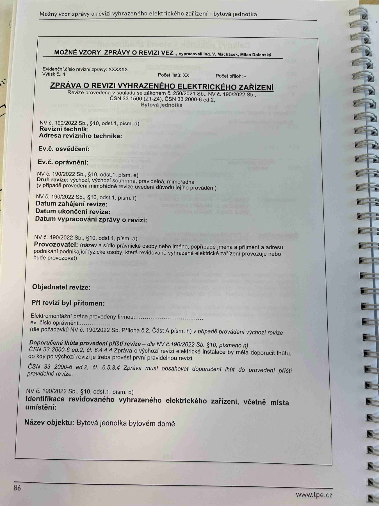

# IMG_2504

**Zdroj**: Macháček V., Dolenský M. — *Možné vzory zprávy o revizi VEZ*, vyd. lpe.cz, str. 86 (titulní strana vzoru pro **bytovou jednotku**). Evidenční číslo revizní zprávy: XXXXXX, výtisk č. 1.

**Téma**: Úvodní (titulní) strana vzoru "Zpráva o revizi vyhrazeného elektrického zařízení" pro bytovou jednotku — povinné úvodní údaje dle NV č. 190/2022 Sb. § 10.

**Paralela k [IMG_2470.md](IMG_2470.md) (rodinný dům) a [IMG_2488.md](IMG_2488.md) (výrobní objekt)** — identická struktura formuláře.

**Klíčové body**:
- Revize provedena v souladu se zákonem č. 250/2021 Sb., NV č. 190/2022 Sb., ČSN 33 1500 (Z1–Z4), ČSN 33 2000-6 ed.2. Objekt: **Bytová jednotka**.
- **§ 10 odst. 1 písm. d)** — Revizní technik (jméno), Adresa revizního technika, Ev. č. osvědčení, Ev. č. oprávnění
- **§ 10 odst. 1 písm. e)** — Druh revize: výchozí / výchozí souhrnná / pravidelná / mimořádná (v případě mimořádné uvedení důvodu provádění)
- **§ 10 odst. 1 písm. f)** — Datum zahájení revize, Datum ukončení revize, Datum vypracování zprávy o revizi
- **§ 10 odst. 1 písm. a)** — Provozovatel (název a sídlo právnické osoby nebo jméno, popř. jména a příjmení a adresu podnikání podnikající fyzické osoby)
- Objednatel revize, Při revizi byl přítomen, Elektromontážní práce provedeny firmou, ev. číslo oprávnění (dle požadavků NV č. 190/2022 Sb. Příloha č. 2, Část A písm. h) v případě provedení výchozí revize)
- **Doporučená lhůta provedení příští revize** — dle NV č. 190/2022 Sb. § 10 písm. n); ČSN 33 2000-6 ed.2 čl. 6.4.4.4; ČSN 33 2000-6 ed.2 čl. 6.5.3.4
- **§ 10 odst. 1 písm. b)** — Identifikace revidovaného vyhrazeného elektrického zařízení, včetně místa umístění. Název objektu: **Bytová jednotka bytovém domě**

**Normy zmíněné na stránce**: zákon č. 250/2021 Sb., NV č. 190/2022 Sb. (§ 10 odst. 1 písm. a, b, d, e, f, h, n), ČSN 33 1500 (Z1–Z4), ČSN 33 2000-6 ed.2 (čl. 6.4.4.4, 6.5.3.4)
