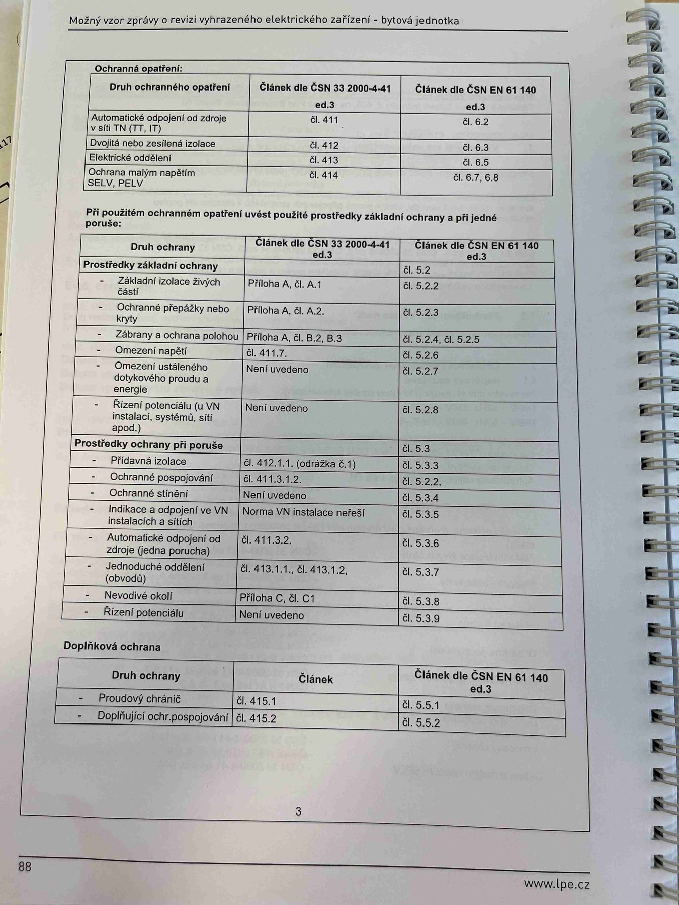

# IMG_2506

**Zdroj**: Macháček V., Dolenský M. — *Možné vzory zprávy o revizi VEZ*, vyd. lpe.cz, str. 88 / vnitřní str. 3 (**bytová jednotka**).

**Téma**: Úplná tabulka ochranných opatření pro bytovou jednotku — mapování **ČSN 33 2000-4-41 ed.3** ↔ **ČSN EN 61 140 ed.3** (základní / při poruše / doplňková ochrana).

**Paralela k [IMG_2472.md](IMG_2472.md) (rodinný dům) a [IMG_2490.md](IMG_2490.md) (výrobní objekt)** — obsah tabulky je napříč všemi třemi typy objektů identický.

**Klíčové body**:

### Ochranná opatření

| Druh ochranného opatření | Článek dle ČSN 33 2000-4-41 ed.3 | Článek dle ČSN EN 61 140 ed.3 |
|---|---|---|
| Automatické odpojení od zdroje v síti TN (TT, IT) | čl. 411 | čl. 6.2 |
| Dvojitá nebo zesílená izolace | čl. 412 | čl. 6.3 |
| Elektrické oddělení | čl. 413 | čl. 6.5 |
| Ochrana malým napětím SELV, PELV | čl. 414 | čl. 6.7, 6.8 |

### Při použitém ochranném opatření uvést použité prostředky základní ochrany a při jedné poruše

**Prostředky základní ochrany** (ČSN EN 61 140 ed.3 čl. 5.2):

| Druh ochrany | ČSN 33 2000-4-41 ed.3 | ČSN EN 61 140 ed.3 |
|---|---|---|
| Základní izolace živých částí | Příloha A, čl. A.1 | čl. 5.2.2 |
| Ochranné přepážky nebo kryty | Příloha A, čl. A.2 | čl. 5.2.3 |
| Zábrany a ochrana polohou | Příloha A, čl. B.2, B.3 | čl. 5.2.4, čl. 5.2.5 |
| Omezení napětí | čl. 411.7 | čl. 5.2.6 |
| Omezení ustáleného dotykového proudu a energie | Není uvedeno | čl. 5.2.7 |
| Řízení potenciálu (u VN instalací, systémů, sítí apod.) | Není uvedeno | čl. 5.2.8 |

**Prostředky ochrany při poruše** (ČSN EN 61 140 ed.3 čl. 5.3):

| Druh ochrany | ČSN 33 2000-4-41 ed.3 | ČSN EN 61 140 ed.3 |
|---|---|---|
| Přídavná izolace | čl. 412.1.1 (odrážka č. 1) | čl. 5.3.3 |
| Ochranné pospojování | čl. 411.3.1.2 | čl. 5.2.2 |
| Ochranné stínění | Není uvedeno | čl. 5.3.4 |
| Indikace a odpojení ve VN instalacích a sítích | Norma VN instalace neřeší | čl. 5.3.5 |
| Automatické odpojení od zdroje (jedna porucha) | čl. 411.3.2 | čl. 5.3.6 |
| Jednoduché oddělení (obvodů) | čl. 413.1.1, čl. 413.1.2 | čl. 5.3.7 |
| Nevodivé okolí | Příloha C, čl. C1 | čl. 5.3.8 |
| Řízení potenciálu | Není uvedeno | čl. 5.3.9 |

**Doplňková ochrana**:

| Druh ochrany | ČSN 33 2000-4-41 ed.3 | ČSN EN 61 140 ed.3 |
|---|---|---|
| Proudový chránič | čl. 415.1 | čl. 5.5.1 |
| Doplňující ochranné pospojování | čl. 415.2 | čl. 5.5.2 |

**Normy zmíněné na stránce**: ČSN 33 2000-4-41 ed.3 (čl. 411, 411.3.1.2, 411.3.2, 411.7, 412, 412.1.1, 413, 413.1.1, 413.1.2, 414, 415.1, 415.2, příloha A, B, C), ČSN EN 61 140 ed.3 (čl. 5.2, 5.3, 5.5, 6.2, 6.3, 6.5, 6.7, 6.8)
