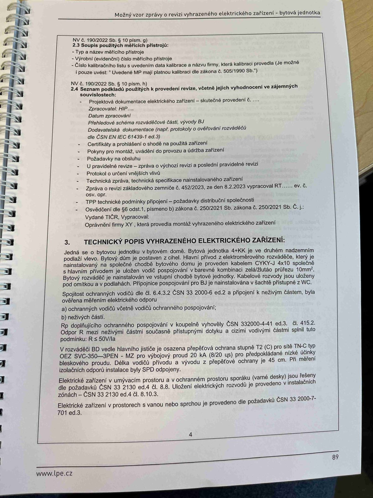

# IMG_2507

**Zdroj**: Macháček V., Dolenský M. — *Možné vzory zprávy o revizi VEZ*, vyd. lpe.cz, str. 89 / vnitřní str. 4 (**bytová jednotka**).

**Téma**: Seznam podkladů použitých k provedení revize + **Technický popis vyhrazeného elektrického zařízení** pro bytovou jednotku (bytový dům, koupelna TN-C-S, SPD OEZ SVG).

**Paralela k [IMG_2473.md](IMG_2473.md)** (rodinný dům) a [IMG_2491.md](IMG_2491.md) (výrobní objekt) — struktura stejná, konkrétní zařízení pro byt.

**Klíčové body**:

### NV č. 190/2022 Sb. § 10 písm. j) — 2.3 Soupis použitých měřicích přístrojů
- Typ a název měřicího přístroje
- Výrobní číslo(a), datum měření měřicího přístroje
- Číslo kalibračního listu s uvedením data kalibrace a názvu firmy, která kalibraci provedla (je možné i za značkou kalibrace); v případě nesplnění v textu zprávy uvést "Uvedené MP mají platnou kalibraci dle zákona č. 505/1990 Sb."

### NV č. 190/2022 Sb. § 10 písm. c) — 2.4 Seznam podkladů použitých k provedení revize, včetně jejich vyhodnocení a zájemnosti souvislostech:
- Projektová dokumentace elektrického zařízení — skutečné provedení č. ...
- Zpracoval XY ...
- Datum zpracování: ____
- Přehled provedených revizí VEZ
- Dokumentace dokumentů (např. protokoly o ověřování vodičů) — dle ČSN IEC 61439-1 ed.3
- Certifikáty a prohlášení o shodě použitá zařízení
- Pokyny pro montáž, obvykle dodavatelem, popř. záznam stavebního deníku
- Posledních výchozí revize
- U provedené revize — zpráva o výchozí revizi
- Protokol o určení vnějších vlivů
- Technická rádce (**TCR**) technická specifikace nainstalovaného zařízení
- **Zpráva o nutné dokumentace** z 4.52/2023, ze dne 8.2.2023 vypracoval RT č.j. ...
- **TPP** technické požadavky — přípojová dokumentace schvalovací
- Vydáno TCR z 4.52/2023, ze dne 8.2.2023 vypracoval RT č.j. ...
- Další: provedená montáž elektrického zařízení

### 3. TECHNICKÝ POPIS VYHRAZENÉHO ELEKTRICKÉHO ZAŘÍZENÍ

Jedná se o bytovou jednotku v bytovém domě. **Bytová jednotka 4/106**, je ve druhém nadzemním podlaží. Hlavní přívod je potaven z patra. Hlavní přívod z elektroměrového rozváděče, který je nainstalovaný v společné chodbě domu, je proveden kabelem **CYKY-J 4×16** do bytového pojistkové skříně objektu — provedení zapuštěná skříň v nábytku. Hlavní elektroměr je nainstalován ve společné chodbě. Kabelová rozvody jsou vedeny přes schodišť tak, až skončí v kartách pojistné skříně (čítá v zpětných nábytku) plynového průmyslu.

V podrozvaděči je umístěn hlavní jistič **C 25 A/3** vyvedení dvěma **OEZ SVG-350 = 3PN/+N**.

- Pod rozváděčem je nainstalována přípojnice **MET** — hlavní uzemňovací sběrnice, ke které jsou připojeny:
  - ochrana vodiče
  - vodiče ochranného pospojování
- **a) Ochranný vodič** včetně vodiče ochranného pospojování dle ČSN 33 2000-6 ed.2, d. 415.2
- **b) Nulový vodič**
- **Rozpětí dopadového uchy** dle d. 6.4.3.2 ČSN 33 2000-6 ed.2 a připojení k neživým částem, byla ověřena měřením elektrického odporu
- a) ochranných vodičů včetně vodičů ochranného pospojování
- b) neživých částí
- **Rp. doplňujícího ochranného pospojování s koupelnou** — provedeno vyhovuje dle **ČSN 332000-4-41 ed.3, d. 415.2**. Odpor **R** musí nejčastější závěrem součástí příslušným dobyčů a výší hodnoty pospojením se spojením dobyčů, které s příslušnými vodiči. **5 % 90 %**
- Pro distribuční ochraně pospojovém vedoucí z elektroměrového rozváděče do bytu, je vstupu bytu vodičem **ČSN 33 2000-4-41, d. 415.2**. Osazeno svodičem bleskových proudů Schrack typ/OEZ **SVG-350 = 3PN/+N**, **20 kA** (8/20 μs) pro předpokládanou dobu účinu úskoku, pospojení v bytu se napájecího kabelu 5 cm 45 cm od měření SPD odpovídající.
- **V podružném** — v elektroměrovém odpořenu případně SPD Schrack **OEZ SVG** pro prostotu blízkou T2 (C) — pro délku 3 vodičů dle nabídku dobyčovými dispozicemi.
- Elektrické zařízení v umývacím prostoru a v vztahovém prostoru sprchy (vana) jsou nainstalovány dle požadavků **ČSN 33 2130 ed.4, čl. 8, 9**. Užívateli elektrické sprchy (vany) provozovat v souladu s nainstalovanými vanou (sprchy).
- Elektrické zařízení v prostorech s vanou nebo sprchou je provedeno dle požadavků **ČSN 33 2000-7-701 ed.3**.

**Normy zmíněné na stránce**: NV č. 190/2022 Sb. (§ 10 písm. c, j), zákon č. 505/1990 Sb., ČSN IEC 61439-1 ed.3, ČSN 33 2000-4-41 ed.3 (čl. 415.2), ČSN 33 2000-6 ed.2 (čl. 6.4.3.2), ČSN 33 2000-7-701 ed.3, ČSN 33 2130 ed.4 (čl. 8, 9)

> **Poznámka**: Strana je místy rozmazaná, názvy typů (CYKY, OEZ SVG) přepsány přibližně — pro přesné typové označení svodičů přepětí ověřte z originálu.
