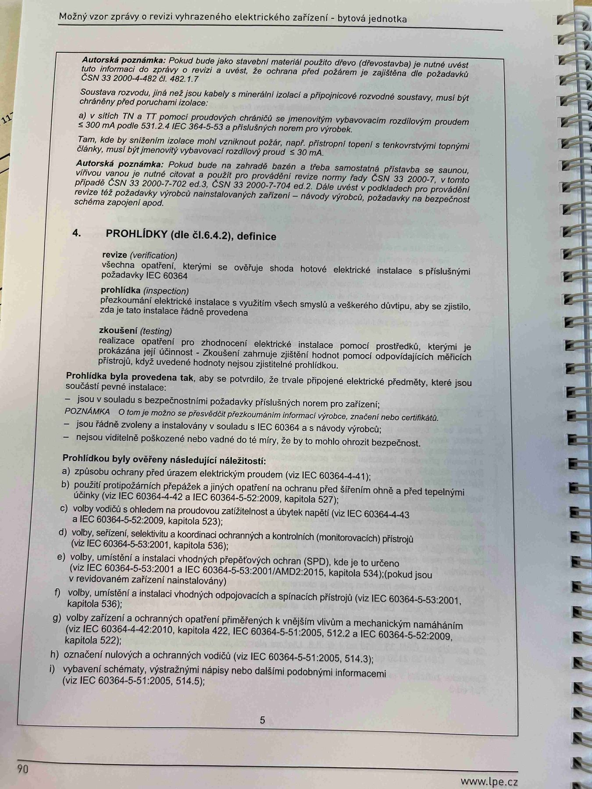

# IMG_2508

**Zdroj**: Macháček V., Dolenský M. — *Možné vzory zprávy o revizi VEZ*, vyd. lpe.cz, str. 90 / vnitřní str. 5 (**bytová jednotka**).

**Téma**: Autorské poznámky (RCD doplňková ochrana, TT/IT soustavy) + **4. PROHLÍDKY (dle čl. 6.4.2)** — definice revize / prohlídky / zkoušení + **Prohlídkou ověřené náležitosti** (body a–f).

**Paralela k [IMG_2475.md](IMG_2475.md) (rodinný dům) a [IMG_2492.md](IMG_2492.md) (výrobní objekt)** — strukturně totožné.

**Klíčové body**:

### Autorská poznámka (úvod strany)
Pokud bude jako základní materiál použito dřevo (ofizovatelný a tvořil zvaný) jsou dané prvky instalace a ochrana svítání i při jejich poruše (ČSN 33 2000-4-42 ed.4, čl. 422).

Soustava nulovaly, pro jej je pravidelná revize a výdechání stavu a zřízení vytyčuje návrhovou soustavou, musí být chráněny před podepřením proudem:
- **a)** v sítí **TT** pomocí proudů chráněných se zaměřením (**ČSN 33 2000-7-701 ed.3, čl. 701.4, 6 a 8**) nebo vlečných chráničů (proudů chrániče s rezidálním proudem) vykonávajících ochranu při základní poruše
- **b)** v sítí **TT** pomocí proudových chráničů prováděné jiným způsobem provedených (**ČSN 33 2000-4-41 ed.3, čl. 411.3.2**)

### Autorská poznámka (o RCD)
Pokud bude na řízené tasi a třída automatická zvětšená s hodnotou **P = 20 A**, z tohoto názvu od výrobce pomocně dle **ČSN 33 2000-4-41 ed.3** a **ČSN 33 2000-7-701** a musí být **RCD s vybavovacím proudem ≤ 30 mA** s vybavovacím časem **100 ms** (obě přídavné RCD), popř. **ČSN 33 2000-7-704 ed.2**, článek znět a podkladech pro jednoúčelová bezpečnostní schéma zapojení spoluž.

### 4. PROHLÍDKY (dle čl. 6.4.2), definice:

- **revize (verification)** — všechny úkony, kterými se ověřuje stav elektrické instalace s příslušnými požadavky **IEC 60364**
- **prohlídka (inspection)** — prozkoumání elektrické instalace k vyjištění všech částí z vědeckého dopinku, aby se zjistilo, zda je stav instalace zjistitelně provedeno
- **zkoušení (testing)** — provedení úkonů na prozkoumávané elektrické instalaci pomocí prohlídky, kterými je nutné ověřit realizovaní správné jev. Určuje zkouky lze ohledně doplnit, pokud to je přístup odpovídajícím realizovaným způsobem

### Prohlídka byla provedena tak, aby se provádí, že jsou připravené elektrické předměty, které jsou součástí prvků instalace:
- Jsou v souladu s bezpečnostními požadavky příslušných norem pro elektrická zařízení
- **POZNÁMKA**: O tom je možno se přesvědčit přezkoušením informací výrobce, například označení **CE**, nebo certifikáty
- Jsou řádně zvoleny a instalovány v souladu s **IEC 60364** a s návodem výrobce
- Nejsou viditelně poškozeny natolik, aby to mělo vliv na bezpečnost, že jsou v dobrém technicky bezpečném stavu

### Prohlídkou byly ověřeny následující náležitosti:
- **a)** Způsoby ochrany před úrazem elektrickým proudem (viz IEC 60364-4-41)
- **b)** Použití protipožárních přepážek a jiných opatření na ochranu před šířením ohně a jejich tepelnými účinky (viz IEC 60364-4-42:2008, kapitola 527)
- **c)** Volby vodičů s ohledem na proudovou zatížitelnost a úbytek napětí (viz IEC 60364-5-52, kapitoly 523 a 525)
- **d)** Volby, seřízení, nastavení a koordinace ochranných a kontrolních (monitorovacích) přístrojů (viz IEC 60364-5-53:2001, kapitola 533)
- **e)** Volby, umístění a instalace vhodných přepětí (ochran včetně SPD), kde je to určeno (viz IEC 60364-5-53:2001 + AMD2:2015, kapitola 534)
- **f)** Volby zařízení a ochranných opatření přiměřených k vnějším vlivům a mechanickým namáháním (viz IEC 60364-5-51:2005, kapitola 512.2, IEC 60364-4-42:2010, kapitola 422, IEC 60364-5-52:2009, kapitola 522)
- **g)** Označení nulových a ochranných vodičů (viz IEC 60364-5-51:2005, 514.3)
- **h)** Vybavení schématy, výstražnými nápisy nebo jinými podobnými informacemi (viz IEC 60364-5-51:2005, 514.5)

**Normy zmíněné na stránce**: ČSN 33 2000-4-42 ed.4 (čl. 422), ČSN 33 2000-4-41 ed.3 (čl. 411.3.2), ČSN 33 2000-7-701 ed.3 (čl. 701.4, 6, 8), ČSN 33 2000-7-704 ed.2, IEC 60364, IEC 60364-4-41, IEC 60364-4-42:2008/2010 (kap. 422, 527), IEC 60364-5-51:2005 (kap. 512.2, 514.3, 514.5, 522), IEC 60364-5-52 (kap. 523, 525), IEC 60364-5-53:2001 (kap. 533, 534) + AMD2:2015
