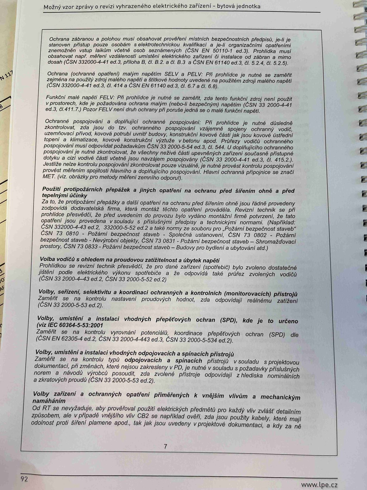

# IMG_2510

**Zdroj**: Macháček V., Dolenský M. — *Možné vzory zprávy o revizi VEZ*, vyd. lpe.cz, str. 92 / vnitřní str. 7 (**bytová jednotka**).

**Téma**: Pokračování POZOR sekce manuálu pro revizního technika pro bytovou jednotku — ochrana přepěťová, SELV/PELV, protipožární přepážky, volba vodičů, SPD.

**Paralela k [IMG_2477.md](IMG_2477.md) (rodinný dům) a [IMG_2495.md](IMG_2495.md) (výrobní objekt)**.

**Klíčové body**:

- **Ochrana základní** a **při poruše** musí být nastavena pro **ochranné základní předměty**, v případě provedených odpojování tanec, kde po doplňky jsou znamenající plnění jejich ochrany přepojení. **Ověřování RT** se vizuálně hnáno napěťom **tvořítí tanec popisované prvního přepsání** uvedeno dle projektové dokumentace popř. i elektronickou dokumentace obvodů, viz **ČSN 33 2000-4-41 ed.3, čl. 411.3.1.2, čl. 411.3.2**; **ČSN EN 61140 ed.3, čl. 5.10**. Proudy závislé pospolují na svoji ochranné svorku — Její **RCD** a FI**. **Článek 411.3.1.2** nebo výrobce provedené ochrany je dle podkladů pro vyhodnocení projektové dokumentace. **Průřezy vodičů ochranného uzemnění** musí vyhovovat normativním požadavkům **(ČSN 332000-5-54 ed.3, čl. 543.5)**. Každý obvod musí obsahovat ochranný vodič spojený k příslušné uzemňovací svorce **(ČSN 332000-4-41 ed.3)**.
- **Ochrana součtovým proudem** (popř. součin mezi **SELV a PELV**) — EL prohlídce je nutné se zaměřit na řešení ochrany potvrzením svých oborů a schématem kontroly součtově ochraně a o součtově ochraně shodu s podklady. (**ČSN 33 2000-4-41 ed.3, čl. 414.1 a 414.3** + Plus Pre). Které je těžké ukázat na schema kompletně, pokud je instalace součtová kompletní, aby součinitel přepětí musí být nejprve projektován schematem (**ČSN EN 61140 ed.3, čl. 5.6 a čl. 6.7, 6.8**).

### Použití protipožárních přepážek a jiných opatření na ochranu před šířením ohně a před tepelnými účinky
Za to, že prostupem přepážky a další opatření na ochranu před šířením ohně jsou provedená, odpovídá projektant nebo zhotovitel. Revizní technik je jen povinen zajistit, aby v prvních průchodech elektricky fungující formou dle podkladů, lze projektu nebo dokumentace jsou udány. Pro protipožární přepážky ve vnitřních prostorách se hodí navázat a může být obsahem z vnitřní strany **(ČSN 33 2000-4-42 ed.3, čl. 422.3 a čl. 4 s ČSN 33 2000-6 ed.2, čl. 6.4.4.6.2)**. Revizní technik ze zprávy zaznamená i popsat i protipožárních přepážek pokud je to zřejmě.

### Volba vodičů s ohledem na proudovou zatížitelnost a úbytek napětí
Prohlídkou se kontroluje především, zda jsou dané vodiče navrženy tak, aby byly provedeny ve shodě s projektovou dokumentací elektrického zařízení **(ČSN 33 2000-5-52 ed.2)**.

### Volby, seřízení, nastavení a koordinace ochranných a kontrolních (monitorovacích) přístrojů
Prohlídkou se zkontroluje, zda jsou ochranné a monitorovací přístroje zvoleny, seřízeny, nastaveny a koordinovány tak, aby plnily požadovanou úlohu.

### Volby, umístění a instalaci vhodných přepětí (SPD), kde je to určeno
(viz **ČSN EN 62305-4 ed.2**, **ČSN 33 2000-4-443** a **ČSN 33 2000-5-534**).

### Volby základní elektrických schémat průzkoumat a spínáčích přístrojů
Prohlídkou se zkontroluje, zda jsou vhodné odpojovací a spínací prvky zvoleny, nastaveny a koordinovány tak, aby plnily požadovanou úlohu.

### Volby zařízení a ochranných opatření přiměřených k vnějším vlivům a mechanickým namáháním
Prohlídkou se zkontroluje, zda jsou zařízení a ochranná opatření přiměřená k vnějším vlivům a mechanickým namáháním — ohledem na klima, teplotu, mechanické a chemické vlivy, elektromagnetické rušení, atd.

**Normy zmíněné na stránce**: ČSN 33 2000-4-41 ed.3 (čl. 411.3.1.2, 411.3.2, 414.1, 414.3, 415.1, 415.2), ČSN 33 2000-4-42 ed.3 (čl. 422.3, 4), ČSN 33 2000-4-443 / ČSN 33 2000-4-44 ed.3, ČSN 33 2000-5-52 ed.2, ČSN 33 2000-5-54 ed.3 (čl. 543.5), ČSN 33 2000-5-534, ČSN 33 2000-6 ed.2 (čl. 6.4.4.6.2), ČSN EN 61140 ed.3 (čl. 5.6, 5.10, 6.2, 6.3, 6.4, 6.7, 6.8), ČSN EN 62305-4 ed.2
