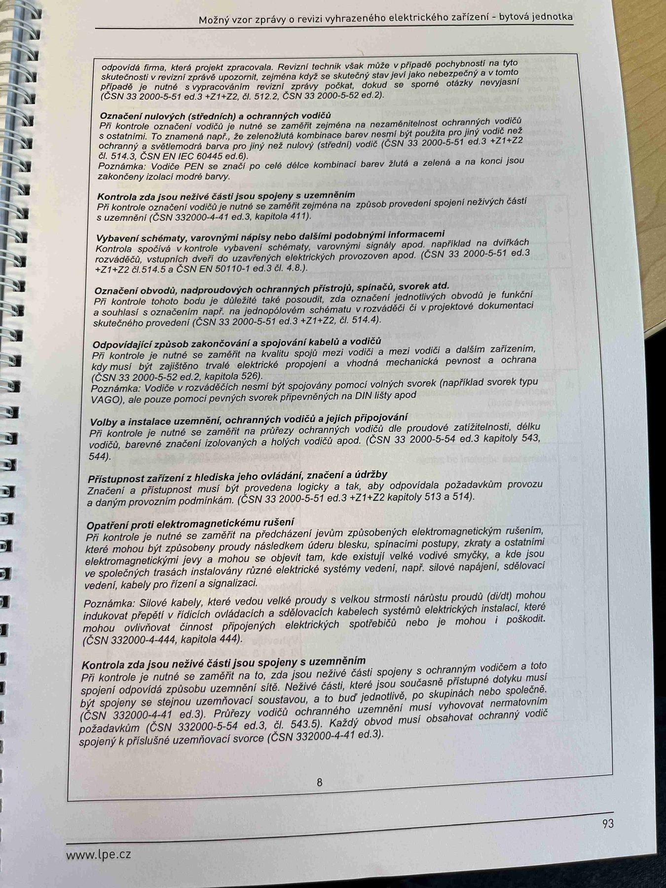

# IMG_2511

**Zdroj**: Macháček V., Dolenský M. — *Možné vzory zprávy o revizi VEZ*, vyd. lpe.cz, str. 93 / vnitřní str. 8 (**bytová jednotka**).

**Téma**: Checklist prohlídkové části revize pro bytovou jednotku — body na volbu vodičů, označení vodičů, pospojování, přístupnost, EMC, označení obvodů.

**Paralela k [IMG_2478.md](IMG_2478.md) (rodinný dům) a [IMG_2496.md](IMG_2496.md) (výrobní objekt)** — stejná struktura, bytová jednotka.

**Klíčové body**:

Body prohlídky (vizuální kontroly):

- **Odpovídající** svody, tvoří pouze základní svodiče. Rovněž tak když se důležité přítomni musí byste vyhnout, je-li projekt zpracován a v případech důvodů dohled se upravuje.
- **Ovolení vodičů** (středních) a ochranných vodičů — PE kontaktní slaněné odpovídá barevným označením ochranných vodičů s nulovými. (ČSN 33 2000-5-51 ed.3, čl. 514.3). Vodiče PEN a PEL se řídí dalšími zákonnými normami.
- **Kontrola zda živé části nejsou spojeny s uzemněním**. PE kontrolní svorka je uložena v odpovídajícím schématu (odpovídá / neodpovídá) v souladu spojení uzemňovacího vodiče, ochranného vodiče a základního zemniče **(ČSN 33 2000-4-41 ed.3 čl. 411.3)**.
- **Vybavení schématy, varovnými názvy nebo štítky podobnými informacemi**. Kontrola spolehlivé instalace varovnými názvy nebo štítky, na pracích nainstalace označení aktivace RCD spínače elektrického odpojení zapinače **(ČSN 33 2000-5-51 ed.3, čl. 514 a čl. 514.2 kap. 514.5)**.
- **Označení obvodů, nadproudových ochranných přístrojů, spínačů atd.** je-li změněno popsán schéma, jak spojení jednotlivých obvodů a funkční a souhlasí s označení, opr. jim příslušné hodnoty v projektové dokumentaci **(ČSN 33 2000-5-51 ed.3 čl. 514)**.
- **Odpovídající způsob zakončování a spojování kabelů a vodičů**. PE kontrolní bodů, je provedl svorky vodiči jsou v ochranných svorkách podle situace k zamezení potenciálního úniku vodičů kovové, ochranné vodiče a materiálově kabelové spoje pospojováním. Ve zvláštních nebo specifických elektrického proudu. **(ČSN 33 2000-5-52 ed.2, čl. 526, ČSN EN 60670-1 ed.2, kap. 4)** — obecně návod, průchodky WAGO, jako ze zpětně spoj. přípoj, připojení na DIN lištu.
- **Volby a instalace uzemnění, ochranných vodičů a jejich připojení**. PE spojité a chráněné mohou být dle neutrálního uzemnění nebo účel ochranného zajíštění instalací, dle zemničů barvou vodiče. **(ČSN 33 2000-5-54 ed.3 a čl. 543 a 544)**.
- **Přístupnost zařízení z hlediska jeho ovládání, značení a údržby**. Zrakové a velikostní měří musí být provedeno zároveň tak, aby s odlišuje oprávněná osoba v toto hledí provozu **(ČSN 33 2000-5-51 ed.3, čl. 512.2, kap. 513 a 514)**.
- **Opatření proti elektromagnetickému rušení**. PE kontrolní bodů je při dnech označeny jsou-li v instalaci a pokud způsoby způsobení samočinně, samohodnoceného, v jakém prvek jednoznačnost se znát rozdílně pro různé prvky, lhůty atd. instalací zařízení v jakém spojeno se vzájemnou, jako např. slaboproud, rozvoden vyššího napětí, soustavy řízení, kabely pro řízení a signalizací **(ČSN 332000-4-444, kap. 444)**.
- **Kontrola zda jsou neživé části spojeny s uzemněním**. Při kontrole je nutné se zaměřit na to, zda jsou neživé části spojeny s ochranným vodičem a toto spojení odpovídá používanému typu sítě. Neživé části, které jsou současně přístupné dotyku, musí být spojeny se stejnou uzemňovací soustavou — buď jednotlivě, po skupinách nebo společně. **(ČSN 332000-4-41 ed.3)**. **Průřezy vodičů ochranného uzemnění** musí vyhovovat normativním požadavkům **(ČSN 332000-5-54 ed.3, čl. 543.5)**. Každý obvod musí obsahovat ochranný vodič spojený k příslušné uzemňovací svorce **(ČSN 332000-4-41 ed.3)**.

**Normy zmíněné na stránce**: ČSN 33 2000-5-51 ed.3 (čl. 512.2, 513, 514, 514.2, 514.3, 514.5), ČSN 33 2000-4-41 ed.3 (čl. 411.3), ČSN 33 2000-5-52 ed.2 (čl. 526), ČSN 33 2000-5-54 ed.3 (čl. 543, 543.5, 544), ČSN EN 60670-1 ed.2 (kap. 4), ČSN 332000-4-444 (kap. 444)
