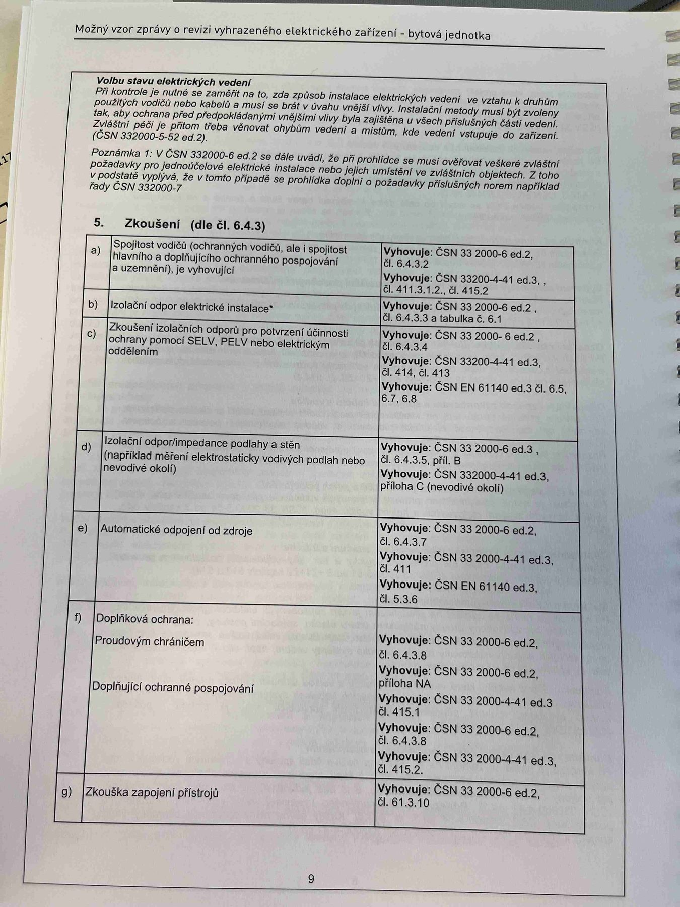

# IMG_2512

**Zdroj**: Macháček V., Dolenský M. — *Možné vzory zprávy o revizi VEZ*, vyd. lpe.cz, str. 95 / vnitřní str. 9 (**bytová jednotka**).

**Téma**: **Volba stavu elektrických vedení** + úvod **5. Zkoušení (dle čl. 6.4.3)** — tabulka zkoušek body a–g pro bytovou jednotku.

**Paralela k [IMG_2479.md](IMG_2479.md) (rodinný dům) a [IMG_2497.md](IMG_2497.md) (výrobní objekt)**, ale tabulka zkoušek pro byt je rozšířena i o bod **f) Doplňková ochrana** — proudový chránič + pospojování — a **g) Zkouška zapojení přístrojů**.

**Klíčové body**:

### Volbu stavu elektrických vedení ve vztahu k druhům
Při kontrole je nutné se zaměřit na to, zda způsob instalace elektrických vedení a instalační metody musí být zvoleny použitých vodičů nebo kabelů a musí v úvahu vnější vlivy. Instalační metody musí být zvoleny tak, aby ochrana před předpokládanými vnějšími vlivy byla zajištěna u všech příslušných částí vedení. Zvláštní péči je přitom třeba věnovat ohybům vedení a místům, kde vedení vstupuje do zařízení. (ČSN 332000-5-52 ed.2)

**Poznámka 1**: V ČSN 332000-6 ed.2 se dále uvádí, že při prohlídce se musí ověřovat veškeré zvláštní požadavky pro jednoúčelové elektrické instalace nebo jejich umístění ve zvláštních objektech. Z toho v podstatě vyplývá, že v tomto případě se prohlídka doplní o požadavky příslušných norem např. řady **ČSN 332000-7**.

### 5. Zkoušení (dle čl. 6.4.3)

| Bod | Zkouška | Vyhovuje podle |
|---|---|---|
| **a)** | Spojitost vodičů (ochranných vodičů, ale i spojitost hlavního a doplňujícího ochranného pospojování a uzemnění), je vyhovující | **ČSN 33 2000-6 ed.2, čl. 6.4.3.2**; **ČSN 33200-4-41 ed.3, čl. 411.3.1.2, čl. 415.2** |
| **b)** | Izolační odpor elektrické instalace* | **ČSN 33 2000-6 ed.2, čl. 6.4.3.3 a tabulka č. 6.1** |
| **c)** | Zkoušení izolačních odporů pro potvrzení účinnosti ochrany pomocí SELV, PELV nebo elektrickým oddělením | **ČSN 33 2000-6 ed.2, čl. 6.4.3.4**; **ČSN 33200-4-41 ed.3, čl. 414, čl. 413**; **ČSN EN 61140 ed.3 čl. 6.5, 6.7, 6.8** |
| **d)** | Izolační odpor/impedance podlahy a stěn (například měření elektrostaticky vodivých podlah nebo nevodivé okolí) | **ČSN 33 2000-6 ed.3, čl. 6.4.3.5, příl. B**; **ČSN 332000-4-41 ed.3, příloha C (nevodivé okolí)** |
| **e)** | Automatické odpojení od zdroje | **ČSN 33 2000-6 ed.2, čl. 6.4.3.7**; **ČSN 33 2000-4-41 ed.3, čl. 411**; **ČSN EN 61140 ed.3, čl. 5.3.6** |
| **f)** | Doplňková ochrana: Proudovým chráničem | **ČSN 33 2000-6 ed.2, čl. 6.4.3.8**; **příloha NA**; **ČSN 33 2000-4-41 ed.3, čl. 415.1** |
| **f)** | Doplňující ochranné pospojování | **ČSN 33 2000-6 ed.2, čl. 6.4.3.8**; **ČSN 33 2000-4-41 ed.3, čl. 415.2** |
| **g)** | Zkouška zapojení přístrojů | **ČSN 33 2000-6 ed.2, čl. 61.3.10** |

**Normy zmíněné na stránce**: ČSN 33 2000-5-52 ed.2, ČSN 33 2000-6 ed.2 (čl. 6.4.3.2, 6.4.3.3 + tab. 6.1, 6.4.3.4, 6.4.3.5, 6.4.3.7, 6.4.3.8, 61.3.10, příloha NA), ČSN 33 2000-7 (řada), ČSN 33 2000-4-41 ed.3 (čl. 411, 411.3.1.2, 413, 414, 415.1, 415.2, příloha C), ČSN EN 61140 ed.3 (čl. 5.3.6, 6.5, 6.7, 6.8)
