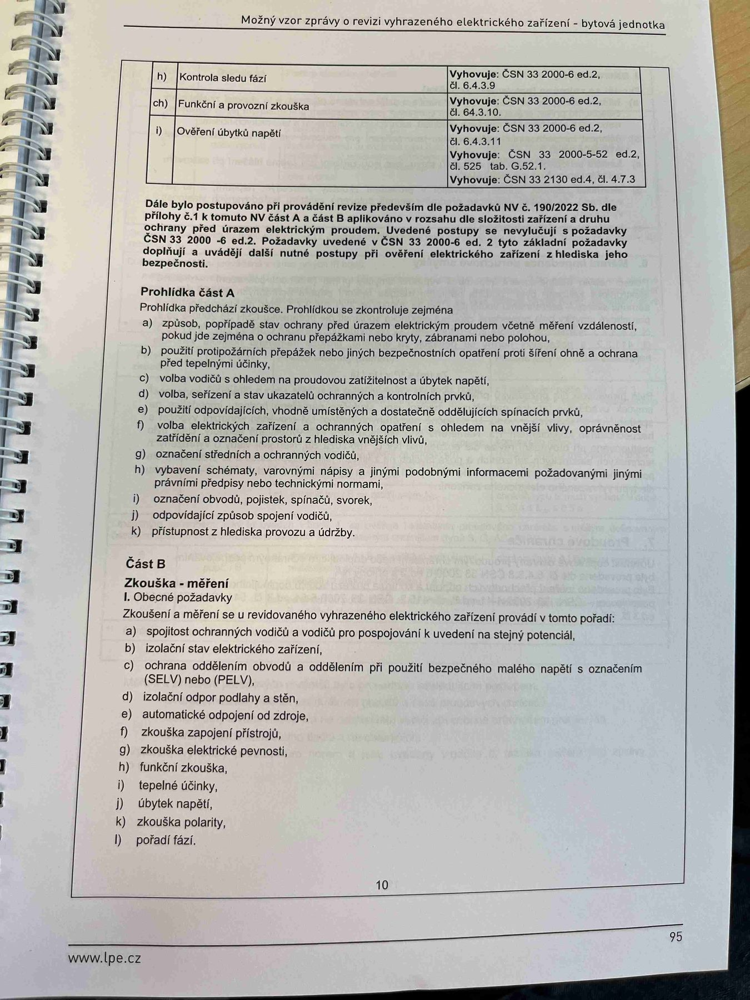

# IMG_2513

**Zdroj**: Macháček V., Dolenský M. — *Možné vzory zprávy o revizi VEZ*, vyd. lpe.cz, str. 95 / vnitřní str. 10 (**bytová jednotka**).

**Téma**: Dokončení tabulky zkoušek (body h–i) + **Prohlídka část A** (12 bodů) + **Část B — Zkouška/měření (I. Obecné požadavky, body a–l)**.

**Kombinuje obsah tří paralelních stran** u jiných vzorů — bytová jednotka má zhuštěnější formát.

**Klíčové body**:

### Dokončení tabulky zkoušek

| Bod | Zkouška | Vyhovuje podle |
|---|---|---|
| **h)** | Kontrola sledu fází | **ČSN 33 2000-6 ed.2, čl. 6.4.3.9** |
| **ch)** | Funkční a provozní zkouška | **ČSN 33 2000-6 ed.2, čl. 64.3.10** |
| **i)** | Ověření úbytků napětí | **ČSN 33 2000-6 ed.2, čl. 6.4.3.11**; **ČSN 33 2000-5-52 ed.2, čl. 525, tab. G.52.1**; **ČSN 33 2130 ed.4, čl. 4.7.3** |

### Dále bylo postupováno při provádění revize
Především dle požadavků **NV č. 190/2022 Sb.** dle přílohy č. 1 **část A a část B**, aplikováno v rozsahu dle složitosti zařízení a druhu ochrany před úrazem elektrickým proudem. Uvedené postupy se nevylučují s požadavky **ČSN 33 2000-6 ed.2**.

### Prohlídka část A
Prohlídka předchází zkoušce. Prohlídkou se zkontroluje zejména:
- **a)** způsob, popřípadě stav ochrany před úrazem elektrickým proudem včetně měření vzdáleností, pokud jde zejména o ochranu přepážkami nebo kryty, zábranami nebo polohou
- **b)** použití protipožárních přepážek nebo jiných bezpečnostních opatření proti šíření ohně a ochrana před tepelnými účinky
- **c)** volba vodičů s ohledem na proudovou zatížitelnost a úbytek napětí
- **d)** volba, seřízení a stav ukazatelů ochranných a kontrolních prvků
- **e)** použití odpovídajících, vhodně umístěných a dostatečně oddělujících spínacích prvků
- **f)** volba elektrických zařízení a ochranných opatření s ohledem na vnější vlivy, oprávněnost zatížení a označení prostorů z hlediska vnějších vlivů
- **g)** označení středních a ochranných vodičů
- **h)** vybavení schématy, varovnými nápisy a jinými podobnými informacemi požadovanými jinými právními předpisy nebo technickými normami
- **i)** označení obvodů, pojistek, spínačů, svorek
- **j)** odpovídající způsob spojení vodičů
- **k)** přístupnost z hlediska provozu a údržby

### Část B — Zkouška/měření
**I. Obecné požadavky**
Zkoušení a měření se u revidovaného vyhrazeného elektrického zařízení provádí v tomto pořadí:
- **a)** spojitost ochranných vodičů a vodičů pro pospojování k uvedení na stejný potenciál
- **b)** izolační stav elektrického zařízení
- **c)** ochrana oddělením obvodů a oddělením při použití bezpečného malého napětí s označením (**SELV**) nebo (**PELV**)
- **d)** izolační odpor podlahy a stěn
- **e)** automatické odpojení od zdroje
- **f)** zkouška zapojení přístrojů
- **g)** zkouška elektrické pevnosti
- **h)** funkční zkouška
- **i)** tepelné účinky
- **j)** úbytek napětí
- **k)** zkouška polarity
- **l)** pořadí fází

**Normy zmíněné na stránce**: NV č. 190/2022 Sb. (příloha č. 1 A a B), ČSN 33 2000-6 ed.2 (čl. 6.4.3.9, 6.4.3.11, 64.3.10), ČSN 33 2000-5-52 ed.2 (čl. 525, tab. G.52.1), ČSN 33 2130 ed.4 (čl. 4.7.3)
