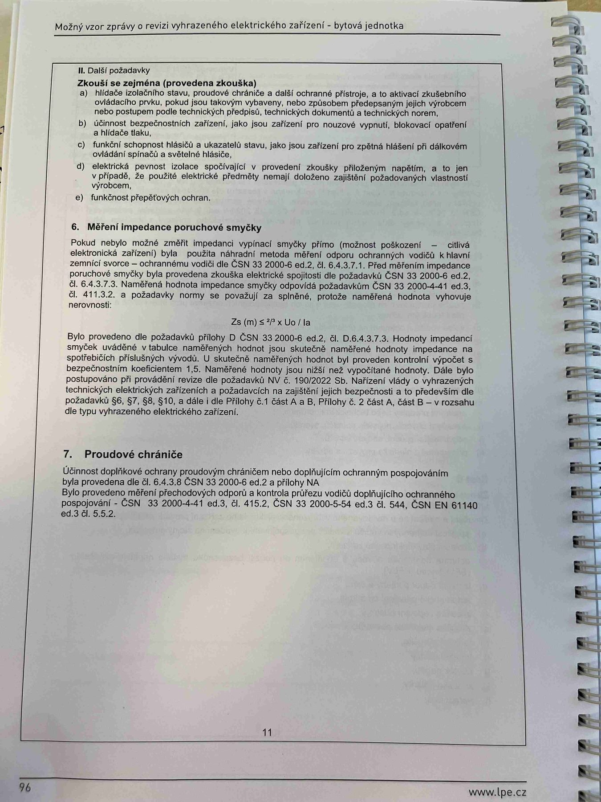

# IMG_2514

**Zdroj**: Macháček V., Dolenský M. — *Možné vzory zprávy o revizi VEZ*, vyd. lpe.cz, str. 96 / vnitřní str. 11 (**bytová jednotka**).

**Téma**: **II. Další požadavky** (zkoušky RCD, SPD a nouzové vypnutí) + **6. Měření impedance poruchové smyčky** (vzorec) + úvod **7. Proudové chrániče**.

**Paralela k [IMG_2481.md](IMG_2481.md) / [IMG_2499.md](IMG_2499.md)** s průběhem do kapitoly 7 o RCD.

**Klíčové body**:

### II. Další požadavky
Zkouší se zejména (provedená zkouška):
- **a)** hlídače izolačního stavu, proudové chrániče a další ochranné přístroje, a to aktivací zkušebního ovládacího prvku, pokud jsou takovým vybaveny, nebo způsobem předepsaným jejich výrobcem nebo postupem podle technických předpisů, technických dokumentů a technických norem
- **b)** účinnost bezpečnostních zařízení, jako jsou zařízení pro nouzové vypnutí, blokovací opatření a hlídače tlaku
- **c)** funkční schopnost hlásičů a ukazatelů stavu, jako jsou zařízení pro zpětná hlášení při dálkovém ovládání spínačů a světelné hlásiče
- **d)** elektrická pevnost izolace spočívající v provedení zkoušky přiloženým napětím, a to jen v případě, že použité elektrické předměty nemají doloženo zajištění požadovaných vlastností výrobcem
- **e)** funkčnost přepěťových ochran

### 6. Měření impedance poruchové smyčky

Pokud nebylo možné změřit impedanci vypínací smyčky přímo (možnost poškození — citlivá elektronická zařízení), byla použita náhradní metoda měření odporu ochranných vodičů k hlavní zemnicí svorce — ochrannému vodiči dle **ČSN 33 2000-6 ed.2, čl. 6.4.3.7.1**. Před měřením impedance poruchové smyčky byla provedena zkouška elektrické spojitosti dle požadavků **ČSN 33 2000-6 ed.2, čl. 6.4.3.7.3**. Naměřená hodnota impedance smyčky odpovídá požadavkům **ČSN 33 2000-4-41 ed.3, čl. 411.3.2**, a požadavky normy se považují za splněné, protože naměřená hodnota vyhovuje nerovnosti:

**Zs(m) ≤ (2/3) × Uo / Ia**

Bylo provedeno dle požadavků přílohy D ČSN 33 2000-6 ed.2, čl. D.6.4.3.7.3. Hodnoty impedancí smyček uváděné v tabulce naměřených hodnot jsou **skutečně naměřené hodnoty impedance** na spotřebičích příslušných vývodů. U skutečně naměřených hodnot byl proveden kontrolní výpočet s **bezpečnostním koeficientem 1,5**. Naměřené hodnoty jsou nižší než vypočítané hodnoty.

Dále bylo postupováno při provádění revize dle požadavků **NV č. 190/2022 Sb.** o vyhrazených technických elektrických zařízeních a požadavcích na zajištění jejich bezpečnosti, a to především dle požadavků **§ 6, § 7, § 8, § 10**, a dále dle **Přílohy č. 1 část A a B**, **Přílohy č. 2 část A, část B** — v rozsahu dle typu vyhrazeného elektrického zařízení.

### 7. Proudové chrániče

Účinnost doplňkové ochrany proudovým chráničem nebo doplňujícím ochranným pospojováním byla provedena dle **ČSN 33 2000-6 ed.2, čl. 6.4.3.8** a přílohy **NA**.

Bylo provedeno měření přechodových odporů a kontrola průřezu vodičů doplňujícího ochranného pospojování — **ČSN 33 2000-4-41 ed.3, čl. 415.2**, **ČSN 33 2000-5-54 ed.3 čl. 544**, **ČSN EN 61140 ed.3 čl. 5.5.2**.

**Normy zmíněné na stránce**: NV č. 190/2022 Sb. (§ 6, 7, 8, 10, příloha č. 1 A, B, příloha č. 2 A, B), ČSN 33 2000-6 ed.2 (čl. 6.4.3.7.1, 6.4.3.7.3, 6.4.3.8, příloha D, příloha NA), ČSN 33 2000-4-41 ed.3 (čl. 411.3.2, 415.2), ČSN 33 2000-5-54 ed.3 (čl. 544), ČSN EN 61140 ed.3 (čl. 5.5.2)
