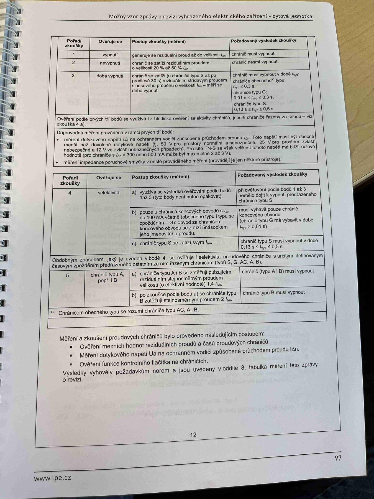

# IMG_2515

**Zdroj**: Macháček V., Dolenský M. — *Možné vzory zprávy o revizi VEZ*, vyd. lpe.cz, str. 97 / vnitřní str. 12 (**bytová jednotka**).

**Téma**: **Kapitola 7. Proudové chrániče** — úplná tabulka postupů zkoušky RCD pro bytovou jednotku. Obsahuje detailní mezní hodnoty časů pro různé typy sítí (TN-S) a chrániče G, S, A, B.

**Paralela k [IMG_2482.md](IMG_2482.md) (rodinný dům) a [IMG_2500.md](IMG_2500.md) (výrobní objekt)** — nejkompletnější verze tabulky.

**Klíčové body**:

### Tabulka postupů zkoušky proudových chráničů (body 1–3)

| Pořadí zkoušky | Ověření se | Postup zkoušky (měření) | Požadovaný výsledek zkoušky |
|---|---|---|---|
| **1** | vypnutí | generuje se reziduální proud až do velikosti **IΔn** | chránič musí vypnout |
| **2** | nevypnutí | chránič se zatíží reziduálním proudem o velikosti **20 % až 50 % IΔn** | chránič nesmí vypnout |
| **3** | doba vypnutí | chránič se zatíží (u chrániče typu S až po prodlevě 30 s) reziduálním střídavým proudem sinusového průběhu o velikosti **IΔn** — měří se doba vypnutí | chránič musí vypnout v době t_vyp: • **chráničů obecného\* typu**: t_vyp ≤ 0,3 s • **chráničů typu G**: **0,01 s ≤ t_vyp ≤ 0,3 s** • **chráničů typu S**: **0,13 s ≤ t_vyp ≤ 0,5 s** |

### Doprovodný text
Ověření podle prvních tří bodů se využívá i z hlediska ověření selektivity chrániče, jsou-li chrániče řazeny za sebou — viz zkouška 4.

Doprovodná měření prováděná v rámci prvých tří bodů:
- **Měření dotykového napětí U_a** na ochranném vodiči způsobené průchodem proudu IΔn. Toto napětí musí být obecně **menší než dovolené dotykové napětí** (tj. **50 V** pro prostory normální a nebezpečné, **25 V** pro prostory zvlášť nebezpečné a **12 V** ve zvlášť nebezpečných případech). Pro síť **TN-S** se však velikost tohoto napětí má blížit **nulové hodnotě** (pro chrániče s IΔn = 300 nebo 500 mA může být maximálně **2 až 3 V**).
- Měření impedance poruchové smyčky v místě prováděného měření (provádějí je jen některé přístroje).

### Tabulka postupů zkoušky (body 4–5)

| Pořadí zkoušky | Ověření se | Postup zkoušky (měření) | Požadovaný výsledek zkoušky |
|---|---|---|---|
| **4** | selektivita | **a)** využívá se výsledků ověřování podle bodů 1 až 3 (tyto body není nutno opakovat) | při ověřování podle bodů 1 až 3 nemělo dojít k vypnutí předřazeného chrániče typu S |
| | | **b)** pouze u chrániče koncových obvodů s IΔn do 100 mA včetně (obecného typu i typu se zpožděním — G): obvod za chráničem koncového obvodu se zatíží 5násobkem jeho jmenovitého proudu | musí vybavit pouze chránič koncového obvodu (chránič typu G má vybavit v době **t_vyp ≤ 0,01 s**) |
| | | **c)** chránič typu S se zatíží svým IΔn | chránič typu S musí vypnout v době **0,13 s ≤ t_vyp ≤ 0,5 s** |
| Obdobným způsobem, jaký je uveden v bodě 4, se ověřuje i selektivita proudového chrániče s určitým definovaným časovým zpožděním předřazeného ostatním za ním řazeným chráničům (typů S, G, AC, A, B). | | | |
| **5** | chránič typu A, popř. i B | **a)** chránič typu A i B se zatíží pulzujícím reziduálním stejnosměrným proudem velikosti **(o efektivní hodnotě) 1,4 IΔn** | chránič (typu A i B) musí vypnout |
| | | **b)** po zkoušce podle bodu a) se chránič typu B zatíží stejnosměrným proudem **2 IΔn** | chránič typu B musí vypnout |

\* **Chráničem obecného typu se rozumí chrániče typu AC, A i B.**

### Měření a zkoušení proudových chráničů bylo provedeno následujícím postupem:
- Ověření mezních hodnot reziduálních proudů a časů proudových chráničů
- Měření dotykového napětí **U_a** na ochranném vodiči způsobené průchodem proudu IΔn
- Ověření funkce kontrolního tlačítka na chráničích

Výsledky vyhověly požadavkům norem a jsou uvedeny v oddíle **8. tabulka měření** této zprávy o revizi.

**Normy zmíněné na stránce**: ČSN 33 2000-6 ed.2 (čl. 6.4.3.8, příloha NA), ČSN EN 61008-1 ed.3 (typy RCD), ČSN 33 2000-4-41 ed.3 (čl. 415.1, 415.2), ČSN EN 61140 ed.3

> **Meze dotykového napětí** (důležité pro revize):
> - prostory normální: ≤ 50 V
> - prostory nebezpečné: ≤ 50 V (u doplňkové ochrany)
> - prostory zvlášť nebezpečné: ≤ 25 V
> - zvláštní případy: ≤ 12 V
> - síť TN-S s RCD 300/500 mA: max. 2–3 V
