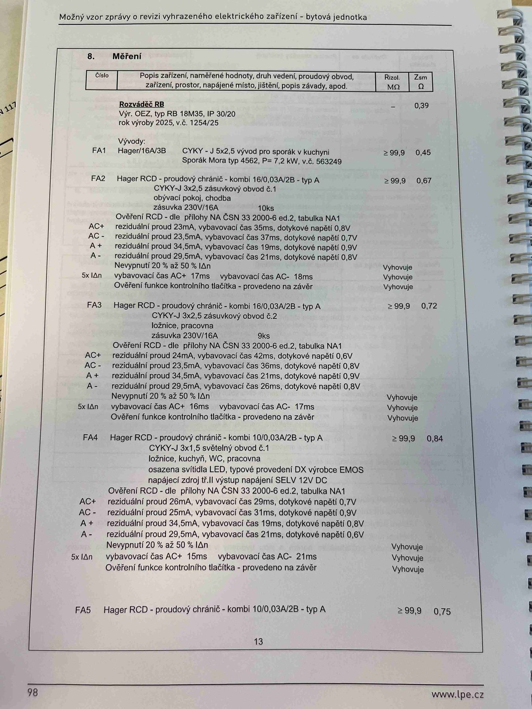

# IMG_2516

**Zdroj**: Macháček V., Dolenský M. — *Možné vzory zprávy o revizi VEZ*, vyd. lpe.cz, str. 98 / vnitřní str. 13 (**bytová jednotka**).

**Téma**: **Kapitola 8. Měření** — tabulka naměřených hodnot revize bytové jednotky. Rozváděč **RB** (OEZ RB 18M35), vývody FA1–FA5 včetně ověření RCD.

**Paralela k [IMG_2483.md](IMG_2483.md) (rodinný dům) a [IMG_2501.md](IMG_2501.md) (výrobní objekt)**, ale v menším rozsahu — byt má obvykle méně okruhů.

**Klíčové body**:

### 8. Měření

Hlavičky tabulky: **Číslo | Popis zařízení, naměřené hodnoty, druh vedení, proudový obvod, zařízení, prostor, napájené místo, jištění, popis závady, apod. | Rizol. MΩ | Zsm Ω**

### Rozváděč RB

**Výr. OEZ, typ RB 18M35, IP 30/20, rok výroby 2025, v.č. 1254/25.** **Z_sm = 0,39 Ω**.

### Vývody (obvody FA1–FA5)

| Obvod | Jištění / RCD | Kabel | Popis | R_izol [MΩ] | Z_sm [Ω] |
|---|---|---|---|---|---|
| **FA1** | Hager/16A/3B | **CYKY-J 5×2,5** | vývod pro sporák v kuchyni; Sporák Mora typ 4562, P = 7,2 kW, v.č. 563249 | ≥ 99,9 | 0,45 |
| **FA2** | **Hager RCD kombi 16/0,03 A/2B — typ A** | **CYKY-J 3×2,5** | zásuvkový obvod č. 1, obývací pokoj, chodba, zásuvka 230V/16A, 10 ks | ≥ 99,9 | 0,67 |
| **FA3** | **Hager RCD kombi 16/0,03 A/2B — typ A** | **CYKY-J 3×2,5** | zásuvkový obvod č. 2, ložnice, pracovna, zásuvka 230V/16A, 9 ks | ≥ 99,9 | 0,72 |
| **FA4** | **Hager RCD kombi 10/0,03 A/2B — typ A** | **CYKY-J 3×1,5** | světelný obvod č. 1, ložnice, kuchyň, WC, pracovna; osazena svítidla **LED**, typové provedení **DX** výrobce **EMOS**, napájecí zdroj tř. II, výstup napájení **SELV 12 V DC** | ≥ 99,9 | 0,84 |
| **FA5** | **Hager RCD kombi 10/0,03 A/2B — typ A** | — | (pokračování na další straně) | ≥ 99,9 | 0,75 |

### Ověření RCD — dle přílohy NA ČSN 33 2000-6 ed.2, tabulka NA1

**FA2** (Hager RCD kombi 16/0,03 A/A):

| Pol. | Reziduální proud | Vybavovací čas | Dotykové napětí | Výsledek |
|---|---|---|---|---|
| AC+ | 23 mA | 35 ms | 0,8 V | Vyhovuje |
| AC− | 23,5 mA | 37 ms | 0,7 V | Vyhovuje |
| A+  | 34,5 mA | 19 ms | 0,9 V | Vyhovuje |
| A−  | 29,5 mA | 21 ms | 0,8 V | Vyhovuje |
| **Nevypnutí 20 % až 50 % IΔn** | — | — | — | Vyhovuje |
| **5× IΔn**: vybavovací čas AC+ 17 ms / AC− 18 ms | — | — | — | Vyhovuje |
| Ověření funkce kontrolního tlačítka — provedeno na závěr | — | — | — | Vyhovuje |

**FA3** (Hager RCD kombi 16/0,03 A/A):

| Pol. | Reziduální proud | Vybavovací čas | Dotykové napětí | Výsledek |
|---|---|---|---|---|
| AC+ | 24 mA | 42 ms | 0,6 V | Vyhovuje |
| AC− | 23,5 mA | 36 ms | 0,8 V | Vyhovuje |
| A+  | 34,5 mA | 21 ms | 0,9 V | Vyhovuje |
| A−  | 29,5 mA | 26 ms | 0,8 V | Vyhovuje |
| **Nevypnutí 20 % až 50 % IΔn** | — | — | — | Vyhovuje |
| **5× IΔn**: vybavovací čas AC+ 16 ms / AC− 17 ms | — | — | — | Vyhovuje |
| Ověření funkce kontrolního tlačítka | — | — | — | Vyhovuje |

**FA4** (Hager RCD kombi 10/0,03 A/A):

| Pol. | Reziduální proud | Vybavovací čas | Dotykové napětí | Výsledek |
|---|---|---|---|---|
| AC+ | 26 mA | 29 ms | 0,7 V | Vyhovuje |
| AC− | 25 mA | 31 ms | 0,9 V | Vyhovuje |
| A+  | 34,5 mA | 19 ms | 0,8 V | Vyhovuje |
| A−  | 29,5 mA | 21 ms | 0,6 V | Vyhovuje |
| **Nevypnutí 20 % až 50 % IΔn** | — | — | — | Vyhovuje |
| **5× IΔn**: vybavovací čas AC+ 15 ms / AC− 21 ms | — | — | — | Vyhovuje |
| Ověření funkce kontrolního tlačítka — provedeno na závěr | — | — | — | Vyhovuje |

**Normy zmíněné na stránce**: ČSN 33 2000-6 ed.2 (příloha NA, tabulka NA1)

> **Poznámka**: Byt používá podobné typy RCD jako rodinný dům (Hager kombi typ A), měřené hodnoty jsou téměř identické — vzor slouží jako reference pro zpracování kombinovaných revizních zpráv pro bytové jednotky v aplikaci revize-el.
