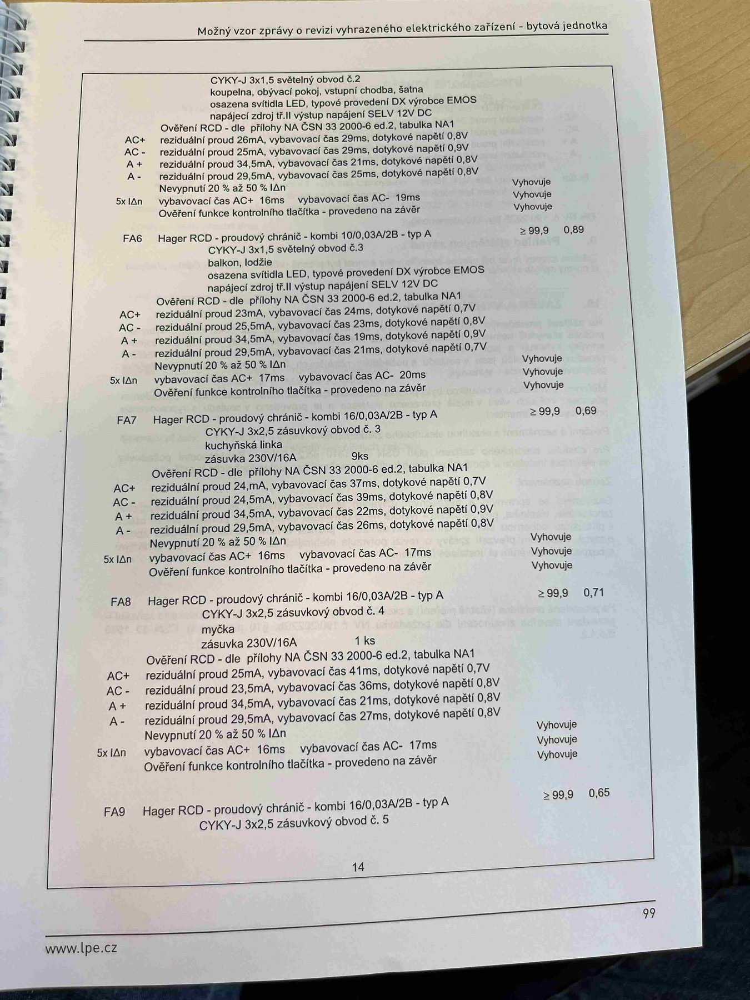

# IMG_2517

**Zdroj**: Macháček V., Dolenský M. — *Možné vzory zprávy o revizi VEZ*, vyd. lpe.cz, str. 99 / vnitřní str. 14 (**bytová jednotka**).

**Téma**: Pokračování tabulky **8. Měření** — vývody FA5 (dokončení), FA6, FA7, FA8, FA9 bytové jednotky včetně ověření RCD.

**Paralela k [IMG_2484.md](IMG_2484.md) (rodinný dům)** — pokračování tabulky pro byt.

**Klíčové body**:

### Dokončení FA5 (Hager RCD kombi 10/0,03 A/A — typ A)
**CYKY-J 3×1,5** světelný obvod č. 2 — koupelna, obývací pokoj, vstupní chodba, šatna; osazena svítidla **LED**, typové provedení **DX** výrobce **EMOS**, napájecí zdroj tř. II, výstup napájení **SELV 12 V DC**. **R_izol ≥ 99,9 MΩ**.

Ověření RCD — dle přílohy NA ČSN 33 2000-6 ed.2, tabulka NA1:

| Pol. | Reziduální proud | Vybavovací čas | Dotykové napětí | Výsledek |
|---|---|---|---|---|
| AC+ | 26 mA | 29 ms | 0,8 V | Vyhovuje |
| AC− | 25 mA | 29 ms | 0,9 V | Vyhovuje |
| A+  | 34,5 mA | 21 ms | 0,9 V | Vyhovuje |
| A−  | 29,5 mA | 25 ms | 0,8 V | Vyhovuje |
| **Nevypnutí 20–50 % IΔn** | — | — | — | Vyhovuje |
| **5× IΔn**: vybavovací čas AC+ 16 ms / AC− 19 ms | — | — | — | Vyhovuje |
| Ověření funkce kontrolního tlačítka | — | — | — | Vyhovuje |

### FA6 (Hager RCD kombi 10/0,03 A/A — typ A)
**CYKY-J 3×1,5** světelný obvod č. 3 — **balkon, lodžie**, osazena svítidla **LED**, typové provedení **DX** výrobce **EMOS**, napájecí zdroj tř. II, výstup napájení **SELV 12 V DC**. **R_izol ≥ 99,9 MΩ, Z_sm = 0,89 Ω**.

| Pol. | Reziduální proud | Vybavovací čas | Dotykové napětí | Výsledek |
|---|---|---|---|---|
| AC+ | 23 mA | 24 ms | 0,7 V | Vyhovuje |
| AC− | 25,5 mA | 23 ms | 0,8 V | Vyhovuje |
| A+  | 34,5 mA | 19 ms | 0,9 V | Vyhovuje |
| A−  | 29,5 mA | 21 ms | 0,7 V | Vyhovuje |
| **Nevypnutí 20–50 % IΔn** | — | — | — | Vyhovuje |
| **5× IΔn**: vybavovací čas AC+ 17 ms / AC− 20 ms | — | — | — | Vyhovuje |
| Ověření funkce kontrolního tlačítka | — | — | — | Vyhovuje |

### FA7 (Hager RCD kombi 16/0,03 A/A — typ A)
**CYKY-J 3×2,5** zásuvkový obvod č. 3 — **kuchyňská linka**, zásuvka 230V/16A, **9 ks**. **R_izol ≥ 99,9 MΩ, Z_sm = 0,69 Ω**.

| Pol. | Reziduální proud | Vybavovací čas | Dotykové napětí | Výsledek |
|---|---|---|---|---|
| AC+ | 7 mA | 37 ms | 0,7 V | Vyhovuje |
| AC− | 24,5 mA | 39 ms | 0,8 V | Vyhovuje |
| A+  | 34,5 mA | 22 ms | 0,9 V | Vyhovuje |
| A−  | 29,5 mA | 26 ms | 0,8 V | Vyhovuje |
| **Nevypnutí 20–50 % IΔn** | — | — | — | Vyhovuje |
| **5× IΔn**: vybavovací čas AC+ 16 ms / AC− 17 ms | — | — | — | Vyhovuje |
| Ověření funkce kontrolního tlačítka | — | — | — | Vyhovuje |

### FA8 (Hager RCD kombi 16/0,03 A/A — typ A)
**CYKY-J 3×2,5** zásuvkový obvod č. 4 — **myčka**, zásuvka 230V/16A, **1 ks**. **R_izol ≥ 99,9 MΩ, Z_sm = 0,71 Ω**.

| Pol. | Reziduální proud | Vybavovací čas | Dotykové napětí | Výsledek |
|---|---|---|---|---|
| AC+ | 25 mA | 41 ms | 0,7 V | Vyhovuje |
| AC− | 23,5 mA | 36 ms | 0,8 V | Vyhovuje |
| A+  | 34,5 mA | 21 ms | 0,9 V | Vyhovuje |
| A−  | 29,5 mA | 27 ms | 0,8 V | Vyhovuje |
| **Nevypnutí 20–50 % IΔn** | — | — | — | Vyhovuje |
| **5× IΔn**: vybavovací čas AC+ 16 ms / AC− 17 ms | — | — | — | Vyhovuje |
| Ověření funkce kontrolního tlačítka | — | — | — | Vyhovuje |

### FA9 (Hager RCD kombi 16/0,03 A/A — typ A)
**CYKY-J 3×2,5** zásuvkový obvod č. 5. **R_izol ≥ 99,9 MΩ, Z_sm = 0,65 Ω**. (Pokračování na další straně.)

**Normy zmíněné na stránce**: ČSN 33 2000-6 ed.2 (příloha NA, tabulka NA1)
