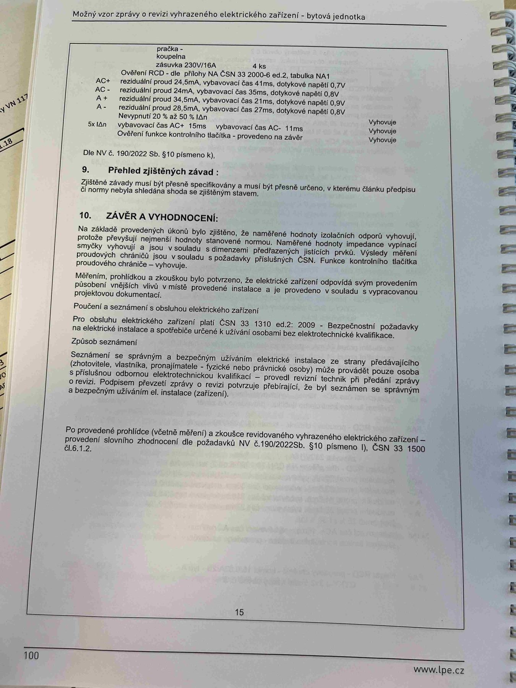

# IMG_2518

**Zdroj**: Macháček V., Dolenský M. — *Možné vzory zprávy o revizi VEZ*, vyd. lpe.cz, str. 100 / vnitřní str. 15 (**bytová jednotka**).

**Téma**: Dokončení tabulky měření (pračka / koupelna) + **Kapitola 9. Přehled zjištěných závad** + **Kapitola 10. Závěr a vyhodnocení** revize bytové jednotky.

**Paralela k [IMG_2486.md](IMG_2486.md) (rodinný dům) a [IMG_2502.md](IMG_2502.md) (výrobní objekt)** — stejný formát závěru.

**Klíčové body**:

### Dokončení tabulky měření (pračka / koupelna)

- **Pračka / koupelna** — zásuvka 230V/16A, **4 ks**

Ověření RCD — dle přílohy NA ČSN 33 2000-6 ed.2, tabulka NA1:

| Pol. | Reziduální proud | Vybavovací čas | Dotykové napětí | Výsledek |
|---|---|---|---|---|
| AC+ | 24,5 mA | 41 ms | 0,7 V | Vyhovuje |
| AC− | 24 mA | 35 ms | 0,8 V | Vyhovuje |
| A+  | 34,5 mA | 21 ms | 0,9 V | Vyhovuje |
| A−  | 28,5 mA | 27 ms | 0,8 V | Vyhovuje |
| **Nevypnutí 20 % až 50 % IΔn** | — | — | — | Vyhovuje |
| **5× IΔn**: vybavovací čas AC+ 15 ms / AC− 11 ms | — | — | — | Vyhovuje |
| Ověření funkce kontrolního tlačítka — provedeno na závěr | — | — | — | Vyhovuje |

Dle **NV č. 190/2022 Sb. § 10 písmeno k)**.

### 9. Přehled zjištěných závad
Zjištěné závady musí být přesně specifikovány a musí být přesně určeno, v kterém článku předpisu či normy nebyla shledána shoda se zjištěným stavem.

### 10. ZÁVĚR A VYHODNOCENÍ
Na základě provedených úkonů bylo zjištěno, že **naměřené hodnoty izolačních odporů vyhovují**, protože převyšují nejmenší hodnoty stanovené normou. **Naměřené hodnoty impedance vypínací smyčky vyhovují** a jsou v souladu s dimenzemi předřazených jisticích prvků. Výsledky měření proudových chráničů jsou v souladu s požadavky příslušných ČSN. Funkce kontrolního tlačítka proudového chrániče — vyhovuje.

Měřením, prohlídkou a zkouškou bylo potvrzeno, že elektrické zařízení odpovídá svým provedením působení vnějších vlivů v místě provedené instalace a je provedeno v souladu s vypracovanou projektovou dokumentací.

### Poučení a seznámení s obsluhou elektrického zařízení
Pro obsluhu elektrického zařízení platí **ČSN 33 1310 ed.2 : 2009** — Bezpečnostní požadavky na elektrické instalace a spotřebiče určené k užívání osobami bez elektrotechnické kvalifikace.

### Způsob seznámení
Seznámení se správným a bezpečným užíváním elektrické instalace ze strany předávajícího (zhotovitele, vlastníka, pronajímatele — fyzické nebo právnické osoby) může provádět pouze osoba s příslušnou odbornou elektrotechnickou kvalifikací — provedl revizní technik při předání zprávy o revizi. Podpisem převzetí zprávy o revizi potvrzuje přebírající, že byl seznámen se správným a bezpečným užíváním el. instalace (zařízení).

Po provedené prohlídce (včetně měření) a zkoušce revidovaného vyhrazeného elektrického zařízení — provedení slovního zhodnocení dle požadavků **NV č. 190/2022 Sb. § 10 písmeno l)**, **ČSN 33 1500 čl. 6.1.2**.

**Normy zmíněné na stránce**: NV č. 190/2022 Sb. (§ 10 písm. k, l), ČSN 33 1310 ed.2 : 2009, ČSN 33 1500 (čl. 6.1.2), ČSN 33 2000-6 ed.2 (příloha NA, tab. NA1)
