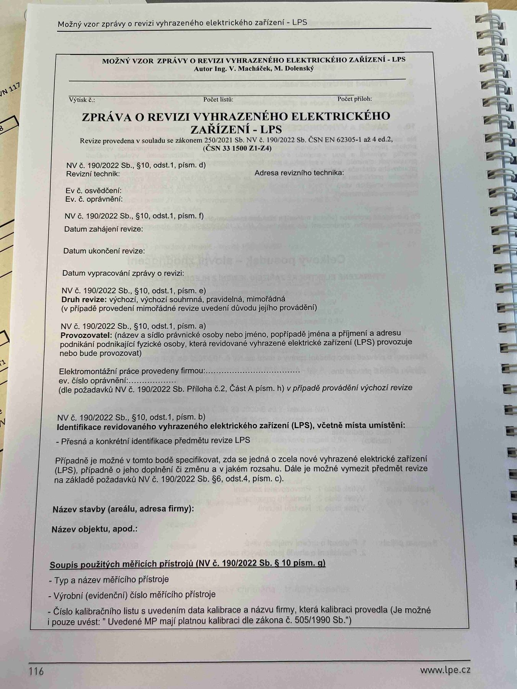

# IMG_2520

**Zdroj**: Macháček V., Dolenský M. — *Možné vzory zprávy o revizi VEZ – LPS*, vyd. lpe.cz, str. 116 / vnitřní str. 1 (**titulní strana LPS — hromosvod**).

**Téma**: Úvodní (titulní) strana vzoru **"ZPRÁVA O REVIZI VYHRAZENÉHO ELEKTRICKÉHO ZAŘÍZENÍ — LPS"** — povinné úvodní údaje pro revizi ochrany před bleskem dle NV č. 190/2022 Sb. § 10.

**Klíčové body**:

### ZPRÁVA O REVIZI VYHRAZENÉHO ELEKTRICKÉHO ZAŘÍZENÍ — LPS

Revize provedena v souladu se zákonem **250/2021 Sb.**, **NV č. 190/2022 Sb.**, **ČSN EN 62305-1 až 4 ed.2**, **(ČSN 33 1500 Z1–Z4)**.

### Formulář úvodní strany LPS
- **NV č. 190/2022 Sb. § 10 odst. 1 písm. d)** — Revizní technik, Adresa revizního technika, Ev. č. osvědčení, Ev. č. oprávnění
- **§ 10 odst. 1 písm. f)** — Datum zahájení revize, Datum ukončení revize, Datum vypracování zprávy o revizi
- **§ 10 odst. 1 písm. e)** — Druh revize: výchozí / výchozí souhrnná / pravidelná / mimořádná (v případě mimořádné uvedení důvodu provádění)
- **§ 10 odst. 1 písm. a)** — Provozovatel (název a sídlo právnické osoby nebo jméno, popř. jména a příjmení a adresa podnikání podnikající fyzické osoby, která revidované vyhrazené elektrické zařízení **(LPS)** provozuje nebo bude provozovat)
- Elektromontážní práce provedeny firmou, ev. číslo oprávnění (dle požadavků NV č. 190/2022 Sb. Příloha č. 2, Část A písm. h) v případě provádění výchozí revize)
- **§ 10 odst. 1 písm. b)** — Identifikace revidovaného vyhrazeného elektrického zařízení **(LPS)**, včetně místa umístění
  - Přesná a konkrétní identifikace předmětu revize **LPS**
  - Případně je možné v tomto bodě specifikovat, zda se jedná o zcela nové vyhrazené elektrické zařízení (LPS), případně o jeho doplnění či změnu a v jakém rozsahu. Dále je možné vymezit předmět revize na základě požadavků **NV č. 190/2022 Sb. § 6, odst. 4, písm. c)**.
- **Název stavby (areálu, adresa firmy)**: ____
- **Název objektu, apod.**: ____

### Soupis použitých měřicích přístrojů (NV č. 190/2022 Sb. § 10 písm. g)
- Typ a název měřicího přístroje
- Výrobní (evidenční) číslo měřicího přístroje
- Číslo kalibračního listu s uvedením data kalibrace a názvu firmy, která kalibraci provedla (je možné i pouze uvést: **"Uvedené MP mají platnou kalibraci dle zákona č. 505/1990 Sb."**)

**Normy zmíněné na stránce**: zákon č. 250/2021 Sb., zákon č. 505/1990 Sb. (metrologie), NV č. 190/2022 Sb. (§ 6 odst. 4 písm. c, § 10 odst. 1 písm. a, b, d, e, f, g, h, příloha č. 2 část A písm. h), ČSN EN 62305-1 až 4 ed.2, ČSN 33 1500 (Z1–Z4)

> **Poznámka**: Jedná se o **samostatný vzor zprávy pro LPS (hromosvod)** — nikoli součást vzoru pro rodinný dům / byt / průmysl. Je určen pro revize vyhrazeného elektrického zařízení ochrany před bleskem podle řady norem ČSN EN 62305 ed.2.
