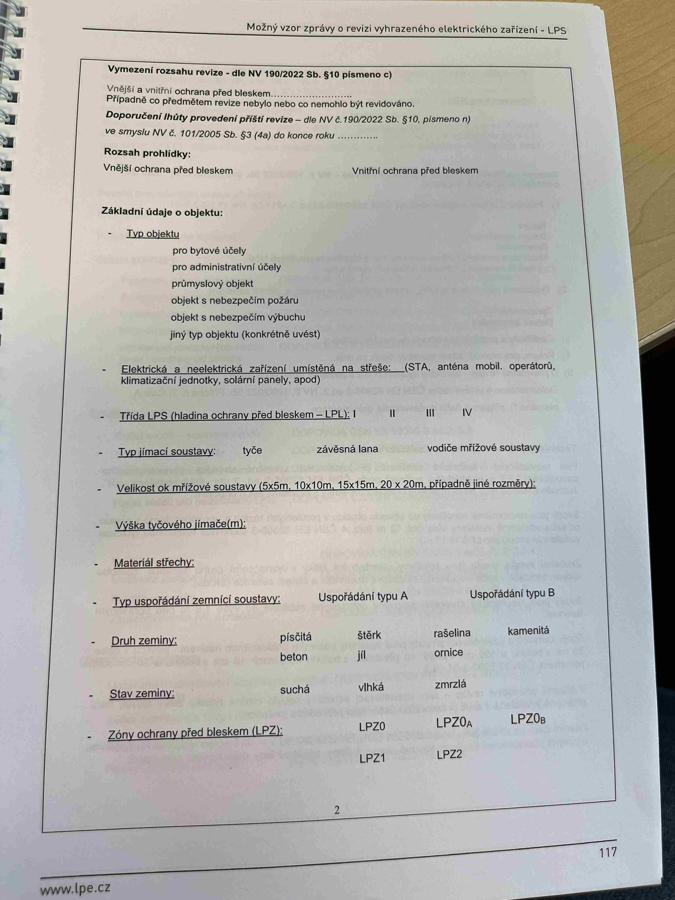

# IMG_2521

**Zdroj**: Macháček V., Dolenský M. — *Možné vzory zprávy o revizi VEZ – LPS*, vyd. lpe.cz, str. 117 / vnitřní str. 2 (**LPS — hromosvod**).

**Téma**: Vymezení rozsahu revize LPS + rozsah prohlídky + **Základní údaje o objektu** (typ, třída LPS, jímací soustava, zemnič, druh a stav zeminy, zóny ochrany před bleskem LPZ).

**Klíčové body**:

### Vymezení rozsahu revize — dle NV č. 190/2022 Sb. § 10 písmeno c)
- Vnější i vnitřní ochrana před bleskem ____
- Případně co předmětem revize nebylo nebo co nemohlo být revidováno.

### Doporučená lhůta provedení příští revize
Dle **NV č. 190/2022 Sb. § 10 písmeno n)**, ve smyslu **NV č. 101/2005 Sb. § 3 (4a)** do konce roku ____

### Rozsah prohlídky
- **Vnější** ochrana před bleskem
- **Vnitřní** ochrana před bleskem

### Základní údaje o objektu

**Typ objektu**:
- pro bytové účely
- pro administrativní účely
- průmyslový objekt
- objekt s nebezpečím požáru
- objekt s nebezpečím výbuchu
- jiný typ objektu (konkrétně uvést)

**Elektrická a neelektrická zařízení umístěná na střeše**: (STA, anténa mobil. operátorů, klimatizační jednotky, solární panely, apod.)

**Třída LPS** (hladina ochrany před bleskem — LPL): **I | II | III | IV**

**Typ jímací soustavy**: tyče | závěsná lana | vodiče mřížové soustavy

**Velikost ok mřížové soustavy**: 5×5 m | 10×10 m | 15×15 m | 20×20 m (případně jiné rozměry)

**Výška tyčového jímače** (m): ____

**Materiál střechy**: ____

**Typ uspořádání zemnicí soustavy**: Uspořádání typu A | Uspořádání typu B

**Druh zeminy**: písčitá | štěrk | rašelina | kamenitá | beton | jíl | ornice

**Stav zeminy**: suchá | vlhká | zmrzlá

**Zóny ochrany před bleskem (LPZ)**: LPZ0 | LPZ0A | LPZ0B | LPZ1 | LPZ2

**Normy zmíněné na stránce**: NV č. 190/2022 Sb. (§ 10 písm. c, n), NV č. 101/2005 Sb. (§ 3 odst. 4a), ČSN EN 62305 (třídy LPS I–IV, zóny LPZ)

> **Poznámka pro aplikaci revize-el (LPS modul)**:
> - **Třída LPS** je zásadní pro výpočet požadavků (průřezy vodičů, počet svodů, vzdálenost)
> - **Typ zemnicí soustavy A/B**: A = tyčové/ploché zemniče jednotlivě pro každý svod, B = obvodové (okruhové) nebo základové zemniče
> - **Zóny LPZ**: LPZ0A (přímý blesk), LPZ0B (nepřímý blesk), LPZ1 (EMP zeslaben), LPZ2 (další zeslabení)
