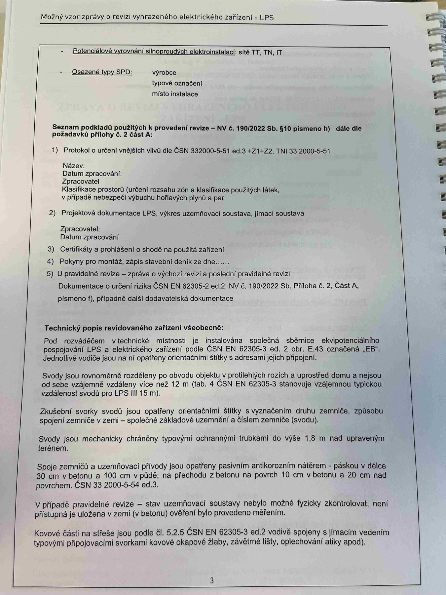

# IMG_2522

**Zdroj**: Macháček V., Dolenský M. — *Možné vzory zprávy o revizi VEZ – LPS*, vyd. lpe.cz, vnitřní str. 3 (**LPS — hromosvod**).

**Téma**: Potenciálové vyrovnání silnoproudých elektroinstalací + osazené typy SPD + **Seznam podkladů** použitých k revizi + **Technický popis revidovaného zařízení všeobecně** (sběrnice EB, svody, zkušební svorky, zemniče, pasivní ochrana proti korozi).

**Klíčové body**:

### Potenciálové vyrovnání silnoproudých elektroinstalací
Sítě: **TT, TN, IT**

### Osazené typy SPD
- Výrobce: ____
- Typové označení: ____
- Místo instalace: ____

### Seznam podkladů použitých k provedení revize — NV č. 190/2022 Sb. § 10 písmeno h), dále dle požadavků přílohy č. 2 část A:

1. **Protokol o určení vnějších vlivů** dle **ČSN 332000-5-51 ed.3 +Z1+Z2**, **TNI 33 2000-5-51**
   - Název:
   - Datum zpracování:
   - Zpracovatel:
   - Klasifikace prostorů (určení rozsahu zón a klasifikace použitých látek, v případě nebezpečí výbuchu hořlavých plynů a par)

2. **Projektová dokumentace LPS**, výkres uzemňovací soustavy, jímací soustava
   - Zpracovatel:
   - Datum zpracování:

3. **Certifikáty a prohlášení o shodě na použitá zařízení**

4. **Pokyny pro montáž, zápis stavebního deníku** ze dne ...

5. **U pravidelné revize** — zpráva o výchozí revizi a poslední pravidelné revizi. **Dokumentace o určení rizika** dle **ČSN EN 62305-2 ed.2**, **NV č. 190/2022 Sb. Příloha č. 2, Část A, písmeno f)**, případně další dodavatelská dokumentace.

### Technický popis revidovaného zařízení všeobecně

- Pod rozváděčem v technické místnosti je nainstalována **společná sběrnice ekvipotenciálního pospojování LPS a elektrického zařízení** podle **ČSN EN 62305-3 ed.2 obr. E.43** označená **„EB"**. Jednotlivé vodiče jsou na ni opatřeny orientačními štítky s adresami jejich připojení.
- **Svody jsou rovnoměrně rozděleny** po obvodu objektu v protilehlých rozích a uprostřed domu a nejsou od sebe vzájemně vzdáleny více než **12 m** (tab. 4 ČSN EN 62305-3 stanovuje vzájemnou typickou vzdálenost svodů pro **LPS III 15 m**).
- **Zkušební svorky svodů** jsou opatřeny orientačními štítky s vyznačením druhu zemniče, způsobu spojení zemniče v zemi — společné základové uzemnění a číslem zemniče (svodu).
- **Svody jsou mechanicky chráněny typovými ochrannými trubkami** do výše **1,8 m** nad upraveným terénem.
- **Spoje zemničů a uzemňovací přívody** jsou opatřeny pasivním antikorozním nátěrem — páskou v délce **30 cm v betonu** a **100 cm v půdě**; na přechodu z betonu na povrch **10 cm v betonu** a **20 cm nad povrchem**. **ČSN 33 2000-5-54 ed.3**.
- V případě pravidelné revize — stav uzemňovací soustavy nebylo možné fyzicky zkontrolovat, není přístupná je uložena v zemi (v betonu), ověření bylo provedeno měřením.
- **Kovové části na střeše** jsou podle **čl. 5.2.5 ČSN EN 62305-3 ed.2** vodivě spojeny s jímacím vedením typovými připojovacími svorkami (kovové okapové žlaby, závětrné lišty, oplechování atiky apod.)

**Normy zmíněné na stránce**: NV č. 190/2022 Sb. (§ 10 písm. h, příloha č. 2 část A písm. f), ČSN 33 2000-5-51 ed.3 +Z1+Z2, TNI 33 2000-5-51, ČSN EN 62305-2 ed.2, ČSN EN 62305-3 ed.2 (čl. 5.2.5, obr. E.43, tab. 4), ČSN 33 2000-5-54 ed.3

> **Důležité hodnoty pro LPS modul v revize-el**:
> - Max. vzdálenost svodů pro **LPS III**: **15 m**
> - Mechanická ochrana svodů do výšky **1,8 m**
> - Antikorozní páska: **30 cm** v betonu, **100 cm** v půdě; **10/20 cm** na přechodu
