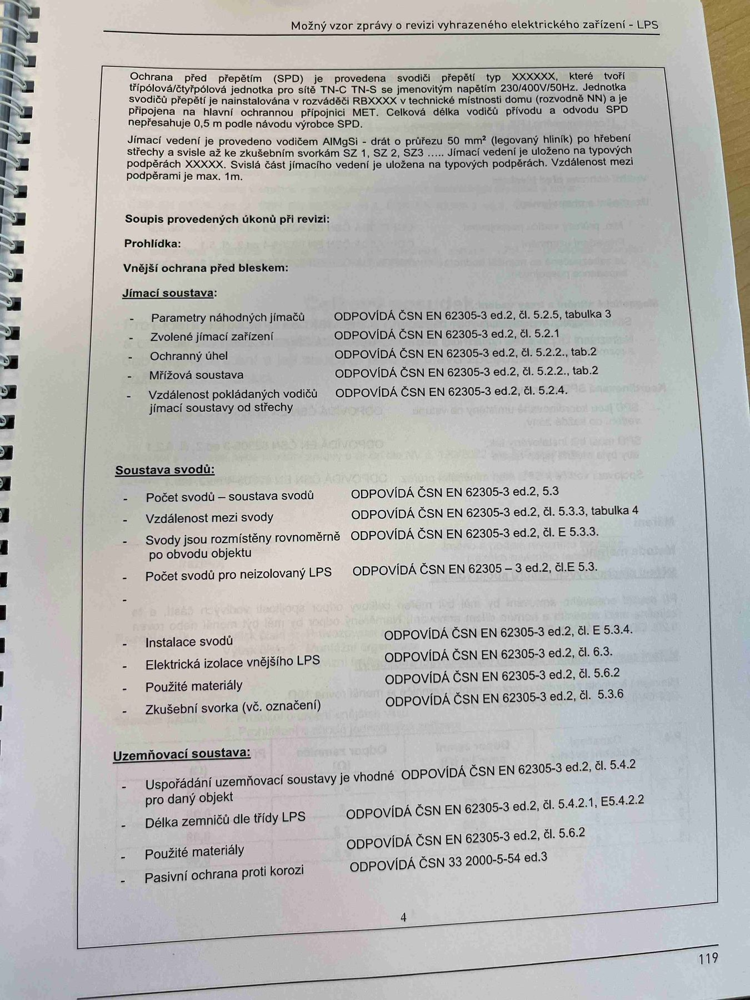

# IMG_2523

**Zdroj**: Macháček V., Dolenský M. — *Možné vzory zprávy o revizi VEZ – LPS*, vyd. lpe.cz, str. 119 / vnitřní str. 4 (**LPS — hromosvod**).

**Téma**: Ochrana před přepětím (SPD) + **Soupis provedených úkonů při revizi** LPS — prohlídka jímací soustavy, soustava svodů a uzemňovací soustava s odkazy na ČSN EN 62305-3 ed.2.

**Klíčové body**:

### Ochrana před přepětím (SPD)
Je provedena **svodiči přepětí typu XXXXXX**, které tvoří **třípólovou/čtyřpólovou** jednotku pro sítě **TN-C / TN-S** se jmenovitým napětím **230/400V/50Hz**. Jednotka svodičů přepětí je nainstalována v rozváděči **RBXXXX** v technické místnosti domu (rozvodně NN) a je připojena na **hlavní ochrannou přípojnici MET**. Celková délka vodičů přívodu a odvodu SPD **nepřesahuje 0,5 m** podle návodu výrobce SPD.

**Jímací vedení** je provedeno vodičem **AlMgSi** — drát o průřezu **50 mm²** (legovaný hliník) po hřebeni střechy a svisle až ke zkušebním svorkám **SZ 1, SZ 2, SZ 3** ... Jímací vedení je uloženo na **typových podpěrách XXXXX**. Svislá část jímacího vedení je uložena na typových podpěrách. **Vzdálenost mezi podpěrami je max. 1 m**.

### Soupis provedených úkonů při revizi
**Prohlídka — Vnější ochrana před bleskem**

#### Jímací soustava
| Kontrola | Norma / článek |
|---|---|
| Parametry náhodných jímačů | **ČSN EN 62305-3 ed.2, čl. 5.2.5, tabulka 3** |
| Zvolené jímací zařízení | **ČSN EN 62305-3 ed.2, čl. 5.2.1** |
| Ochranný úhel | **ČSN EN 62305-3 ed.2, čl. 5.2.2., tab. 2** |
| Mřížová soustava | **ČSN EN 62305-3 ed.2, čl. 5.2.2., tab. 2** |
| Vzdálenost pokládaných vodičů jímací soustavy od střechy | **ČSN EN 62305-3 ed.2, čl. 5.2.4** |

#### Soustava svodů
| Kontrola | Norma / článek |
|---|---|
| Počet svodů — soustava svodů | **ČSN EN 62305-3 ed.2, čl. 5.3** |
| Vzdálenost mezi svody | **ČSN EN 62305-3 ed.2, čl. 5.3.3, tabulka 4** |
| Svody jsou rozmístěny rovnoměrně po obvodu objektu | **ČSN EN 62305-3 ed.2, čl. E.5.3.3** |
| Počet svodů pro neizolovaný LPS | **ČSN EN 62305-3 ed.2, čl. E.5.3.** |
| Instalace svodů | **ČSN EN 62305-3 ed.2, čl. E.5.3.4** |
| Elektrická izolace vnějšího LPS | **ČSN EN 62305-3 ed.2, čl. 6.3** |
| Použité materiály | **ČSN EN 62305-3 ed.2, čl. 5.6.2** |
| Zkušební svorka (vč. označení) | **ČSN EN 62305-3 ed.2, čl. 5.3.6** |

#### Uzemňovací soustava
| Kontrola | Norma / článek |
|---|---|
| Uspořádání uzemňovací soustavy je vhodné pro daný objekt | **ČSN EN 62305-3 ed.2, čl. 5.4.2** |
| Délka zemničů dle třídy LPS | **ČSN EN 62305-3 ed.2, čl. 5.4.2.1, E.5.4.2.2** |
| Použité materiály | **ČSN EN 62305-3 ed.2, čl. 5.6.2** |
| Pasivní ochrana proti korozi | **ČSN 33 2000-5-54 ed.3** |

**Normy zmíněné na stránce**: ČSN EN 62305-3 ed.2 (čl. 5.2.1–5.2.5, 5.3, 5.3.3, 5.3.4, 5.3.6, 5.4.2, 5.4.2.1, 5.6.2, 6.3, E.5.3, E.5.3.3, E.5.3.4, E.5.4.2.2, tab. 2, 3, 4), ČSN 33 2000-5-54 ed.3

> **Důležité parametry pro LPS modul v revize-el**:
> - Jímací vodič **AlMgSi drát 50 mm²** (typický pro řadové domy)
> - Max. vzdálenost podpěr jímacího vedení: **1 m**
> - Max. délka vodičů přívodu a odvodu SPD: **0,5 m**
> - SPD jednotka: 3pól/4pól pro **TN-C / TN-S, 230/400 V, 50 Hz**
