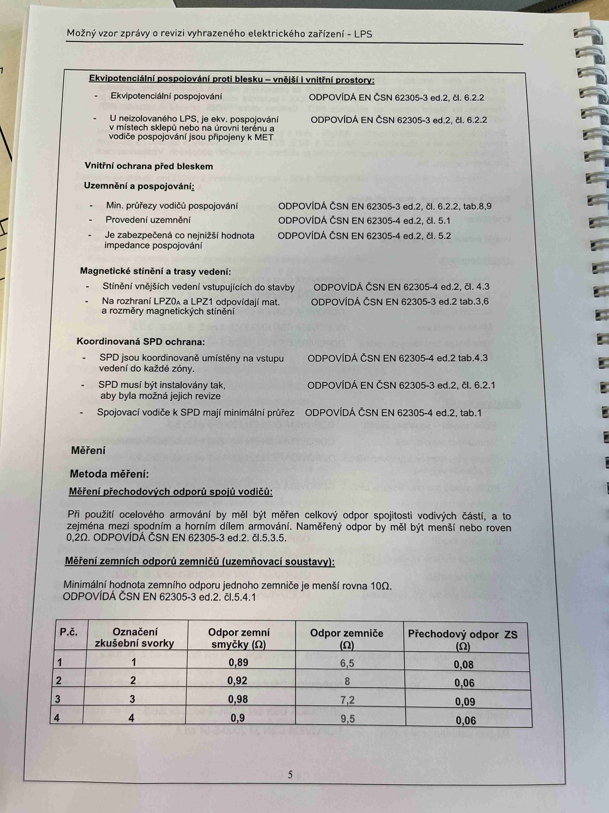

# IMG_2524

**Zdroj**: Macháček V., Dolenský M. — *Možné vzory zprávy o revizi VEZ*, vyd. lpe.cz, vnitřní str. 5 (**LPS — hromosvod**).

**Téma**: Ekvipotenciální pospojování proti blesku + Vnitřní ochrana před bleskem (uzemnění a pospojování, magnetické stínění, SPD) + **Měření** přechodových odporů spojů vodičů a zemních odporů zemničů + **tabulka 4 zkušebních svorek**.

**Klíčové body**:

### Ekvipotenciální pospojování proti blesku — vnější i vnitřní prostory
| Položka | Požadavek | Norma |
|---|---|---|
| Ekvipotenciální pospojování | ODPOVÍDÁ | **ČSN EN 62305-3 ed.2, čl. 6.2.2** |
| U neizolovaného LPS, je ekv. pospojování v místech sklepů nebo na úrovni terénu a vodiče pospojování jsou připojeny k MET | ODPOVÍDÁ | **ČSN EN 62305-3 ed.2, čl. 6.2.2** |

### Vnitřní ochrana před bleskem

**Uzemnění a pospojování**:

| Kontrola | Výsledek | Norma |
|---|---|---|
| Min. průřezy vodičů pospojování | ODPOVÍDÁ | **ČSN EN 62305-3 ed.2, čl. 6.2.2, tab. 8, 9** |
| Provedení uzemnění | ODPOVÍDÁ | **ČSN EN 62305-4 ed.2, čl. 5.1** |
| Je zabezpečena co nejnižší hodnota impedance pospojování | ODPOVÍDÁ | **ČSN EN 62305-4 ed.2, čl. 5.2** |

**Magnetické stínění a trasy vedení**:

| Kontrola | Výsledek | Norma |
|---|---|---|
| Stínění vnějších vedení vstupujících do stavby | ODPOVÍDÁ | **ČSN EN 62305-4 ed.2, čl. 4.3** |
| Na rozhraní LPZ0a a LPZ1 odpovídají mat. a rozměry magnetických stínění | ODPOVÍDÁ | **ČSN EN 62305-3 ed.2 tab. 3, 6** |

**Koordinovaná SPD ochrana**:

| Kontrola | Výsledek | Norma |
|---|---|---|
| SPD jsou koordinovaně umístěny na vstupu vedení do každé zóny | ODPOVÍDÁ | **ČSN EN 62305-4 ed.2, tab. 4.3** |
| SPD musí být instalovány tak, aby byla možná jejich revize | ODPOVÍDÁ | **ČSN EN 62305-3 ed.2, čl. 6.2.1** |
| Spojovací vodiče k SPD mají minimální průřez | ODPOVÍDÁ | **ČSN EN 62305-4 ed.2, tab. 1** |

### Měření

**Metoda měření**:

- **Měření přechodových odporů spojů vodičů**: Při použití ocelového armování by měl být měřen celkový odpor spojitosti vodivých částí, a to zejména mezi spodním a horním dílem armování. **Naměřený odpor by měl být menší nebo roven 0,2 Ω**. ODPOVÍDÁ **ČSN EN 62305-3 ed.2, čl. 5.3.5**.

- **Měření zemních odporů zemničů (uzemňovací soustavy)**: **Minimální hodnota zemního odporu jednoho zemniče je menší rovna 10 Ω**. ODPOVÍDÁ **ČSN EN 62305-3 ed.2, čl. 5.4.1**.

### Tabulka zemních odporů — 4 zkušební svorky

| P.č. | Označení zkušební svorky | Odpor zemní smyčky [Ω] | Odpor zemniče [Ω] | Přechodový odpor ZS [Ω] |
|---|---|---|---|---|
| 1 | 1 | 0,89 | 6,5 | 0,08 |
| 2 | 2 | 0,92 | 8 | 0,06 |
| 3 | 3 | 0,98 | 7,2 | 0,09 |
| 4 | 4 | 0,9 | 9,5 | 0,06 |

**Normy zmíněné na stránce**: ČSN EN 62305-3 ed.2 (čl. 5.3.5, 5.4.1, 6.2.1, 6.2.2, tab. 3, 6, 8, 9), ČSN EN 62305-4 ed.2 (čl. 4.3, 5.1, 5.2, tab. 1, 4.3)

> **Důležité pro aplikaci revize-el (LPS modul)**:
> - Mezní hodnoty: **přechodový odpor ≤ 0,2 Ω**, **zemní odpor jednoho zemniče ≤ 10 Ω**
> - Struktura tabulky měření: svorka, odpor zemní smyčky, odpor zemniče, přechodový odpor ZS
